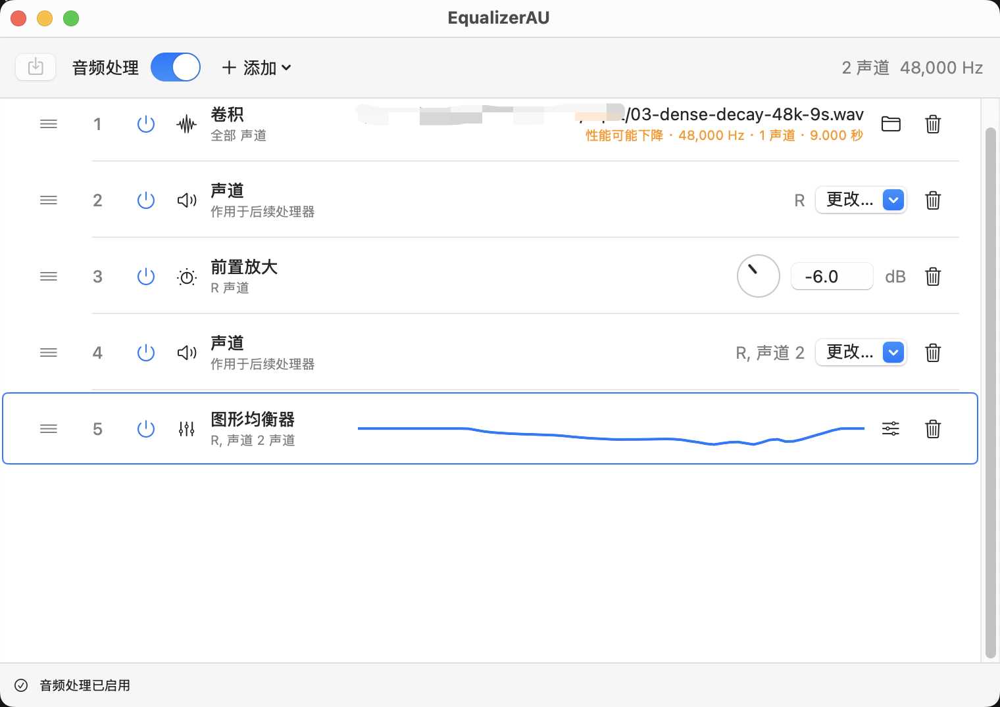
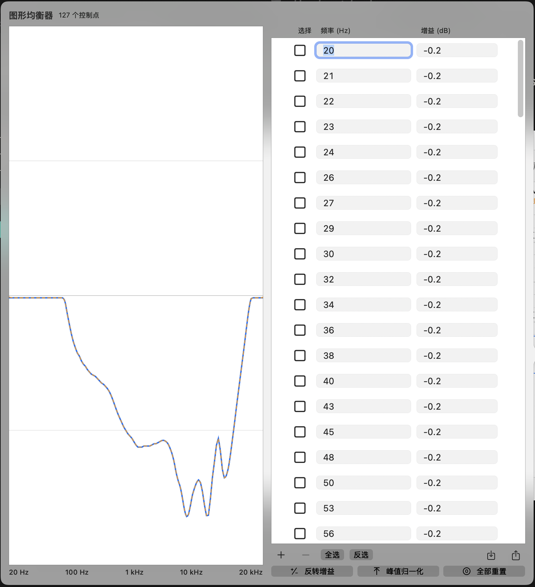
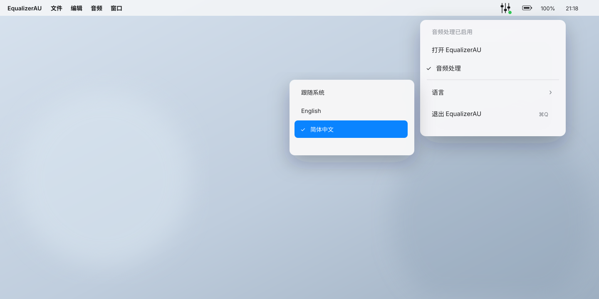

<h1 align="center">EqualizerAU</h1>

<p align="center"><strong>让 macOS 系统音频，按你的方式工作。</strong></p>

<p align="center">原生、全局、无需虚拟音频驱动。用前置放大、图形均衡器和卷积构建自己的音频处理链。</p>

<p align="center"><a href="#立即使用">立即使用</a> · <a href="#开发者">开发者指南</a> · <a href="#文档">项目文档</a></p>

## 简介

### 是什么

EqualizerAU 是一款独立运行的 macOS 全局音频处理工具。它通过原生 Process Tap 和 Core Audio API 捕获系统音频，处理后再送回当前默认输出设备。

虽然名称中包含 AU，但它不是 Audio Unit 插件。

<p align="center">
  
</p>

### 能做什么

- 用**前置放大**调整整体增益。
- 用**任意点图形均衡器**编辑响应曲线，并编译为随采样率缩放的最小相位 FIR（≤48 kHz 为 16,384 taps，高采样率保持同等频率分辨率）。
- 从外部 WAV 文件加载**卷积脉冲响应**，无需复制到 App 内部。
- 按声道组织、排序、复制和启用处理器节点。
- 从 Dock 或菜单栏控制音频处理，并即时切换 English/简体中文。
- 在 realtime callback 之外准备完整处理链，避免 callback 读取文件。

<p align="center">
  
</p>

<p align="center">
  
</p>

### 为什么使用

- **原生**：不安装虚拟音频驱动，直接使用 macOS 音频能力。
- **可控**：编辑不会悄悄生效，选择**保存**后才应用完整配置。
- **稳定**：音频处理链在控制路径构建，通过验证后再切换到 realtime runtime。
- **透明**：配置、源码、构建流程和第三方来源都可以审查。
- **开源**：使用 GPL-3.0-or-later 许可证发布。

## 立即使用

> EqualizerAU 当前是面向 macOS 14.2 及以上版本的 Apple Silicon 技术预览版。预构建版本采用 ad-hoc 签名且未经 Apple 公证。公开 Release 创建后，这里会加入正式下载链接。

### 安装

1. 从同一个 Release 下载 `EqualizerAU-0.1.0-arm64-preview.zip` 及其 `.sha256` 文件。
2. 验证归档完整性：

   ```bash
   shasum -a 256 -c EqualizerAU-0.1.0-arm64-preview.zip.sha256
   ```

3. 解压 ZIP，将 `EqualizerAU.app` 移到 `/Applications`。
4. 尝试打开一次 App，然后前往**系统设置 → 隐私与安全性**，找到 EqualizerAU 并选择**仍要打开**。
5. 启用**音频处理**，并在 macOS 提示时授予系统音频录制权限。

不要全局关闭 Gatekeeper。SHA-256 只能验证文件完整性，不能证明发布者身份。

### 创建第一条处理链

1. 选择**添加**，加入前置放大、图形均衡器或卷积节点。
2. 调整参数和节点顺序。
3. 选择**保存**，应用并持久化完整配置。
4. 使用菜单栏或主窗口切换**音频处理**。

卷积节点始终引用原始 WAV 路径。如果文件不可用，下一次启动、保存或音频路由重建会旁路该节点；文件恢复后，再次应用即可自动加载。

<details>
<summary>技术预览版的当前边界</summary>

- 仅支持 Apple Silicon 和当前默认输出设备，不支持 Intel Mac 或手动选择输出设备。
- 图形均衡器最多支持 512 个控制点，增益范围为 −24 至 +24 dB。
- 卷积支持采样率 8–768 kHz 的 RIFF/WAVE PCM 8/16/24/32-bit 或 Float32，不限制文件时长或 taps；源采样率必须与当前输出匹配，超过 30 秒时显示性能下降警告，末尾精确零值不进入 Runtime kernel。
- 图形均衡器和卷积合计最多使用 8 个 convolution channel instances，但不设置单 kernel 或所有实例总 taps 上限。
- system tap 与输出设备之间没有 realtime sample-rate conversion；格式不兼容时无法启动音频处理。
- M10 的 ADR-0017 长度自由、Accepted [`ADR-0018`](docs-dev/adr/0018-computational-processing-bypass.md)
  computational bypass 和 [`ADR-0019`](docs-dev/adr/0019-float64-deadline-distributed-convolution.md) 多级卷积
  已完成产品实现、自动化、Release 候选和用户真实音频验收；M10 已完成并关闭。
- 发布物由 GitHub Actions 在 tag 推送后自动构建并以 ad-hoc 签名发布，每个 ZIP 附带 `.sha256` 校验文件。
- 尚未实现 EqualizerAPO 配置导入、登录时启动和自动更新。

</details>

## 开发者

### 环境要求

- macOS 14.2 或更高版本
- Apple Silicon Mac
- Xcode 26.3

### 构建

无需使用仓库作者的签名身份即可完成本地构建，Debug 和 Release 产物都写入
`build/bin/EqualizerAU.app`：

```bash
make build
make release
```

运行完整测试和 hostless 覆盖率门禁：

```bash
make test
make coverage
```

覆盖率门禁统计无 GUI、无真实音频即可确定性执行的 M1 核心产品逻辑，要求总行覆盖率不低于
95%、Runtime 不低于 95%、关键文件不低于 90%。SwiftUI/AppKit 组合和直接 Core Audio
系统调用适配器会在报告中单列，不计入核心逻辑分母，也不会被静默忽略。

如需运行原生系统音频测试，请在 Xcode 中为 EqualizerAUM1 target 配置你自己的 Apple Development Team。

### 验证

```bash
./scripts/verify-m1-isolation.sh
./scripts/verify-m1-realtime.sh
./scripts/verify-localization.zsh
```

生成可重现的 ad-hoc 技术预览包：

```bash
./scripts/package-adhoc-preview.zsh
```

打包脚本默认只接受干净 commit，并在 `.build/release/` 下生成 App、许可证、源码 commit 记录、ZIP 和 SHA-256 文件。它不会上传 Release、创建 tag 或推送仓库。

## 文档

- [使用说明](#立即使用)
- [开发者指南](#开发者)
- [更新日志](CHANGELOG.md)
- [开源许可证](LICENSE)
- [第三方版权与来源说明](THIRD_PARTY_NOTICES.md)

## 开源与致谢

EqualizerAU 使用 [GPL-3.0-or-later](LICENSE) 许可证发布。

项目中的最小相位图形均衡器设计、对数频率插值和兼容 CSV 工作流包含派生自 [EqualizerAPO](THIRD_PARTY_NOTICES.md#equalizerapo) 的工作。EqualizerAPO 由 Jonas Thedering 创建，并以 GPL-2.0-or-later 发布。

双二阶滤波器公式参考了 Robert Bristow-Johnson 的 *Audio EQ Cookbook*。完整版权、许可证与代码来源说明请参阅 [THIRD_PARTY_NOTICES.md](THIRD_PARTY_NOTICES.md)。