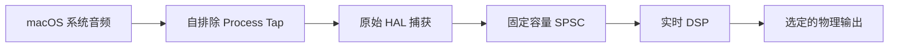
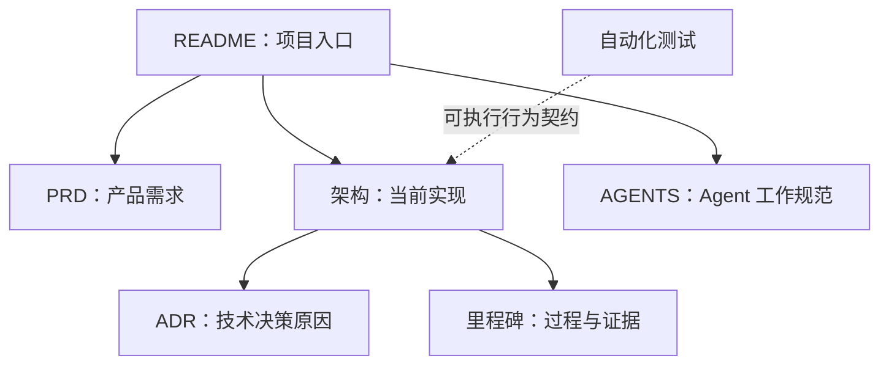

# EqualizerAU

EqualizerAU 是一款 macOS 系统级音频处理工具，借鉴 EqualizerAPO 可自由编排
处理链的理念。

## 当前状态

M0 已证明单进程原生链路可行：



M0 的验证 DSP 为固定 `-12 dB` 增益和限幅。M1 已分阶段实现；M1.0 已完成独立工程边界、
typed Preamp 与真实 buffer/channel 布局快照、确定性 Builder、正式 Runtime ABI、10 ms 平滑、
完整代次发布与安全回收，以及 M1 自有的原生 Process Tap、tap-only Aggregate、捕获和输出宿主。
M1.1 已完成版本化规范 JSON、`4 MiB` 预算、主文件与 previous 轮换、Recovery、Repair、
结果不确定和同代次 Retry 的持久化基础。M1.2 已接入单选 Preamp 编辑、显式 Save、
Start/Stop、独立即时音效总开关、布局构建、Runtime 发布、基础状态诊断和有序 Quit 清理。
M1.3 已完成多选与键盘选择、typed 剪贴板、组移动与 Option-copy、预算化 Undo/Redo、
分代诊断和完整退出确认。M1.4 已完成并发压力、Repair 故障注入、实时静态审计、运行计数器、
正式 `EqualizerAU` 产品身份和用户明确执行的真实音频验收。M1 已关闭。M2 已加入 schema v3
的固定 15 段 Graphic EQ、有序 Channels/Preamp/Graphic EQ 编译、Runtime ABI v2 biquad chain、
10 ms 双槽切换，以及通用节点行中的频段编辑器。M3 已加入 schema v4 Convolution、严格 WAV
IR sidecar、控制线程 SRC、Runtime ABI v3 zero-latency hybrid convolution 和安全链切换。M2 的
固定 15 段产品模型已由 M6 任意点 Graphic EQ 取代，原待验收项不再执行；M3 的 IR 导入、错误、
sidecar 恢复、处理器交互和真实音频已由 M4 T10–T15 与 M5-B 人工验收补齐。M4 已加入设备与
sleep/wake 监听、持久 UID 复核、有界自动恢复、权限提示和恢复状态；人工验收发现音频恢复循环、
单实例和单主窗口三个 M4 收尾问题，音频恢复循环、单进程和单主窗口均已通过修复后人工复测。采样率切换恢复已完成
稳定格式确认、近零点释放和跨代 muted Tap
handover，并通过签名应用人工复测；第一版权限候选虽通过 275 项 hostless，但签名应用在撤权
后冷启动 Start 时仍会静音。修订候选改为在实际路线 Tap 上完成启动前权限探测和 mute 转换，
并在返回前台时复核同一 Tap；36 项聚焦与 278 项完整 hostless 测试、构建和静态门禁均已通过，
签名应用冷启动拒权 T19-A 已通过；当前进程授权仍有效时路线和旁路继续正常工作的 T19-B 也
符合平台预期，AUD-03 已关闭。
其余延期生命周期行为保持明确记录。M5 已完成 EqualizerAPO 处理器编辑器对齐、性能基线、
签名候选和用户原生 GUI 验收。M6 已完成本地 EqualizerAPO Graphic EQ 源码探索、minimum-phase
FIR 数值探针和 ABI v3 Release 性能基线；ADR 0013 已获批准，schema v7、旧配置迁移、DSP 和
最终任意点编辑器均已实现并通过 hostless 回归、签名应用原生 GUI 和真实音频验收。Graphic EQ
原样保存所有正有限频率点，只使用 20 Hz...20 kHz 内的点设置 EQ 目标；域外点原样保留但不参与
插值或 FIR 设计，域外目标为 0 dB，有限 FIR 的自然域外影响不做硬切。M6 已完成并关闭。
M7 已确定采用无 Developer ID、未 notarize 的 arm64 开源技术预览：源码与 GPL 归属、ad-hoc
Release ZIP、SHA-256 和逐应用 Gatekeeper 授权构成发布契约，不加入付费 Apple Developer Program。
M8 已将 Convolution 升级为 schema v8 外部源路径：不复制 WAV，每次生效重新读取，资源局部
故障只旁路所属节点并保留用户启用意图；自动化、原生 GUI 与真实音频验收均已通过，M8 已完成并关闭。
M0 的源码、测试和构建产物只作参考，不被 M1 复用。BlackHole 只作为未启用的后备路线，
不是当前依赖，也无需安装。

## 环境要求

| 项目 | 要求 |
|---|---|
| 操作系统 | macOS 14.2 及以上 |
| 开发工具 | 当前工程使用 Xcode 26.3 |
| 交互式测试 | 需要 Apple Development 签名身份 |

## 构建

```bash
xcodebuild \
  -project EqualizerAU.xcodeproj \
  -scheme EqualizerAU \
  -configuration Debug \
  -destination 'platform=macOS,arch=arm64' \
  -derivedDataPath .build/DerivedData \
  build
```

## 测试

```bash
xcodebuild \
  -project EqualizerAU.xcodeproj \
  -scheme EqualizerAU \
  -configuration Debug \
  -destination 'platform=macOS,arch=arm64' \
  -derivedDataPath .build/DerivedData \
  test
```

M0 的自动化、真实 HAL 与人工音频证据统一记录在
[`docs/milestones/M0-native-route.md`](docs/milestones/M0-native-route.md)。

M1 的正常构建产物位于 configuration 目录下的 `M1/` 子目录，避免与保留的 M0
`EqualizerAU.app` 相互覆盖；先运行隔离与实时审计，再执行无音频构建：

```bash
./scripts/verify-m1-isolation.sh
./scripts/verify-m1-realtime.sh

xcodebuild \
  -project EqualizerAU.xcodeproj \
  -scheme EqualizerAU \
  -configuration Debug \
  -destination 'platform=macOS,arch=arm64' \
  -derivedDataPath .build/M1DerivedData \
  build-for-testing CODE_SIGNING_ALLOWED=NO
```

## 开源技术预览

M7 技术预览不使用 Developer ID，也未经 Apple notarization。打包脚本生成 arm64 Release App，
应用免费的 ad-hoc 签名和 Hardened Runtime，随包附带许可证、上游归属、源码 commit 和 SHA-256：

```bash
./scripts/package-adhoc-preview.zsh
```

脚本默认拒绝未提交的源码输入，防止二进制与对应 commit 不一致。本地验证当前改动时可以显式运行：

```bash
ALLOW_DIRTY=1 ./scripts/package-adhoc-preview.zsh
```

产物位于 `.build/release/`。ad-hoc 签名只验证包内代码完整性，不证明发布者身份，也不会获得
Gatekeeper 信任。使用者应先校验 `.sha256`，解压后将 `EqualizerAU.app` 移到 `/Applications`，
尝试打开一次；若 macOS 阻止启动，在“系统设置 → 隐私与安全性”中对 EqualizerAU 选择
“仍要打开”。这是 [Apple 官方支持的逐应用例外流程](https://support.apple.com/en-us/102445)，
不需要也不建议全局关闭 Gatekeeper。

用户也可以忽略预编译 ZIP，审阅对应源码并自行构建。技术预览的具体边界和用户验收清单见
[`M7 开源技术预览发布`](docs/milestones/M7-open-source-preview-release.md)。

## 文档导航



| 文档 | 唯一职责 |
|---|---|
| [`docs/prd.md`](docs/prd.md) | 产品意图、范围、需求和验收标准 |
| [`docs/architecture.md`](docs/architecture.md) | 当前实现、数据流、模块和实时边界 |
| [`docs/adr/`](docs/adr/) | 重要技术决策及其理由 |
| [`docs/milestones/M0-native-route.md`](docs/milestones/M0-native-route.md) | M0 计划、实验、发现、证据和结论 |
| [`docs/milestones/M1-processing-chain-foundation.md`](docs/milestones/M1-processing-chain-foundation.md) | M1 范围、工作包、验证计划和退出条件 |
| [`docs/milestones/M1.0-runtime-kernel.md`](docs/milestones/M1.0-runtime-kernel.md) | M1.0 独立 target、运行时 ABI、所有权、实施顺序和阶段门槛 |
| [`docs/milestones/M2-graphic-equalizer.md`](docs/milestones/M2-graphic-equalizer.md) | M2 Graphic EQ 范围、前置基础、验证计划和阶段证据 |
| [`docs/milestones/M3-convolution.md`](docs/milestones/M3-convolution.md) | M3 Convolution 文件契约、DSP 边界、自动化证据和后续验收闭环 |
| [`docs/milestones/M4-mvp-stabilization.md`](docs/milestones/M4-mvp-stabilization.md) | M4 设备/权限/睡眠恢复、资源所有权、自动化证据和发布待验收范围 |
| [`docs/milestones/M5-equalizerapo-editor-parity.md`](docs/milestones/M5-equalizerapo-editor-parity.md) | M5 EqualizerAPO 编辑器对齐目标、探索门禁、范围与退出条件 |
| [`docs/milestones/M6-arbitrary-point-graphic-equalizer.md`](docs/milestones/M6-arbitrary-point-graphic-equalizer.md) | M6 任意频率 Graphic EQ 目标、决策门禁、范围与退出条件 |
| [`docs/milestones/M7-open-source-preview-release.md`](docs/milestones/M7-open-source-preview-release.md) | M7 无 Developer ID 的 arm64 开源技术预览发布契约与验收门禁 |
| [`docs/milestones/M8-convolution-source-path.md`](docs/milestones/M8-convolution-source-path.md) | M8 Convolution 外部源路径、schema v8、生效时加载和有效旁路契约 |
| [`docs/future-equalizerapo-import.md`](docs/future-equalizerapo-import.md) | 未排期的 EqualizerAPO 导入与多文件 Include 未来需求池，可按需求卡选择范围 |
| [`CONTEXT.md`](CONTEXT.md) | 产品与处理链的规范领域词汇 |
| [`AGENTS.md`](AGENTS.md) | 编码 Agent 的仓库工作规范 |

自动化测试是行为契约；里程碑文档保存重要实验事实，不重复描述当前代码。

## License

EqualizerAU 使用 [`GPL-3.0-or-later`](LICENSE) 发布。Graphic EQ minimum-phase、插值和 CSV
兼容实现的 EqualizerAPO 来源及其他算法/依赖边界见
[`THIRD_PARTY_NOTICES.md`](THIRD_PARTY_NOTICES.md)。
