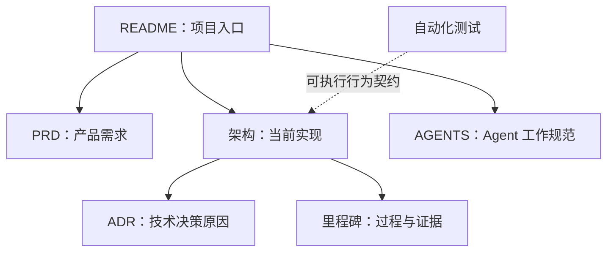

# EqualizerAU

EqualizerAU 是一款 macOS 系统级音频处理工具，借鉴 EqualizerAPO 可自由编排
处理链的理念。

## 当前状态

M0 已证明单进程原生链路可行：


M0 的验证 DSP 为固定 `-12 dB` 增益和限幅。M1 已分阶段实现；M1.0 已完成独立工程边界、
typed Preamp 与真实 buffer/channel 布局快照、确定性 Builder、正式 Runtime ABI、10 ms 平滑、
完整代次发布与安全回收，以及 M1 自有的原生 Process Tap、tap-only Aggregate、捕获和输出宿主。
M1.1 已完成版本化规范 JSON、`4 MiB` 预算、主文件与 previous 轮换、Recovery、Repair、
结果不确定和同代次 Retry 的持久化基础。M1.2 已接入单选 Preamp 编辑、显式 Save、
Start/Stop、独立即时音效总开关、布局构建、Runtime 发布、基础状态诊断和有序 Quit 清理。
M1.3 已完成多选与键盘选择、typed 剪贴板、组移动与 Option-copy、预算化 Undo/Redo、
分代诊断和完整退出确认。M1.4 已完成并发压力、Repair 故障注入、实时静态审计、运行计数器、
正式 `EqualizerAU` 产品身份和用户明确执行的真实音频验收。M1 已关闭，下一阶段为 M2 Graphic EQ。
M0 的源码、测试和构建产物只作参考，不被 M1 复用。BlackHole 只作为未启用的后备路线，
不是当前依赖，也无需安装。

## 环境要求

| 项目 | 要求 |
|---|---|
| 操作系统 | macOS 14.2 及以上 |
| 开发工具 | 当前工程使用 Xcode 26.3 |
| 交互式测试 | 需要 Apple Development 签名身份 |

## 构建

```bash
xcodebuild \
  -project EqualizerAU.xcodeproj \
  -scheme EqualizerAU \
  -configuration Debug \
  -destination 'platform=macOS,arch=arm64' \
  -derivedDataPath .build/DerivedData \
  build
```

## 测试

```bash
xcodebuild \
  -project EqualizerAU.xcodeproj \
  -scheme EqualizerAU \
  -configuration Debug \
  -destination 'platform=macOS,arch=arm64' \
  -derivedDataPath .build/DerivedData \
  test
```

M0 的自动化、真实 HAL 与人工音频证据统一记录在
[`docs/milestones/M0-native-route.md`](docs/milestones/M0-native-route.md)。

M1 的正常构建产物位于 configuration 目录下的 `M1/` 子目录，避免与保留的 M0
`EqualizerAU.app` 相互覆盖；先运行隔离与实时审计，再执行无音频构建：

```bash
./scripts/verify-m1-isolation.sh
./scripts/verify-m1-realtime.sh

xcodebuild \
  -project EqualizerAU.xcodeproj \
  -scheme EqualizerAU \
  -configuration Debug \
  -destination 'platform=macOS,arch=arm64' \
  -derivedDataPath .build/M1DerivedData \
  build-for-testing CODE_SIGNING_ALLOWED=NO
```

## 文档导航



| 文档 | 唯一职责 |
|---|---|
| [`docs/prd.md`](docs/prd.md) | 产品意图、范围、需求和验收标准 |
| [`docs/architecture.md`](docs/architecture.md) | 当前实现、数据流、模块和实时边界 |
| [`docs/adr/`](docs/adr/) | 重要技术决策及其理由 |
| [`docs/milestones/M0-native-route.md`](docs/milestones/M0-native-route.md) | M0 计划、实验、发现、证据和结论 |
| [`docs/milestones/M1-processing-chain-foundation.md`](docs/milestones/M1-processing-chain-foundation.md) | M1 范围、工作包、验证计划和退出条件 |
| [`docs/milestones/M1.0-runtime-kernel.md`](docs/milestones/M1.0-runtime-kernel.md) | M1.0 独立 target、运行时 ABI、所有权、实施顺序和阶段门槛 |
| [`CONTEXT.md`](CONTEXT.md) | 产品与处理链的规范领域词汇 |
| [`AGENTS.md`](AGENTS.md) | 编码 Agent 的仓库工作规范 |

自动化测试是行为契约；里程碑文档保存重要实验事实，不重复描述当前代码。
