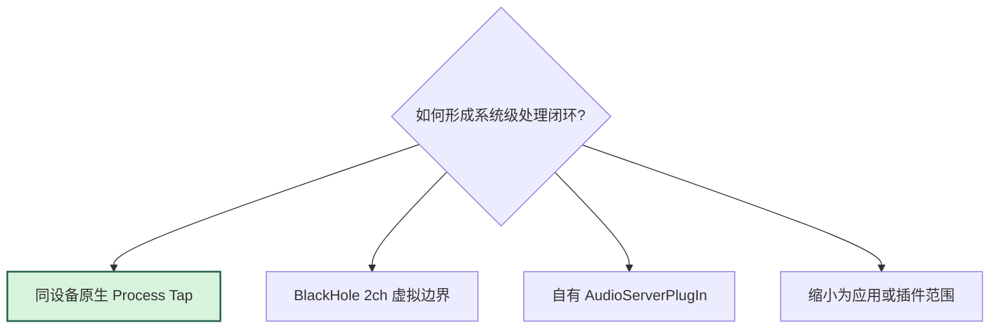
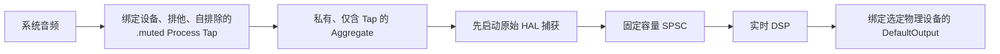
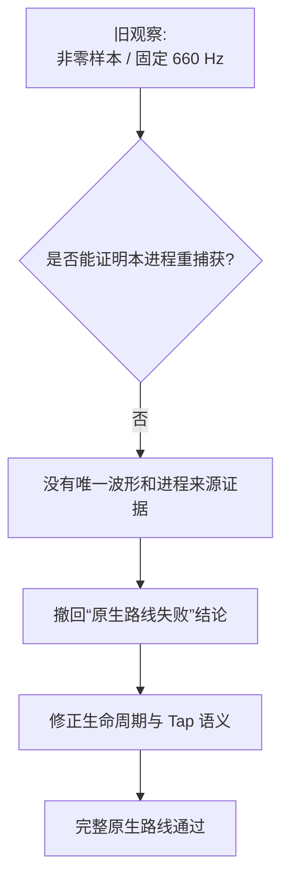
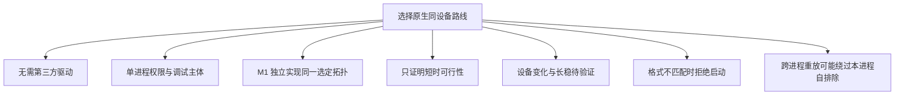

# ADR 0001：选择同设备原生 Process Tap 路线

| 属性 | 内容 |
|---|---|
| 状态 | M0 已接受 |
| 日期 | 2026-07-18 |
| 范围 | macOS 系统音频捕获、处理和物理输出拓扑 |
| 证据 | [`M0-native-route.md`](../milestones/M0-native-route.md) |
| 当前实现 | [`architecture.md`](../architecture.md) |

## 背景

M0 需要在不开发自有驱动的前提下，验证系统音频闭环：

候选路线如下：

## 决策

选择同设备原生路线：

BlackHole 2ch 只保留为未启用的后备路线，不是安装前置条件。应用不得下载、
捆绑、安装、卸载或更新音频驱动。

## 选择理由

| 证据 | 结论 |
|---|---|
| 完整原生链产生明显固定处理效果 | 音频经过捕获、SPSC、DSP 和重放 |
| 三次“启动 → 停止”循环成功 | 短时启动、正常停止和再次启动成立 |
| 未报告静音、双音、反馈或控制故障 | 满足 M0 短时可行性门槛 |
| 不需要第三方驱动和默认路由事务 | 原生路线成本更低 |

详细数值和证据边界只保存在里程碑文档。

## 被纠正的历史结论

旧结论不足的原因：

- 非零计数没有保存波形或识别来源；
- 固定 660 Hz 标记不是唯一信号；
- 旧 probe 在 Tap 创建前创建过输出 Audio Unit；
- active 输出初始化和首帧后没有重新验证进程对象；
- 没有排除目标设备上的跨进程音频转发。

## Resonance 跨进程污染

关闭 Resonance 窗口不一定停止 `resonanced`。两边的自排除都可能正确，但
EqualizerAU 仍会捕获跨进程副本。cold nonce probe 已加入进程身份、输出所有权和
目标设备活动进程检查；它只用于未来异常诊断。

## 备选方案

| 方案 | 当前处理 | 主要原因 |
|---|---|---|
| BlackHole 2ch | 保留为条件后备 | 需要安装、默认路由事务和跨时钟处理 |
| 自有 AudioServerPlugIn | 不属于 MVP | 安装、签名、公证、升级和兼容成本高 |
| inclusive `.mutedWhenTapped` Tap | 不采用 | 需要动态维护进程集合，历史实验未通过 |
| output-first 生命周期 | 不采用 | 与成熟路线顺序不同，也会混淆进程身份 |

## 后果

`.muted` 自排除按进程身份生效，不提供跨进程来源追踪。与其他系统级音频处理器
共存时，对方可能把 EqualizerAU 输出以自己的进程身份重放，形成可被本 Tap 再次
捕获的副本；M0 只在显式停止已知重放器后证明当前路线。

本 ADR 选择的是系统拓扑和外部行为，不授权复用 M0 代码产物。M1 仅把 M0 证据作为
参考，必须独立实现并重新验证同设备原生路线。

## 重新评估条件

满足任一条件时重新打开本 ADR：

- 出现可复现且证据完整的 self-recapture；
- 原流和处理流同时出现且当前 Tap 语义无法修复；
- 必须支持的设备或应用稳定绕过 Process Tap；
- Apple 改变公开 API 或权限行为；
- 产品要求把处理后音频暴露为可选虚拟设备；
- 产品必须与其他系统级重放器同时运行，且无法用可验证方式阻止跨进程重捕获；
- 长期稳定性要求无法在当前路线内满足。

重开时优先评估现有 BlackHole 后备路线；自有 AudioServerPlugIn 必须单独立项。
