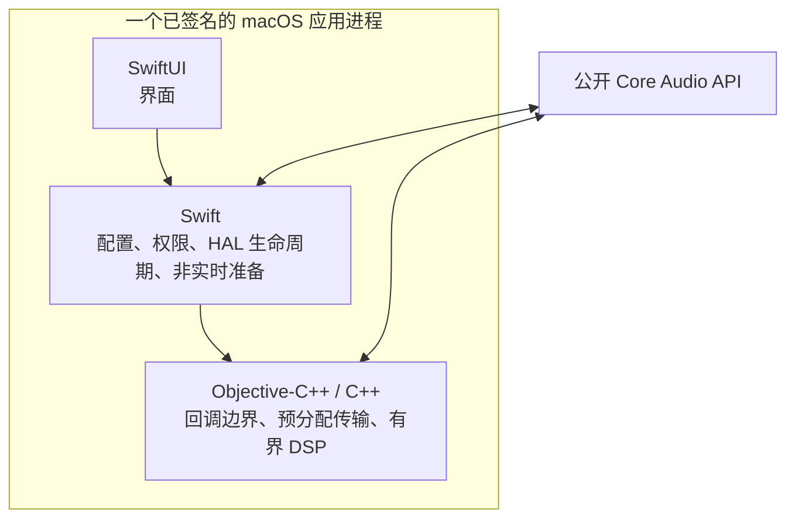
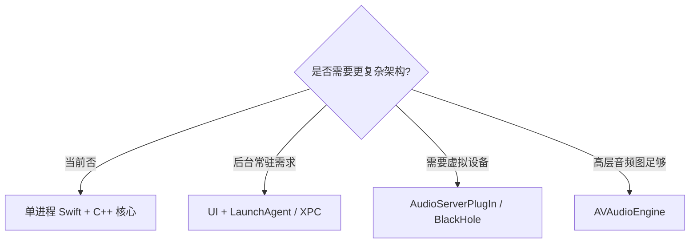
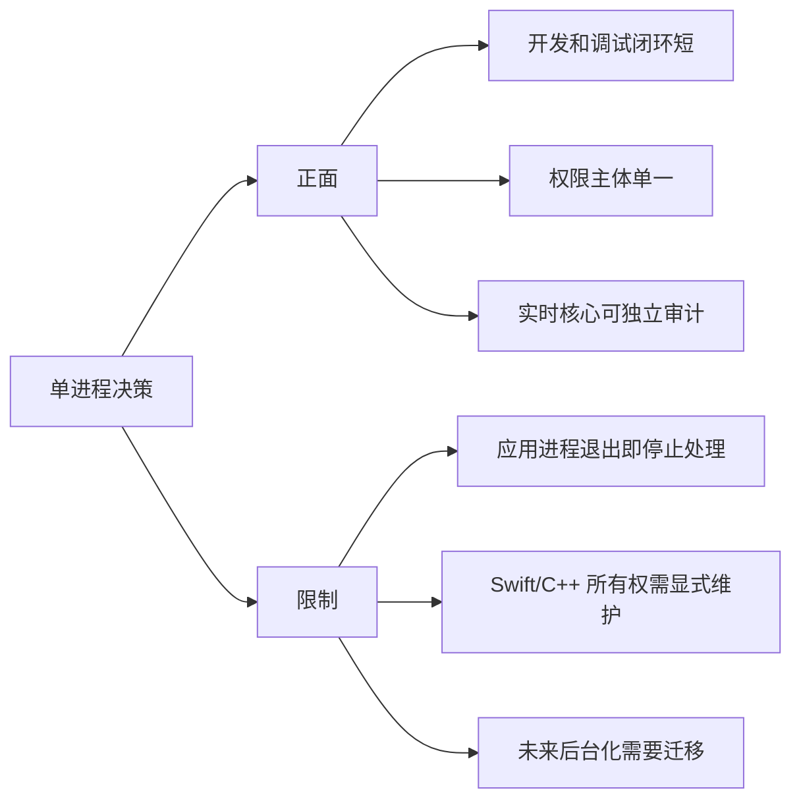

# ADR 0002：单进程原生控制层与小型实时核心

| 属性 | 内容 |
|---|---|
| 状态 | MVP 已接受 |
| 日期 | 2026-07-18 |
| 范围 | 进程模型、语言边界、实时职责和虚拟设备策略 |

## 背景

M0 的目标是尽快证明原生系统链可行，而不是同时建设后台服务、驱动、IPC 和完整
DSP 平台。需要明确界面、控制层和实时层的边界。

## 决策

决策约束：

1. MVP 只使用一个应用进程。
2. SwiftUI 只负责界面。
3. Swift 负责配置、权限、HAL 生命周期和非实时准备。
4. Objective-C++/C++ 负责 Core Audio 回调、预分配传输和有界 DSP。
5. 当前数据面直接使用公开 Core Audio API。
6. MVP 不增加 helper、daemon、LaunchAgent 或 XPC。
7. 不开发或捆绑 AudioServerPlugIn；BlackHole 只作为未启用的后备路线。

## 理由

| 关注点 | 单进程方案的收益 |
|---|---|
| M0 核心未知量 | 可以直接验证 Process Tap、Aggregate 和输出生命周期 |
| 开发周期 | 避免提前承担多进程签名、权限、升级和 IPC 同步成本 |
| 语言职责 | Swift 适合控制层，C++ 便于审计实时内存和对象生命周期 |
| 调试 | 权限主体和故障主体唯一 |
| 已有证据 | M0 已证明单进程原生链短时可行 |

## 备选方案

| 方案 | 当前结论 |
|---|---|
| 纯 Swift + Accelerate | 适合离线算法；实时回调更容易受 ARC、集合增长和错误路径影响 |
| AVAudioEngine | 不替代 Process Tap/HAL 生命周期，render block 仍受实时约束 |
| UI + LaunchAgent/XPC | 仅在明确需要后台常驻时重新评估 |
| 自有 AudioServerPlugIn | 属于独立产品分支，不属于 MVP |
| BlackHole | 保留为未启用后备路线，不是当前依赖 |

## 后果

关闭最后一个窗口不终止应用进程，因此不改变本 ADR 的单进程边界；同一进程可以继续
处理并在重新打开窗口后恢复界面状态。只有明确退出应用进程时才停止处理和清理资源。

## 重新评估条件

- 用户明确要求退出应用进程后仍继续处理；
- 必须支持 Process Tap 无法覆盖的软件或系统版本；
- 需要把处理后音频作为其他应用可选的虚拟设备；
- 单进程权限或恢复模型经实测不满足产品目标；
- 性能测量证明当前回调模型无法满足预算。

## 研究来源

| 类型 | 来源 |
|---|---|
| Process Tap | Apple [`AudioHardwareTap`](https://developer.apple.com/documentation/coreaudio/audiohardwaretap)、[`CATapDescription`](https://developer.apple.com/documentation/coreaudio/catapdescription) |
| HAL Output Audio Unit | Apple 技术说明 TN2091：[通过 HAL Output Audio Unit 使用设备输入](https://developer.apple.com/library/archive/technotes/tn2091/_index.html) |
| 高层音频图 | Apple WWDC19：[AVAudioEngine 新特性](https://developer.apple.com/videos/play/wwdc2019/510/) |
| 语言边界 | Apple WWDC23：[混合使用 Swift 与 C++](https://developer.apple.com/videos/play/wwdc2023/10172/) |
| 后台服务 | Apple [Service Management](https://developer.apple.com/documentation/servicemanagement)、技术说明 TN2083：[Daemon 与 Agent](https://developer.apple.com/library/archive/technotes/tn2083/_index.html) |
| 音频驱动 | Apple WWDC21：[使用 DriverKit 构建音频驱动](https://developer.apple.com/videos/play/wwdc2021/10190/) |
| 参考项目 | [Resonance](https://github.com/ealtun21/resonance)、[AudioCap](https://github.com/insidegui/AudioCap)、[OnlyEQ](https://github.com/zollans/OnlyEQ)、[eqMac](https://github.com/bitgapp/eqMac)、[Background Music](https://github.com/kyleneideck/BackgroundMusic)、[BlackHole](https://github.com/ExistentialAudio/BlackHole) |

这些来源用于识别能力和风险；最终选择以 EqualizerAU 的 M0 实验为准。
