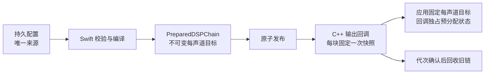
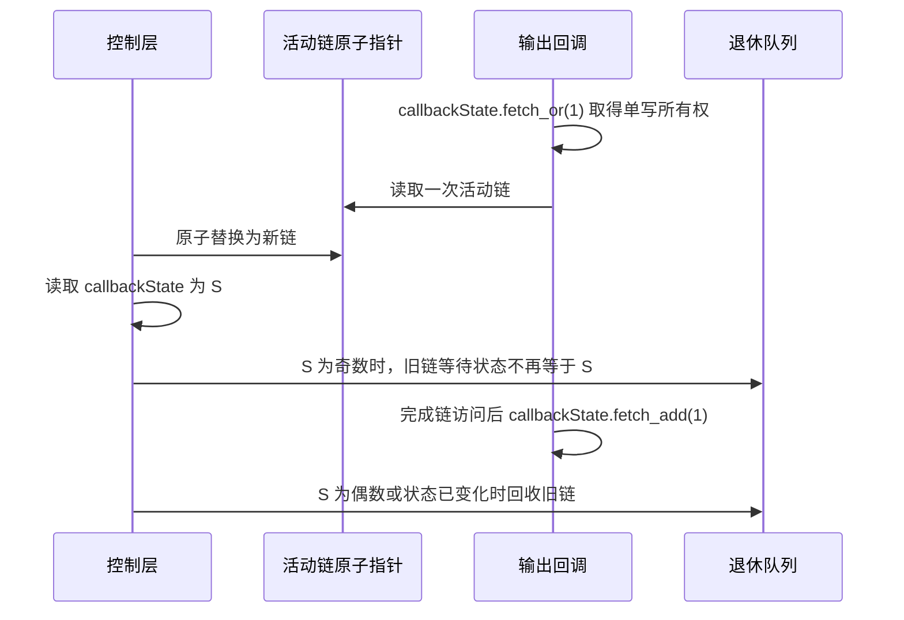
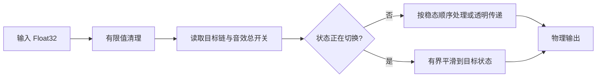

# ADR-0003：预构建 DSP 处理链与无锁发布

| 属性 | 内容 |
|---|---|
| 状态 | M1 已接受，待实现 |
| 日期 | 2026-07-19 |
| 范围 | M1 处理链运行时、参数更新和实时线程边界 |
| 前置事实 | [`architecture.md`](../architecture.md) |
| 产品需求 | [`prd.md`](../prd.md) |

## 背景

M0 的输出回调直接执行固定 `-12 dB` 增益和限幅，足以证明完整音频路线，但不能满足
可持久化、可排序、节点可独立启停和实时调参的处理链。M1 参考 M0 发现的单进程、捕获
先行和实时回调约束，但按照 <PII type="CASE_ID" id="678"/> 独立编码，不复用 M0 实现产物。

## 决策

1. Swift 控制层校验配置，并在非实时线程构建完整的 `PreparedDSPChain`。
2. M1 的配置节点序列只在非实时控制层遍历；发布对象包含与当前输出声道数一致的固定
   目标数组，声道解析、目标合成和缓冲分配在发布前完成。
3. 活动链发布后不可由控制层原地修改。输出回调每个音频块只读取一次活动链引用。
4. 新链通过原子代次切换发布；旧链只在确认没有实时回调引用后回收。
5. Builder 按配置可见顺序读取节点；停用节点不参与目标增益，音效总开关关闭时整条
   处理链透明。
6. 前置放大参数和节点启用状态变化使用有界的逐样本平滑过渡，不在回调中重建节点。
7. 可变平滑进度属于回调独占的预分配 `DSPRuntimeState`，不属于控制层发布的不可变链。

`PreparedDSPChain` 的构建必须依赖调用方提供的真实、有效输出布局快照。该快照除声道数
和缓冲布局外，还必须携带与实时缓冲索引一一对应的声道标识：只有 Core Audio 为该索引
明确提供扬声器位置时才使用 `L`、`R`、`C`、`LFE` 等语义名称，否则该索引使用从 `1`
开始的数字名称。不得仅凭声道数量推断语义布局。没有有效快照时不得猜测声道、构造占位
目标或发布新链；设备无关配置仍可按里程碑的持久化契约保存，待取得真实布局后再构建。
本 ADR 只约束构建完成后的发布与实时行为，不把配置文件当作控制层和实时层之间的通信
通道。

M1 的节点都是可交换的 Preamp。控制层先跳过停用节点，再按当前输出布局解析启用节点
的声道标识；无法解析的标识不参与目标合成，也不重定向到其他声道，控制层为它们生成
非阻塞诊断，同一选择中的可解析标识仍然生效，全部未解析时节点成为空操作。Builder
按可见顺序把所有启用 Preamp 编译为每声道一个目标总增益，`PreparedDSPChain` 不携带
用户节点序列、字符串或诊断对象。实时回调只读取固定的每声道目标，再由独立的
`DSPRuntimeState` 从各声道当前实际增益平滑到新目标，实时工作量与用户节点数无关。

Builder 先按可见顺序收集各声道的启用节点和诊断，再把该声道的 dB 值按数值升序用
Double 完整求和；数值相等的项等价，不需要额外的次序判定。不得在中间步骤按线性转换
边界夹值。每节点绝对值不超过
`100 dB`，内存数组元素数不超过 `Int.max`，因此完整 dB 和在 Double 范围内有限；规范
求和使仅重新排序节点不会改变最终 Float32 目标。令
`maxFiniteGainDB = 20 * log10(Float32.greatestFiniteMagnitude)`，
`minNormalGainDB = 20 * log10(Float32.leastNormalMagnitude)`：最终总值高于上界时，
`PreparedDSPChain` 目标夹到 `Float32.greatestFiniteMagnitude`；低于下界时目标归零，
不发布 Float32 次正规增益。持久配置仍保留原始节点值，控制层生成持续、非阻塞且包含
受影响声道的数值边界诊断。目标数组不得包含次正规值、`NaN` 或 `Inf`，触及边界不拒绝
整份配置。

削波风险诊断同样由 Builder 基于完整求和后的每声道总 dB 生成。总值高于 `0 dB` 的
声道进入诊断集合；总值不高于 `0 dB` 的声道不进入，即使其中包含单个正值 Preamp。
该诊断描述已保存处理链的净增益风险，不改变目标，也不触发隐藏归一化或限幅。

连续发布不会重置当前增益；配置改变导致每声道目标变化时走同一过渡。仅重新排序
数学上可交换的 M1 Preamp 不改变目标，因此不制造无意义的增益过渡。M2 引入非交换
节点前，必须通过新 ADR 或修订本 ADR 定义基于实测处理预算的运行时节点边界、顺序
执行和每节点状态迁移；可以复用本 ADR 的完整代次发布协议，但不得把 M1 的聚合表示
当作通用节点执行器。

首次启动输出前，`DSPRuntimeState` 直接初始化到已装载状态的各声道有效目标：音效总开关
开启时使用活动链目标，关闭时使用透明增益。首次通过预热的完整非静音输出块直接使用
该有效目标，不额外从 `0 dB` 或静音做参数过渡。这与
EqualizerAPO 首次配置直接生效、只对后续配置替换做过渡的行为一致。运行中的后续发布
才从当前实际增益开始 `10 ms` 线性幅值过渡。

运行中的后续链替换和音效总开关切换使用以下唯一逐帧定义：令
`R = max(1, ceil(sampleRate * 0.010))`。状态改变后的下一完整输出块以最近一帧实际使用
的增益 `g0` 为起点；第 `k` 帧使用
`g0 + (target - g0) * k / R`，其中 `k = 1...R`，第 `R` 帧强制写为 `target` 以消除
累计舍入误差。上述斜坡和 `DSPRuntimeState` 的当前值使用 Float64 计算；每帧转换成实际
Float32 增益时，绝对值低于 `Float32.leastNormalMagnitude` 的非零结果显式规范化为 `0`，
不得依赖处理器或线程的 FTZ 模式，也不得让运行状态保存 Float32 次正规增益。每个声道
独立保存 `g0` 与目标；同一声道在一帧内只使用一个规范化后的实际增益。过渡中再次发布时，
以各声道最近一帧实际使用并回写到 Float64 状态的规范化增益作为新 `g0`，从下一完整输出
块重新计算 `R` 帧，不延续旧斜率。接近归零边界时，实际轨迹允许早于第 `R` 帧变为 `0`；
自动化预期必须应用同一显式规范化规则。

音效总开关不通过处理链发布。控制层用独立、目标平台 lock-free 的原子布尔值发布
`effectsEnabled`，输出回调每块只读取一次；关闭时各声道目标变为透明增益，开启时恢复
当前活动链目标，并复用上述 `R` 帧过渡。该控制值只表达整链处理或透明，不作为任意节点
参数的通用旁路通道，也不改变活动链及其回收协议。

### 发布与回收协议

- 同一桥接以一个无锁 `uint64_t callbackState` 同时表示单写所有权和完成 epoch：最低位
  为忙闲位，`0` 表示空闲、`1` 表示一个回调在途，其余位随每次完成按模 `2^63` 前进；
- 回调以顺序一致的 `fetch_or(1)` 取得所有权；返回值为奇数表示异常重叠，重叠者清零
  自己的输出块、递增故障计数并立即返回，不等待、不接触链，也不再修改
  `callbackState`；
- 所有者取得所有权后才读取活动链。完成全部链和 `DSPRuntimeState` 访问后，以一次顺序
  一致的 `fetch_add(1)` 原子地同时释放忙位并推进 epoch；取得所有权后的所有提前返回
  也必须执行该收尾，收尾后不得再访问链指针或执行其引用记账；忙位只界定链和运行
  状态的访问期，桥接销毁仍须等待完整回调返回；
- 控制层先以顺序一致原子替换活动指针，再读取 `callbackState` 为 `S`；`S` 为偶数时
  立即回收旧链，`S` 为奇数时保存为退休票据，并在状态不再等于 `S` 后回收；
- 控制层不得因等待回收而阻塞实时回调；
- 存在未回收旧链时，控制层不再替换活动指针，只保留最新待发布候选；到达所需完成
  序号后先回收，再发布最新候选，因此内存有界，发布至多等待一个已接纳回调完成；
- 保存奇数退休票据时，M1 自有的非实时生命周期协调器必须立即启动一个维护任务，
  每 `1 ms` 检查一次、最长 `100 ms`。每次检查和发布前都重新确认桥接所有权代次；状态
  不再等于票据时，任务先回收旧链，再发布期间合并出的最新候选。该任务不依赖后续用户
  命令，也不向实时回调增加通知、分配或阻塞操作；
- 已接纳回调在 `100 ms` 内仍未完成时，维护任务进入可恢复故障并请求生命周期停止；
  不得因超时提前回收旧链。待应用配置保留在主文件中供下次启动重建，不无限等待当前
  桥接；
- Stop 开始时由 M1 自有生命周期接管并取消尚未完成的维护任务，丢弃尚未发布的准备
  对象，再按 M1 独立实现的桥接静止协议等待已接纳回调；持久主配置不丢失，下次启动
  重新构建；
- 后续若改用 epoch、hazard 或其他协议，必须先证明重叠回调下的单写、安全回收和最终
  发布，并通过新 ADR 或修订本 ADR 接受，M1 实现不得自行偏离上述协议。

`callbackState` 和活动链指针都必须在目标平台 lock-free。所有权释放与 epoch 前进是
同一个原子修改，因此前一回调不存在“先释放、后迟到递增”来错误放行后一所有者的
窗口。退休票据只等待一次当前所有者完成；即使随后已有新回调取得所有权，状态值也
已经变化。M1 的桥接静止期限保证一次退休等待不可能跨越 `2^63` 次完成而发生 ABA。

## M1 最小落地

M1 只实现 Preamp 节点的启停、排序和持久化。M2 的 Graphic EQ 和 M3 的 Convolution
可以复用完整代次发布与安全回收边界，但必须另行定义非交换节点的运行时表示和预算。
M1 不引入通用插件 ABI、脚本、IPC 或动态加载机制。

## M1 信号契约

| 稳态条件 | 行为 |
|---|---|
| Preamp 节点 | `linearGain = 10^(gainDB / 20)`，只计入节点选中的声道 |
| 停用节点 | 不编译到实时目标，不产生当前声道或削波风险诊断；重新启用后重新解析 |
| 多个 Preamp 节点 | 控制层按配置顺序预先合成为每声道目标总增益，实时层只应用一次平滑后的实际总增益 |
| 总目标超出 Float32 正常范围 | 正向夹到最大有限值，低于最小正规值时归零；保留配置并持续标出受影响声道 |
| 部分声道标识未解析 | 忽略缺失项并处理其余可解析声道；控制层保留非阻塞诊断 |
| 全部声道标识未解析 | 节点掩码为空，对所有声道均为空操作，不回退到 `all` |
| `0 dB` | 有限输入保持不变，不附加固定增益或限幅 |
| 节点停用完成 | 该节点不计入目标增益，不改变样本 |
| 音效关闭完成 | 整条 DSP 链不改变有限样本 |
| 非有限输入 | M1 独立实现有限值清理并归零，不调用 M0 数据面 |
| 每声道总 dB 高于 `0 dB` | 不做隐藏自动归一化；控制层生成包含该声道的削波风险诊断 |
| 每声道总 dB 不高于 `0 dB` | 不生成削波风险诊断，即使单个 Preamp 为正值 |
| 有限乘法结果超出 Float32 范围 | 按符号饱和到最大有限值并递增原子样本饱和计数，不夹到 `[-1, +1]` |

M1 激活后移除 M0 的固定 `-12 dB` 增益和 `0.25118864` 硬限幅。停止流程使用的淡出
仍属于音频生命周期，不属于用户处理链，也不受音效总开关影响。参数、节点启用状态或
音效总开关切换期间
允许输出处于旧状态与新稳态之间；切换完成后才适用上表的透明断言。

实时乘法必须保证任何写入输出 ABL 的结果保持有限。实现可以用更宽中间精度比较边界，
或在 Float32 乘法后检测溢出，但饱和值必须保留数学结果符号。该保护只是防止非有限值
进入 HAL，不是常规音频范围限幅；不得因此把有限结果夹到 `[-1, +1]`，也不得隐藏归一化。

## 实时约束

| 回调内允许 | 回调内禁止 |
|---|---|
| 遍历固定帧数和当前输出声道 | 遍历用户配置节点 |
| 访问回调独占的预分配运行状态 | 分配、释放或容器扩容 |
| 原子读取一次活动代次 | 锁、等待或 actor 跳转 |
| 有界参数平滑 | 配置解析、持久化或错误构造 |

`callbackState`、活动链指针或 `effectsEnabled` 只要有一个在目标平台不是 lock-free，
M1-03 即不通过，不能退化为回调内互斥锁。后续若为了性能放宽
`memory_order_seq_cst`，必须先给出跨原子的
happens-before 证明和对应竞态测试，并修订本 ADR。

## 备选方案

| 方案 | 处理 |
|---|---|
| 直接从 Swift 修改 C++ 活动参数 | 不采用；容易产生并发可见性和部分更新问题 |
| 每个参数一个独立原子值 | 不作为通用契约；无法保证多参数和结构变化的一致提交 |
| 停止音频后重建处理链 | 不采用；不满足实时调整要求 |
| 立即建设通用插件系统 | 延期；MVP 只有三类内建节点 |

## 落实条件

- M1 实现和测试证明发布、节点启停、排序、平滑过渡与旧链回收均不阻塞实时回调；
- 处理链可在无真实设备的测试中确定性验证；
- 稳态 `0 dB`、节点停用和音效关闭对有限输入逐位透明，且没有遗留 M0 固定限幅；
- 聚合目标和实时输出始终有限，数值边界夹值可诊断且不改写持久节点值；
- 实现通过以上测试后，`architecture.md` 再更新为已实现结构；接受本 ADR 不代表当前
  源码已经具备该运行时。
