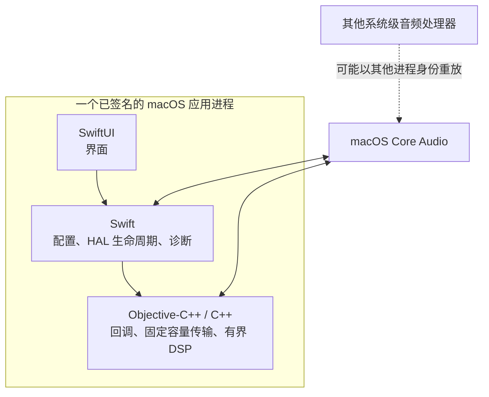
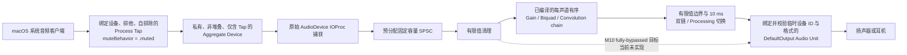
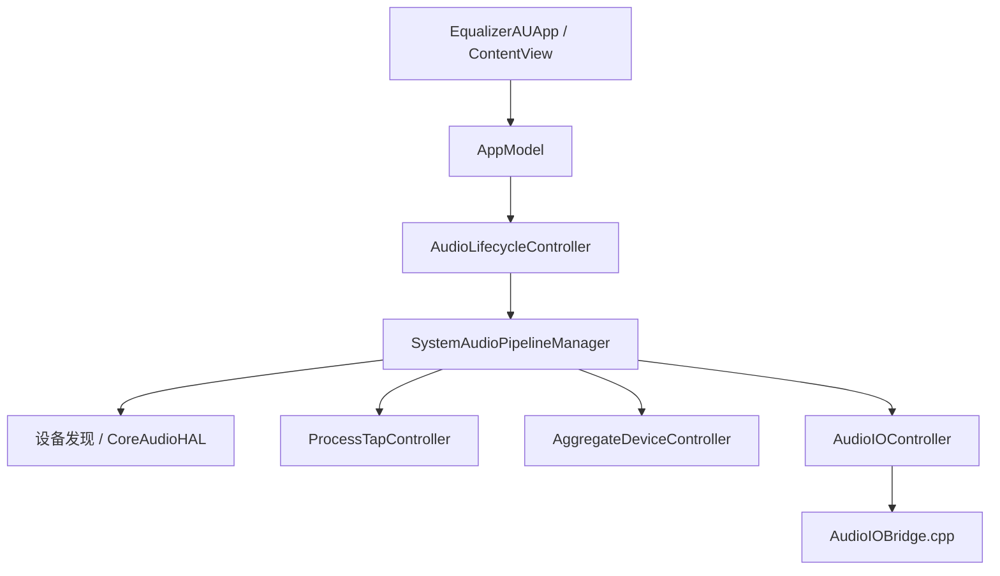
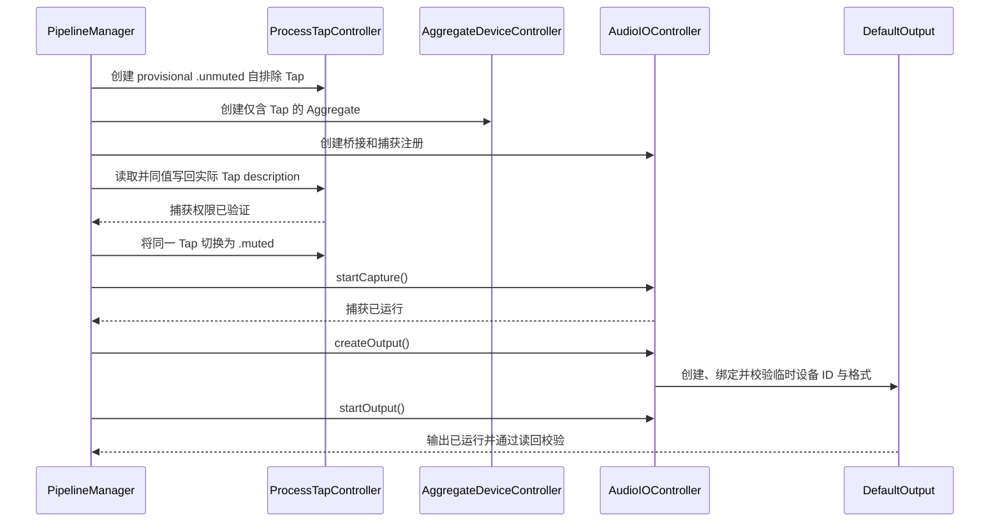
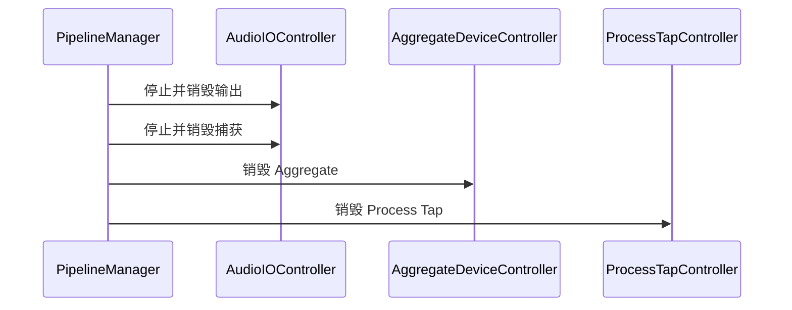
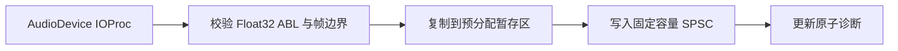
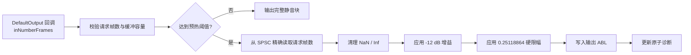
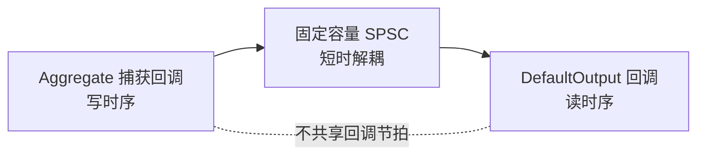
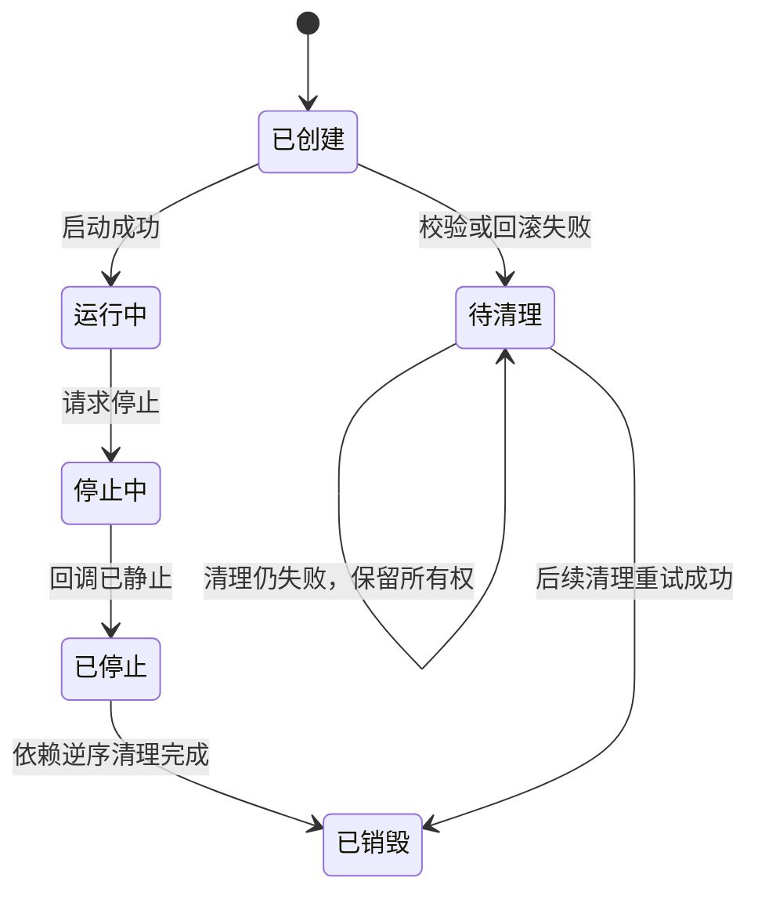

# EqualizerAU 当前架构

本文只描述当前真实实现。产品范围见 [`prd.md`](./prd.md)，决策理由见
[`adr/`](./adr/)，M0 证据见 [`milestones/M0-native-route.md`](./milestones/M0-native-route.md)。
M1 按 <PII type="CASE_ID" id="678"/> 独立编码，不导入、调用或改造 M0 类型和桥接。默认
`EqualizerAU` scheme 现已指向内部 target `EqualizerAUM1`，正式产物为 `EqualizerAU.app`、
bundle ID 为 `com.ruimingchen.EqualizerAU`。M1 正常构建产物位于 configuration 目录的
`M1/` 子目录，Swift 模块名仍为 `EqualizerAUM1`；M0 target 只保留为历史证据，同一构建根中
两者不会覆盖产物。M1 已实现运行时、原生音频宿主、可靠配置和桌面编辑界面，并已通过
用户明确执行和报告的 M1.4 真实音频验收；详细证据边界记录在 M1 里程碑文档中。

### M1 独立实现边界

`EqualizerAUM1Runtime` 提供正式 C ABI v3、有限值 Gain/Biquad/Convolution chain、10 ms 双槽切换、Prepared
发布和退休回收；`EqualizerAUM1` 独立拥有原生 Tap、Aggregate、捕获、输出和代次生命周期。
配置层使用有序的 typed processing-node 快照以及版本化规范 JSON。schema v8 当前包含
非 DSP 的 Channels 作用域节点，以及 Preamp、任意频率控制点 Graphic EQ 和 Convolution 效果节点：
启用的 Channels 选择后续效果的目标声道，直到下一个启用的 Channels 节点覆盖；停用的 Channels
不改变作用域，所有节点的 `isEnabled` 均由 typed 字段持久化，效果节点不重复保存声道字段。
schema v1 读取时按有效作用域
变化确定性插入 Channels 节点，保留原 Preamp UUID/顺序，并以确定性加盐避开任何已有 UUID；
下一次 Save 写出 v8；schema v2/v3/v4/v5/v6/v7 也会在读取后规范化为 v8，其中旧版 Channels 缺省迁移为
启用，schema v3-v5 的固定 15 段 Graphic EQ 在按旧契约严格验证后逐点迁移；schema v6 的
20...30 kHz 点原样保留；schema v4-v7 的 Convolution `storageID` 确定性映射为现有历史
sidecar 的绝对路径，迁移不读取或删除文件。编码结果按键排序、可读格式、
数据上限为 `4 MiB`。设备无关校验不依赖输出布局。

输出声道标识优先采用设备 `preferred channel layout` 的标准 speaker labels；布局未标注的声道再由
`preferred channels for stereo` 明确指定的设备声道补充 `L`/`R`，其余保持稳定的 1-based 数字标识，
界面显示为 `Channel N`。DSP resolver 始终接受 1-based 数字作为同一物理声道的兼容别名，避免
布局语义变完整后使旧配置失效；不根据总声道数推断 5.1/7.1 顺序。应用启动、停止、保存及重新激活时可
被动刷新默认输出布局，此发现不创建 Tap/Aggregate 或启动音频。

Convolution 配置保存用户选择 WAV 的标准化绝对源路径，不复制、移动、删除或监听外部文件。
Add/Replace 只修改草稿引用；Start、运行中 Save、路线重建和输出格式恢复在 detached 控制路径
重新读取 1...64 声道、8...768 kHz 的 RIFF/WAVE linear PCM 8/16/24/32 或 Float32，不设置文件
字节数、时长、单 kernel taps 或所有实例总 taps 上限。loader 拒绝非普通文件、损坏结构、空音频、
不支持编码、非有限和 subnormal samples，且不执行 IR SRC；源采样率与输出偏差超过 1 Hz 时节点
旁路并显示 source/target 原因。严格超过 30 秒的 IR 继续加载，同时显示非阻塞性能下降警告
（2026-08-04 由 8 秒上调，依据 M1 Release dense probe）；
Builder 仅在 Runtime stage 中逐声道去除末尾精确零值，不改变源文件帧数或任何非零 tap。
单声道 IR 广播，多声道 IR 必须与当前有效 Channels 作用域严格等宽并按作用域顺序映射。
文件不可用、不可读、损坏、不支持、采样率或声道不匹配时，该节点在对应 Prepared 中有效旁路并
产生 owned diagnostic，配置 `isEnabled` 不变；下一次生效重新尝试。schema、stage、整数表示和
Prepared 动态分配错误仍整批失败。没有可发现输出时 Save 只做设备无关结构校验，资源读取延后到
真正得到布局的生效边界。

Graphic EQ 保存 `0...512` 个按频率严格升序的正有限频率控制点，不设输入频率上限，gain 为
`-24...+24 dB`。Builder 先排除 20 Hz...20 kHz 之外的点，再用域内点按对数频率插值；域外点
只保存，不参与目标或 FIR 设计。没有域内点时不生成 stage，域外目标为 `0 dB`，有限 FIR 在边界外
的自然过渡不做硬切。Builder 在 detached 控制路径按真实采样率生成 16,384-tap minimum-phase FIR，执行
完整单边 cosine taper、Float32 有限值检查和 subnormal 清零，并通过 ABI v3 convolution 发布。
目标与编译响应在 40 Hz...18 kHz 内域超过 `0.75 dB max / 0.1 dB p99` 时产生节点归属诊断；
20...40 Hz 和 18...20 kHz 的边界过渡仍由双曲线公开显示。编辑器只暴露任意点
模型，使用只读 target/compiled 曲线、独立 Select 列、有边框 Frequency/Gain 表格与
Import/Export/Invert/Normalize/Reset 工具；所有表格编辑在弹窗关闭时一次提交。

Runtime ABI v3 的 Convolution stage 引用 Prepared 中的 planar taps。Graphic EQ FIR 与 WAV IR
共同使用该 stage；每个 kernel 前 256 taps 逐样本 Float64 direct FIR，余下 tail 按
`256×1 @ 256`、`512×≤4 @ 512`、`2048×≤8 @ 2560`、`16384×N @ 18944` 分段，使用
Accelerate Float64 packed-real FFT 与 deadline-distributed MAC。调度由累计 sample cursor 的
256-sample quantum 驱动，与 callback 分块无关，保持第 0 帧响应和零算法延迟。相同 taps 共享
immutable FFT setup/spectra；每个声道、stage 和 execution slot 的 history、job 与 timeline 独立。
所有 taps copy、FFT setup、频谱和状态分配在 control path 完成，callback 只执行预分配 vDSP 和
array 运算。单 Prepared 最多 8 个 Convolution stages，但不限制每个 kernel 或所有实例 taps 数量；
`uint32_t tapCount` 无法表示、非法 taps、未引用 descriptor 或动态分配失败均在发布前失败并保留
旧活动链。normal/pending/bypass publication 使用 build-then-commit，只有 inactive slot 完整构建后
才交换 owner/generation/ticket。WAV taps 每次生效重新生成并由 Prepared 持有，不使用跨生效长期缓存。

`M1ConfigurationStore` actor 串行化完整快照提交。它通过同目录临时文件、文件同步、原子
替换和目录同步维护 `config.json` 与上一版完整 `config.previous.json`；首次创建和 Repair
先建立 previous，再建立主文件。首次创建配置目录时同步其父目录，bootstrap 尝试清理本 store
命名空间内的遗留临时文件，并区分主文件损坏、缺失和 I/O 失败；从 previous 成功恢复会
保留显式恢复来源。主文件替换后的最终目录同步失败会保留唯一候选和代次，bootstrap 使用
代次 `0`，不确定结果继续携带首次建立或 previous 恢复来源，且只允许对同代次执行目录同步
Retry。应用进程只装配一个 production store，不提供跨进程写盘仲裁；产品 Info.plist 禁止
LaunchServices 多实例，SwiftUI 使用唯一 `Window` scene，重复打开只激活或恢复主编辑窗口。

`M1ProductController` actor 是 M1 的产品控制边界。它分别维护草稿修订、配置提交代次和
音频桥接代次；编辑只改变会话草稿，Save 先针对一次发现得到的真实布局在 actor 外构建，
再持久化不可变候选，最后才向仍匹配的运行桥发布 Prepared 状态。没有输出时仍保存并进入
等待输出，显式 Retry、Start 或下一次 Save 各只执行一次发现。Stop 可越过 Start 和发布，
不会取消已接纳提交；过期发布收敛为已保存待启动。

`M1SystemAudioLifecycleMonitor` 在独立串行队列监听默认输出、设备列表、当前默认设备的
alive/sample-rate/stream-layout 属性以及系统 sleep/wake。默认设备监听以临时
`AudioObjectID` 和持久 UID 联合标识，重绑定在新监听完整建立后才移除旧监听；失败按
250 ms、1 s、1 s 最多重试三次，耗尽后向产品层发布明确的 monitoring failure。设备列表
变化只有在默认输出联合身份实际变化后才成为恢复事件；Tap/Aggregate 生命周期导致的
默认输出身份不变的列表变化不会触发自恢复。首次重绑定失败会保留旧身份，待重试成功后
再完成分类。产品恢复
保留显式 Start/Stop 与配置提交语义：只有先前运行意图存在时自动恢复，每批最多三次，
恢复中事件合并为一次后继恢复，睡眠期间禁止启动，权限错误和预算耗尽会停止自动重试。

`M1EditingSession` 保存异构有序节点、多选、焦点和锚点，并提供批量删除、组移动、Option-copy、
typed 剪贴板和 Undo/Redo。剪贴板沿用规范 JSON 和 `4 MiB` 限制；Undo 与 Redo 合计最多
30 条、规范载荷合计最多 `64 MiB`，按跨栈单调序号淘汰最旧记录。连续增益手势只合并同一
节点的更新，其他编辑形成独立历史步骤。草稿与独立已保存基线按语义比较，历史淘汰不改变
未保存判断。

主窗口只暴露一个 Processing 控件。停止状态下开启会使用已保存配置启动路线。运行中关闭的
**目标合同**是以 10 ms wet→dry 淡出后停止全部 wet DSP，只保留 `采集 → finite sanitize → 输出`
的应用内直通；Tap、Aggregate、Audio Unit 和 Runtime handle 不销毁。重新开启时保持 dry，在控制
线程按 `runtimeBaseline.nodes` 构建并安装 fresh Prepared 后再 10 ms 淡入，不恢复缺失输入历史的
旧状态。Accepted [`ADR-0018`](./adr/0018-computational-processing-bypass.md) 已将该目标实现为
callback dry fast path、block-boundary ack 与 fresh Prepared 冷恢复。

ADR-0018 computational bypass 和 ADR-0019 Float64 deadline-distributed 多级卷积均已完成
hostless/Release/签名候选和用户真实音频验收，M10 已完成并关闭。真正的 Start/Stop 位于
高级 Audio 命令，用于生命周期和恢复。Runtime 已应用的效果状态独立于草稿记录，失败的
持久化或 Runtime 切换不会让 Processing 控件冒充成功。效果切换随后以最近一次成功保存的
节点链提交完整快照；
Save 期间的多次切换只保留最新成功应用的意图。退休维护把 pending 配置代次提升为 active，
产品层在提升前分别保留活动与期望诊断。明确 Quit 关闭新命令接纳，等待 bootstrap、Save、
Retry、音效后继提交和已接纳编辑到达终态，再按节点、音效、组合或持久化不确定状态进入
对应的 Save、Discard、Retry、Exit 或 Cancel 分支；只有批准退出后才按依赖顺序停止路线。
关闭最后一个窗口本身不终止进程，退出取消或失败会恢复编辑窗口。

音频宿主和 Runtime 通过 lock-free 原子计数器记录捕获/渲染帧、欠载、溢出、积压丢帧、
无效回调、重叠回调、非有限输入和有限值饱和。产品只在控制线程显式读取快照并展示当前值。
`verify-m1-realtime.sh` 对 29 个明确列出的回调和实时 helper 做源码审计，并检查同两个实现
文件中按裸函数名直接调用的本地 helper 是否也在审计集合中；审计拒绝常见分配入口、锁、
等待、日志、文件/网络 I/O、dispatch、Objective-C 消息和异常。它是保守的源码回归门禁，
不宣称解析 C++ 重载、头文件内联调用或提供编译器/二进制级证明；启动前能力检查同时要求
宿主与 Runtime 使用的原子类型在当前平台 lock-free。

## 1. 系统边界

选定路线不包含 helper、daemon、XPC、捆绑驱动或必需的虚拟音频设备。
本进程自排除只排除由本进程直接拥有的输出；其他系统级音频处理器若捕获后以
另一个进程身份重放，仍可能被本应用的 Tap 捕获。

## 2. 原生音频拓扑

启动构建期间，实际路线 Tap 先以 `.unmuted` 创建；捕获 IOProc 注册后，在同一 Tap 上完成权限
探测并切换为 `.muted`，之后才启动捕获。捕获必须先启动，之后才创建输出 Audio Unit。这是
权限失败时保留原声及自排除拓扑的功能条件，不是性能优化。

## 3. 模块职责

| 模块 | 当前职责 |
|---|---|
| `EqualizerAUApp`、`ContentView` | 提供单一主窗口，展示 Save、Processing、通用可展开节点行、上下文状态和高级诊断入口，不直接拥有 Core Audio 对象 |
| `AppModel` | 把用户命令转换为生命周期操作，发布状态和错误，阻止互相冲突的操作 |
| `M1SystemAudioLifecycleMonitor` | 监听系统设备、当前默认输出属性和 sleep/wake，以持久 UID 复核监听身份并执行有界重绑 |
| `CoreAudioHAL` 与发现类型 | 集中读写 HAL 属性，区分持久 UID 与临时 `AudioObjectID`，解析有界格式 |
| `ProcessTapController` | 翻译本进程身份，创建并校验设备绑定的自排除 Tap，管理所有权令牌和回滚 |
| `AggregateDeviceController` | 创建仅含 Tap 的私有 Aggregate，设置漂移补偿，校验实际格式和帧容量 |
| `AudioIOController` | 管理桥接、捕获和输出的分阶段生命周期，硬校验输出临时设备 ID 与格式 |
| `SystemAudioPipelineManager` | 把设备、Tap、Aggregate、捕获和输出组成同一代次事务 |
| `AudioLifecycleController` | 串行化启动与停止，合并重复停止，向应用层发布生命周期状态 |
| `AudioIOBridge.cpp` | 拥有实时回调、预分配存储、SPSC、固定 DSP 和原子诊断 |

## 4. 生命周期

### 4.1 启动

### 4.2 停止与清理

若上游资源清理失败，其依赖资源必须保留，供下一次停止操作重试。

### 4.3 系统变化与恢复

设备、默认输出、采样率、布局和 Core Audio 服务变化会先停止旧路线，再按最近一次运行基线
重新发现和启动。一次恢复最多尝试三次；恢复中的重复事件只形成一次后继恢复。显式 Stop、
Quit 或 sleep 通过 generation token 使在途 Start、output-layout 读取和退避失效，旧操作不得
重新发布 running 投影。sleep 只停止，wake 才恢复；捕获权限被拒绝时不自动重试，并展示
系统设置入口。系统设备列表变化先重新读取默认输出联合身份，身份未变时不重建路线，避免
应用自身创建或销毁 Aggregate 形成恢复反馈环。

当前输出的 nominal sample rate、stream configuration、preferred channel layout 或 preferred stereo
channels 变化使用独立
的格式恢复路径。停止旧路线后最多读取输出快照 6 次、间隔 50 ms；只有连续两次临时 ID、
持久 UID、采样率、布局和最大帧容量全部一致才创建 Tap。若事件携带的设备身份已不是当前
默认输出，则降级为普通路线恢复，不把格式恢复策略套用到新设备。同一输出身份的格式恢复
在销毁旧 Aggregate 后保留旧 `.muted` Tap 作为跨代 mute guard；新 Tap、捕获和输出启动后才
按持久 UID 销毁 guard。取消、显式 Stop、sleep、Quit、权限失败或恢复预算耗尽会执行终态
清理；guard 销毁失败保留所有权并进入 cleanup-required。具体决策见
[`ADR 0011`](adr/0011-stable-format-recovery-release.md)。

每次 Start/恢复都会在实际路线 Tap 保持 unmuted 时创建 Aggregate 和捕获 IOProc，但不启动
捕获；随后读取并同值写回该 Tap description，成功后再把同一对象切换为 `.muted`。任一 Tap
属性操作失败都不会启动捕获或输出，并按依赖顺序回滚。应用从其他应用返回前台且路线稳定运行
时，在既有路线 Tap 上再次执行 description 读取和同值写回，不创建临时 Tap，也不改变其
`.muted` 状态。权限拒绝或其他复核错误都会先执行普通路线清理，再进入 permission、waiting
或 cleanup-required 状态。该机制不轮询、不读取私有 TCC，也不根据静音内容推断权限，详见
[`ADR 0012`](adr/0012-runtime-capture-permission-verification.md)。

## 5. 实时数据面

### 5.1 捕获回调

### 5.2 输出回调

`-12 dB` 增益与相同幅值的限幅只用于 M0 路线证明，不代表最终 EQ 或限幅设计。

### 5.3 回调时序边界

捕获和输出属于两个独立回调时序。SPSC 吸收短时调度差异，但当前积压丢帧和欠载
静音策略不构成长稳漂移控制，也不证明两端长期保持相同速率。

## 6. 传输行为

| 条件 | 行为 |
|---|---|
| 启动前 | 一次性确定 SPSC 容量并预分配所有实时存储 |
| 尚未达到预热阈值 | 输出完整静音块 |
| SPSC 欠载 | 整块静音，不输出残留或半块旧数据 |
| SPSC 积压 | 执行有界、可观测的积压修正 |
| 格式恢复的新输出 | priming 后固定静音 50 ms，期间继续消费 SPSC 并推进 DSP；随后在当前块的共同跨零点或有界最小幅值帧释放 |
| 输出回调 | 以 `inNumberFrames` 为准，不以缓冲容量推导工作量 |
| 捕获与输出格式不匹配 | 当前 M0 路线拒绝启动，不做实时采样率转换 |

输出创建前，持久 UID 已用于同一发现代次内的 Tap、Aggregate 和输出快照一致性校验；
DefaultOutput 创建后和启动后只读回校验临时 `AudioObjectID`、ASBD、帧容量和运行状态，
当前没有从 Audio Unit 绑定设备再次读回持久 UID。

## 7. 资源所有权与并发

- Tap、Aggregate 和 IO 资源都携带控制器签发的所有权令牌。
- 所有权令牌只保护同一控制器记录中的对象代次；当同一临时对象 ID 已由控制器登记为
  新代次时，旧令牌不能销毁新代次。
- Tap 与 Aggregate 销毁前从 HAL 重新读取持久 UID；同一临时 ID 已被不同 UID 复用时只释放
  旧代次的本地所有权记录，不销毁新对象。若 UID 无法读取则保留所有权并允许重试。
- Tap 创建后若首次 UID 读取和立即回滚销毁同时失败，会保留 unknown-identity pending
  ownership；后续不得仅凭临时 ID 销毁该对象。
- 普通路线仍只允许一个 active Tap；同一输出身份的格式恢复只允许“一个已验证旧 guard +
  一个后继代次 Tap”的受限重叠。guard 同时记录来源 bridge generation，使迟到维护回调只能
  清理其拥有的 guard，不能停止已接管的新路线。
- 创建成功但校验失败时，控制器保留按令牌标识的待清理资源。
- 每个 IO 资源使用操作状态阻止重入的创建、启动、停止和销毁。
- 异步诊断返回前重新校验运行代次和所有权；停止期间的旧快照返回空值。

## 8. 实时约束

| 回调内允许 | 回调内禁止 |
|---|---|
| 预分配存储 | 堆分配和容器扩容 |
| 原子操作 | 锁、信号量、actor 跳转和等待 |
| 有界循环 | 日志、字符串和错误对象构造 |
| 有界 `memcpy` / `memset` | 文件、网络和配置 I/O |
| 有限标量 DSP | 动态图、FFT 初始化和滤波器构造 |

控制层可以异步复制诊断快照，但实时回调绝不等待控制层。

## 9. 诊断

M1 桥接层通过原子计数器发布捕获和渲染帧、欠载、溢出、积压丢帧、无效与重叠回调；
Runtime 另行发布非有限输入、有限值饱和、无效处理调用和重叠处理计数。控制层读取前后均
复核运行代次与所有权，停止后不沿用旧快照。

DEBUG 版本可在控制层写入 JSONL 和有界 WAV/JSON 证据。cold nonce probe 是
独立的来源归因工具，不参与正常处理；M0 成功后仅在出现隔离异常时使用。

## 10. 未启用的 BlackHole 后备路线

该实现具备设备识别、默认路由事务、恢复日志、捕获先行启动、淡出和可重试清理，
但不是当前路线，也不要求安装。若未来启用，虚拟设备与物理设备的独立时钟要求
成熟的可变速率 SRC 和漂移控制。

## 11. 当前限制

- 只有短时真实音频验证，没有长期稳定性结论。
- 其他系统级处理器可能以不同进程身份重放本应用输出；当前没有运行期共存检测或隔离保证。
- 设备切换、采样率/布局变化、sleep/wake 与 Core Audio 服务事件已有 hostless 状态机和故障
  注入覆盖；真实硬件和 `coreaudiod` 交互仍待人工验收。
- 不提供实时 SRC；格式不兼容时拒绝启动。
- 输出绑定后的身份读回只校验临时 `AudioObjectID`，尚未再次校验持久设备 UID。
- 输出 Audio Unit 仍只读回临时设备 ID 与格式；Tap/Aggregate 销毁和生命周期 monitor 已使用
  持久 UID 防止临时 ID 复用造成误销毁或错误监听。
- 正式产品入口已切换到独立 M1 target；M0 应用和测试 target 只保留为历史证据，不属于
  默认 scheme，也不参与 M1 构建。
- M1 的窗口、编辑命令、拖拽修饰键和 AppKit 退出提示已完成静态构建及 hostless 状态机验证，
  但未执行 hosted 自动化验收。
- M2 Graphic EQ 已完成 hostless 数值、状态、发布和产品层验证，但尚未执行 hosted GUI 或真实
  音频验收。
- M3 Convolution 的历史 sidecar、SRC 与固定容量契约已分别被 M8 source-path 和 M10
  原采样率/长度自由契约取代；当前文件选择器、GUI 与真实音频证据以 M8/M10 milestone 为准。
- M4 已完成设备/服务事件监听、有界恢复、格式稳定确认与恢复输出释放、启动及运行期权限门禁、
  sleep/wake、权限提示和持久 UID 所有权复核的 hostless 实现；格式恢复听感已通过人工复测，
  冷启动拒权已通过人工复测；系统设置未使当前进程授权失效时，运行路线保持正常也已按平台
  行为验收。设备切换、sleep/wake 和服务重启仍以对应 milestone 的人工证据为准。
- 用户已按 M1.4 完整人工脚本报告真实音频、重复启停、持久恢复和 30 秒实时计数增量验收通过；
  该报告是整体结论，未附设备型号或逐项原始计数。
- 应用退出后处理停止。
- BlackHole 未被选择和安装，因此没有真实设备证据。

## 12. 源码位置

| 路径 | 内容 |
|---|---|
| `EqualizerAU/App/` | SwiftUI 应用和应用状态 |
| `EqualizerAU/Audio/` | HAL 控制、生命周期、诊断和 Swift 包装 |
| `EqualizerAU/Audio/AudioIOBridge.*` | Objective-C++ 实时桥接和 DSP 边界 |
| `EqualizerAUTests/` | 单元测试和确定性失败/竞态测试 |
| `EqualizerAUIntegrationTests/` | 不启动音频的真实 HAL 测试 |
| `EqualizerAUM1Runtime/` | M1 独立实时库与正式 C ABI |
| `EqualizerAUM1/Audio/` | M1 独立原生音频宿主、路线与生命周期 |
| `EqualizerAUM1/Configuration/` | M1 typed 配置、Builder、规范 JSON 与可恢复持久化 |
| `EqualizerAUM1RuntimeTests/` | 不加载应用宿主的 M1 Runtime、配置和故障注入测试 |
| `docs/` | 需求、架构、ADR 和里程碑 |
