# M0 里程碑：原生系统音频链路

> **最终状态**：原生短时验证通过（`NATIVE_SHORT_PROOF_PASS`）
>
> 本文是 M0 范围、实验过程、发现、证据、结论和延期事项的唯一事实来源。
> 产品需求见 [`../prd.md`](../prd.md)，当前实现见
> [`../architecture.md`](../architecture.md)，路线决策见
> [`../adr/0001-native-process-tap-route.md`](../adr/0001-native-process-tap-route.md)。

## 1. 里程碑问题

M0 只回答一个边界清楚的问题：

> 一个原生 macOS 应用进程能否捕获系统混音，通过实时安全路径处理，再重放到
> 选定物理设备，并在不依赖虚拟音频驱动的情况下正常停止？

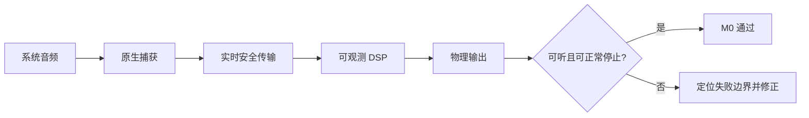

M0 不包含用户可调 EQ、长期稳定性、设备变化恢复、后台服务、helper、IPC 或
生产级 SRC。这些事项不影响短时可行性结论。

## 2. 最终路线

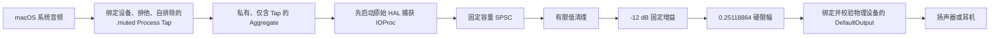

## 3. 最终结果

| 证据 | 结果 |
|---|---|
| 完整原生生产链 | 最新 Debug 版本成功运行 |
| 用户首次结果 | “效果明显！且无故障” |
| 重复启停 | 同一进程完成三次“启动 → 停止”循环 |
| 用户重复启停结果 | “效果明显，试验成功” |
| DSP 路径归因 | 明显固定 `-12 dB` 效果支持音频经过捕获、SPSC、DSP 和重放 |
| 最终短时异常 | 未报告静音、双音、反馈或控制层故障 |
| 路线选择 | 选择同设备原生路线；BlackHole 保留为未启用后备路线 |

### 证据边界

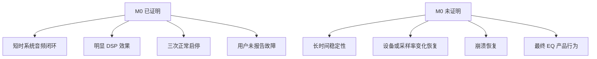

最终人工验证没有采集新的回调、欠载、溢出或长时计数，因此本文不虚构这些数据。

## 4. 工作包完成情况

| 工作包 | 结论 |
|---|---|
| 已签名 macOS 宿主与 HAL 基础 | 完成 |
| Process Tap 与私有 Aggregate 生命周期 | 完成 |
| 预分配实时桥接与固定 DSP | 完成 |
| 自排除、捕获先行的完整原生链 | 完成 |
| 资源所有权、回滚、并发与过期句柄防护 | 完成 |
| 自动化与不启动音频的真实 HAL 证据 | 完成 |
| 短时真实音频验证与三次启停 | 完成 |
| cold nonce 来源归因 | 仅保留为异常诊断 |
| BlackHole 虚拟路线 | 已实现后备方案，未选择 |
| 长稳、设备矩阵、SRC、崩溃恢复 | 延期 |

## 5. 自动化基线

| 检查 | 最终结果 |
|---|---|
| 完整测试 | 122 个通过，0 个失败，0 个跳过 |
| 真实 HAL / 不启动音频的集成测试 | 8 个通过 |
| 测试结果包 | `.build/DerivedData/Logs/Test/Test-EqualizerAU-2026.07.18_22-57-43-+0800.xcresult` |
| 代码签名 | 严格校验与指定要求通过 |
| Plist | `project.pbxproj` 与 `Info.plist` 校验通过 |
| 实时静态审计 | 捕获与渲染回调通过 |
| 独立审查 | 最终只读审查未发现严重、高危或中危问题 |

## 6. 实验演化总览

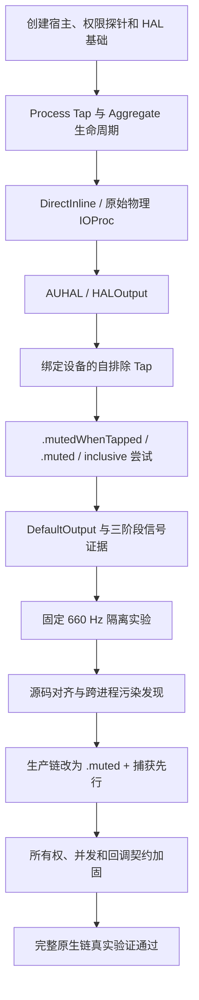

## 7. 阶段记录

### 7.1 宿主、权限和 HAL 基础

| 阶段 | 关键结果 |
|---|---|
| M0-01 应用宿主 | 工程、测试宿主、签名和元数据建立 |
| M0-02 权限与 Tap 探针 | 首次完整链请求权限；普通播放产生非零 Tap 数据 |
| M0-03 HAL 基础层 | 属性读写、结构化错误、失败注入和代次语义集中实现 |
| M0-04 默认输出快照 | UID、临时对象 ID、采样率、声道和帧容量形成一致快照 |
| M0-05 Tap 生命周期 | 自进程翻译、Tap 创建、格式读回、销毁与真实 HAL 循环通过 |
| M0-06 Aggregate 生命周期 | 私有 Aggregate 创建、格式读回、清理和真实 HAL 拓扑通过 |

早期一次普通播放观测到 1539 次 IOProc 回调、787968 帧和 547628 个非零样本，
证明权限与 Tap 输入成立；它不证明重放链路成立。

### 7.2 失败路线与边界定位

| 路线 | 实际结果 | 处理 |
|---|---|---|
| Aggregate `DirectInline` | 启动后静音，停止时出现高幅瞬态 | 冻结，不再运行 |
| Tap-only Aggregate + 原始物理输出 IOProc | 启动后仍静音，停止时再次出现高幅瞬态 | 否决原始物理 IOProc 输出 |
| AUHAL + 全局 Tap | 出现持续高幅重复信号，符合正反馈 | 改为绑定设备并排除本进程 |
| 绑定设备、`.unmuted`、低增益 | 音乐可听、无静音和停止瞬态，但原流仍叠加 | 只证明捕获、传输和输出，不证明替换 |
| `.mutedWhenTapped` 排他替换 | 原流被抑制，但处理流不可听 | 失败 |
| `.muted` 排他替换 | 完全静音 | 失败，但当时生命周期仍未与参考实现一致 |
| inclusive 进程快照 Tap | 回调和非零样本完整，硬件仍不可听 | 放弃动态进程快照路线 |
| current-default `DefaultOutput` | Apple 输出缓冲存在非零处理数据，硬件仍不可听 | 继续定位 Tap/输出生命周期交互 |

### 7.3 三阶段信号证据

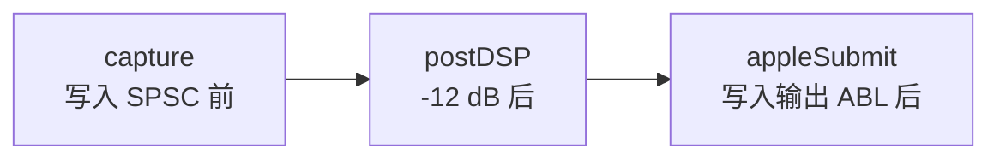

| 阶段 | 峰值 | 均方根 | 主频 | 结论 |
|---|---:|---:|---:|---|
| capture | `0.9599329` | `-9.802701 dBFS` | `492.1875 Hz` | 真实源音频存在 |
| postDSP | `0.24112424` | 约 `-21.78177 dBFS` | `492.1875 Hz` | 固定 `-12 dB` 处理正确 |
| appleSubmit | `0.24112424` | 约 `-21.78177 dBFS` | `492.1875 Hz` | 与 postDSP 一致 |

该证据排除了 Tap 输入、SPSC、固定 DSP 和输出 ABL 数据错误，但不能替代扬声器或
硬件环回测量。

### 7.4 Audio Unit 静音标志修正

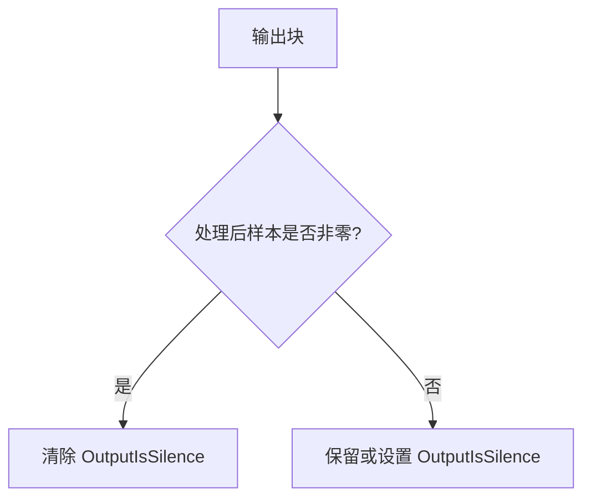

该修正符合 Apple 合约，但后续低音量复测仍静音，因此静音标志不是根因。修正被
保留，根因搜索转向 Tap 语义和生命周期。

### 7.5 固定 660 Hz 隔离实验

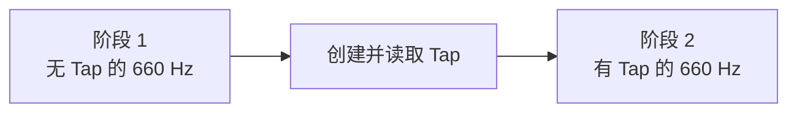

| 观察 | 数值或结果 |
|---|---|
| 两阶段软件提交 | 各 94 次回调、48000 帧、95996 个非零样本、故障标志 0 |
| Tap 稳定等待 | 750 ms，计数持续增长 |
| 听感 | 第二声被感知为明显缩短 |
| Tap 非零计数 | 74214，但没有波形、频率或来源归因 |

原结论曾认为这些数据证明自重捕获，后来被撤回。非零计数没有来源信息；两阶段
实验还混合了不同 mute 语义和不同输出创建顺序。

### 7.6 旧 Resonance 对齐实验为何无效

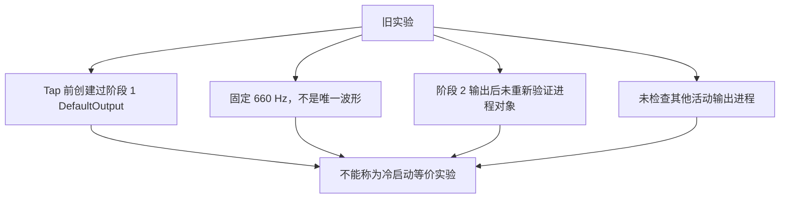

旧会话 `c6db8f3c-bbed-45b6-b1de-bd6795bdfdd2` 记录了：

| 检查 | 结果 |
|---|---|
| 无输出基线 | 12800 帧、零丢失、`-160 dBFS` |
| 活动窗口 | 62464 帧、零丢失、峰值约 `0.02` |
| 660 Hz 幅值 | 约 `0.01891`，比基线高 `125.533 dB` |
| 听感 | 只听到一声，无法判断属于哪一阶段 |

这些数据证明活动窗口存在强 660 Hz 能量，但不证明进程来源，因此不再参与路线否决。

### 7.7 跨进程转发污染

源码和本机检查确认：关闭 Resonance GUI 不会自动停止 `resonanced`。本机曾观测到
GUI 已退出，但 `resonanced` 仍由 PID 1 管理并运行约 1 天 19 小时。两边的自排除
均可能正确，EqualizerAU 仍会合法捕获由 `resonanced` 转发的副本。

这解释了早期“Resonance 可用，但 EqualizerAU 检测到重捕获”的表面矛盾。之后的
实验要求显式停止 Resonance daemon，并在目标设备上检查活动输出进程集合。

### 7.8 cold nonce 诊断

该诊断只在未来出现来源异常时运行，不是当前路线门槛。

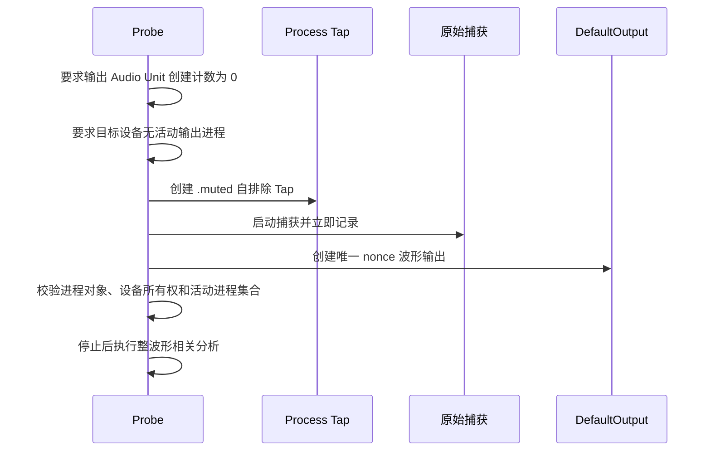

nonce 为随机种子的 `+1/-1` 相位码，使用 660 Hz 载波、10 ms 码片、峰值 `0.02`。
判定要求：

| 条件 | 门槛 |
|---|---:|
| 归一化相关系数 | `>= 0.75` |
| 估计增益 | `>= 0.05` |
| 比较覆盖率 | `>= 90%` |

进程身份变化、输出所有权不符、出现其他活动输出进程、故障、丢帧、覆盖不足或格式
不匹配都产生“不确定”或直接拒绝，不输出路线结论。

## 8. 最终生产路线修正

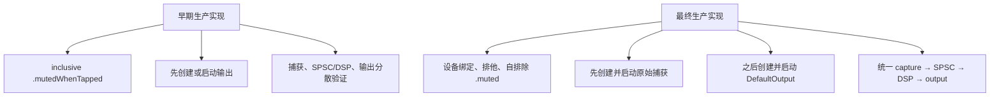

最终修正后，M0 不再依赖独立探针推断完整链；用户直接运行完整生产数据面并听到
明显固定处理效果。

## 9. 资源与并发加固

这些修改不是新的产品架构，而是确保停止失败不会留下持续静音资源。

| 问题 | 最终措施 |
|---|---|
| Tap/Aggregate 校验后回滚失败 | 控制器保留按所有权令牌标识的待清理资源 |
| 控制器内对象代次复用同一 HAL ID | 销毁前同时校验对象 ID 与控制器签发的所有权令牌；不证明控制器外失效后的 UID 身份 |
| 启停 actor 重入 | 管理器和生命周期控制器显式占用操作阶段 |
| 直接并发停止/销毁 | 每个 IO 资源使用独立操作状态拒绝重叠操作 |
| 旧资源访问原生桥接 | IO 状态按令牌索引，并校验桥接指针 |
| 停止期间返回旧诊断 | 返回前重新校验代次、阶段和所有权 |
| 输出设备或格式偏移 | 创建后和启动后硬校验组件、设备、ASBD、帧容量和运行状态 |
| 回调误用缓冲容量 | 使用 Core Audio 传入的 `inNumberFrames` |

多轮独立只读审查发现的严重、高危和中危问题均已修复；最终审查未发现同等级问题。

## 10. BlackHole 后备路线

BlackHole 路线已实现自动化基础，但未被选择，也未安装或运行真实设备验证。

| 能力 | 自动化状态 |
|---|---|
| 精确 UID、型号、名称、厂商和虚拟传输校验 | 通过 |
| 双默认选择器事务与写后读校验 | 通过 |
| 路由前输出和捕获预检 | 通过 |
| 激活失败回滚与 compare-and-restore | 通过 |
| 版本化恢复日志 | 通过 |
| 捕获先行、淡出停止和可重试清理 | 通过 |
| 真实 BlackHole 设备运行 | 未执行，设备未安装 |

### 后备路线约束

- 只兼容官方 BlackHole 2ch。
- 预期 UID 为 `BlackHole2ch_UID`，型号 UID 为 `BlackHole2ch_ModelUID`。
- 应用和自动化 Agent 不得下载、安装、删除或更新驱动。
- 不得使用 `sudo`、写入 `/Library`、重启 `coreaudiod` 或手工创建多输出设备。
- 恢复日志路径为
  `~/Library/Application Support/EqualizerAU/audio-route-recovery.json`。
- 恢复记录只保存持久设备 UID，不保存临时 `AudioObjectID`。
- 虚拟设备和物理设备时钟独立；长期使用前需要成熟的可变速率 SRC 和漂移控制。

官方来源：<https://github.com/ExistentialAudio/BlackHole>、
<https://existential.audio/blackhole>。

## 11. 关键发现与处置

| 早期设计或结论 | M0 发现 | 最终处置 |
|---|---|---|
| 同设备 Process Tap 已失败，必须使用 BlackHole | 旧证据没有建立进程来源 | 撤回；原生路线通过 |
| 生产 Tap 应使用 inclusive `.mutedWhenTapped` | 工作路线是设备绑定、排他、自排除 `.muted` | 替换生产语义 |
| 输出可先于捕获创建或启动 | 生命周期顺序影响进程归属和自排除 | 固定为捕获先行 |
| 分别验证捕获、DSP 和输出即可 | 分段成功不能代替完整闭环 | 合并为一条生产链验证 |
| 当前默认输出应使用 HALOutput | 成熟实现对当前默认设备使用 DefaultOutput | 改为 DefaultOutput 并硬校验 |
| 关闭 Resonance 窗口即停止处理 | `resonanced` 可能继续运行并转发音频 | 干净实验必须显式停止 daemon |
| 重复冷诊断需要 helper 或 daemon | 删除进程历史只能重启应用 | 不增加架构，严格诊断使用新进程 |
| BlackHole 是当前前置条件 | 原生路线已通过 | 后备路线不安装 |
| M0 必须包含长稳、设备矩阵和 SRC | 这些不回答短时可行性 | 延期到产品需要时 |

## 12. 当前结论与下一步

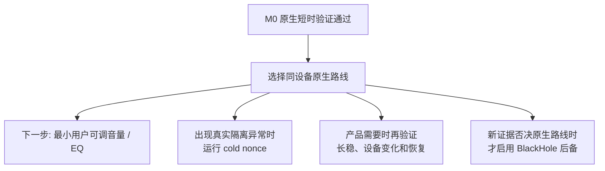

| 门槛 | 状态 | 后续动作 |
|---|---|---|
| 同设备原生短时证明 | 通过 | 保持当前路线 |
| 三次启停循环 | 通过 | 不再增加 M0 重复实验 |
| cold nonce | 可选诊断 | 仅在来源异常时运行 |
| BlackHole 安装 | 未选择 | 当前不要安装 |
| 最小 EQ 参数 | 下一阶段 | 替换固定验证增益 |
| 设备变化和崩溃恢复 | 延期 | 产品需要时验证 |
| 30 分钟和 2 小时稳定性 | 延期 | 不属于短时 M0 |

M0 到此关闭。后续文档不得用历史失败覆盖本文顶部的最终结论。
