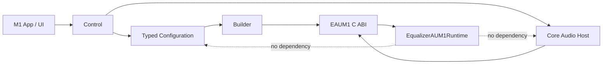
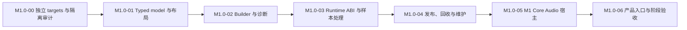

# M1.0 运行时内核

| 属性 | 内容 |
|---|---|
| 状态 | 已完成（M1.0-00 至 M1.0-05） |
| 父里程碑 | [`M1 处理链基础`](M1-processing-chain-foundation.md) |
| 主要 ADR | [`0001`](../adr/0001-native-process-tap-route.md)、[`0002`](../adr/0002-single-process-native-architecture.md)、[`0003`](../adr/0003-prepared-dsp-chain-publication.md)、[`0006`](../adr/0006-independent-m1-implementation.md) |
| 参考实现 | [`EqualizerAPO`](../../../EqualizerAPO/)；只读参考，不复制源码或接口 |

## 1. 目标

M1.0 建立可以独立测试的 M1 音频运行时内核。它交付 M1 自有的模块、C ABI、资源所有权、
typed Preamp 编译、实时处理、完整代次发布和安全回收边界，但不交付持久配置或完整编辑器。

M1.0 完成不代表 M1 完成，也不触发正式产品身份切换。所有自动化默认不启动真实音频；
真实音频仍只在 M1.4 且用户明确执行时验收。

## 2. EqualizerAPO 对齐基线

本地 EqualizerAPO 的有效设计是：配置在非实时阶段按顺序解析，由 factory 创建并初始化
滤镜，完成路由和内存准备后形成可运行配置；平台 APO 宿主只把音频块交给该配置处理。
运行中重新加载时先构建完整候选，不原地修改当前滤镜结构。

M1.0 学习该设计，而不是学习其 Windows 实现细节：

| EqualizerAPO 设计 | M1.0 采用方式 |
|---|---|
| 平台宿主与可运行 DSP 配置分离 | M1 app 是 Core Audio 宿主，`EqualizerAUM1Runtime` 是独立实时库 |
| factory / initialize / process 分阶段 | typed model 与 Builder 先校验和编译，Prepared 状态发布后才处理 |
| 系数、路由和 scratch 在处理前准备 | 所有目标、索引、状态和容量在发布前完成分配与校验 |
| 完整候选替换当前配置 | 发布完整 Prepared 代次，不原地修改活动代次 |
| 空配置透明 | 空链、`0 dB`、停用节点和音效关闭满足既有透明合同 |
| 宿主之外可运行 Benchmark | RuntimeTests 不依赖 SwiftUI 或真实 Core Audio |

以下 EqualizerAPO 行为与本项目约束冲突，不采用：

- Windows COM/APO、注册表、设备安装和目录监听；
- 把解析、文件 I/O、watcher、Builder、发布与实时处理集中在单个 `FilterEngine`；
- 共享裸指针、回调中释放信号量以及缺少明确内存序的换代；
- 同时运行两份完整处理图并做整图 crossfade；
- 单行失败后继续发布部分配置；
- 编辑器重复编译运行时源码；
- VST、卷积、Graphic EQ、表达式、Include 和后台滤镜线程。

这些差异分别由 macOS Core Audio、实时回调禁令、候选事务完整性、M1 范围和
[`<PII type="CASE_ID" id="678"/>`](../adr/0006-independent-m1-implementation.md)要求决定。

## 3. 工程与物理边界

### 3.1 Target

M1.0 在现有 Xcode 工程内创建以下独立 target：

| Target | 类型 | 依赖 |
|---|---|---|
| `EqualizerAUM1Runtime` | 静态库 | C++ 标准库、系统原子能力；不依赖 AppKit、SwiftUI、文件或 Core Audio 生命周期 |
| `EqualizerAUM1` | macOS app | 只依赖 `EqualizerAUM1Runtime` 和系统框架 |
| `EqualizerAUM1RuntimeTests` | hostless test bundle | 只链接 `EqualizerAUM1Runtime` |
| `EqualizerAUM1Tests` | M1 app hosted test bundle | 测试宿主仅为 `EqualizerAUM1.app` |
| `EqualizerAUM1IntegrationTests` | M1 app hosted integration bundle | 只执行不启动真实音频的 HAL 验证 |

开发期使用独立 `EqualizerAUM1` scheme 和 `.build/M1DerivedData`。M0 scheme、target membership、
bridging header、bundle 与测试保持不变。M1.2 达到基础产品闭环并通过显式切换门槛前，
不得把正式产品身份或默认发布 scheme 隐式指向 M1。

### 3.2 物理目录

```text
EqualizerAUM1/
  App/
  Configuration/
  Audio/
  Control/
  Resources/
  EqualizerAUM1-Bridging-Header.h
EqualizerAUM1Runtime/
  include/EAUM1Runtime.h
  src/
EqualizerAUM1RuntimeTests/
EqualizerAUM1Tests/
EqualizerAUM1IntegrationTests/
```

M1 target 的 Sources、Headers、Resources、Header Search Paths、Library Search Paths、Other
Linker Flags、Copy Files 和 Test Host 不得引用以下 M0 根或产物：

```text
EqualizerAU/App/
EqualizerAU/Audio/
EqualizerAU/EqualizerAU-Bridging-Header.h
EqualizerAUTests/
EqualizerAUIntegrationTests/
.build/DerivedData/
```

### 3.3 依赖方向



Runtime 不读取 JSON、不解析声道字符串、不访问文件、不调用 Core Audio 生命周期、不构造
UI 诊断。宿主负责把真实布局和 typed 节点编译为已解析的有限每声道目标，再经 ABI 创建
Prepared 状态。

## 4. 模块职责

| 边界 | 责任 | 禁止事项 |
|---|---|---|
| Typed Configuration | `PreampNode`、稳定 UUID、顺序、启用状态、dB、声道选择 | 文件写入、实时状态、M0 类型 |
| Layout Snapshot | 实时 buffer/channel 地址与语义标识一一对应；未知项数字回退 | 按声道数猜位置、持久化 HAL 临时 ID |
| Builder | 完整校验、声道解析、规范求和、有限目标和诊断 | 部分成功、发布、文件 I/O |
| Core Audio Host | Tap/Aggregate/capture/output 生命周期和 callback 适配 | DSP 构建、配置持久化、回调中 actor 跳转 |
| Runtime ABI | Prepared 创建/销毁、发布、音效总开关、处理和诊断计数快照 | Swift/STL 类型、隐式所有权、异常跨边界 |
| Runtime | callbackState、活动/候选/退休代次、`DSPRuntimeState`、有界样本处理 | 分配、锁、日志、文件、Core Audio 对象管理 |
| Control | 串行生命周期、bridge generation、退休维护、状态汇总 | 进入实时回调、复用 M0 actor 或状态机 |

## 5. M1 C ABI

唯一公开头为 `EqualizerAUM1Runtime/include/EAUM1Runtime.h`，公开符号统一使用 `EAUM1`
前缀。ABI 只暴露 opaque handle、固定宽度整数、`float` 样本和调用方提供的 POD 数组。

函数能力至少分为以下组；精确签名在首个实现 patch 中连同 ABI 测试固定：

| 能力组 | 合同 |
|---|---|
| Runtime create/destroy | 非实时创建；销毁前宿主证明所有 callback 已返回 |
| Prepared create/destroy | 非实时创建并完整校验；所有权转移必须显式 |
| Publish | 完整代次一次发布；旧代次返回退休票据或进入有界退休状态 |
| Effects switch | lock-free 原子布尔；每块只读一次，复用 10 ms 平滑 |
| Process | 调用方提供非交错或明确描述的 buffer；固定帧/声道容量；回调内无失败对象 |
| Diagnostics | 原子计数快照；读取和格式化只在非实时线程 |
| Capability check | 启动前验证活动指针、`callbackState` 和 effects 原子均 lock-free |

ABI 不承诺 M2/M3 的通用插件节点。M1.0 的 Prepared 表示仅包含按当前布局编译的每声道
目标以及 ADR-0003 规定的运行时状态；M2 引入非交换节点前必须修订 ADR 和 ABI。

## 6. 所有权与生命周期

| 资源 | 创建者 | 运行时所有者 | 销毁条件 |
|---|---|---|---|
| Typed candidate | M1 Control | Control | Builder/Save 流程终态后释放 |
| Layout snapshot | Core Audio Host | 不可变值，由 Builder 借用 | Builder 返回后释放 |
| Prepared state | Runtime ABI 非实时创建 | 发布前 Control；发布后 Runtime | 未发布候选由 Control 销毁；退休票据满足后由非实时维护销毁 |
| DSPRuntimeState | Runtime create | 单一被接纳 callback | Runtime 销毁且所有 callback 已返回 |
| Runtime handle | Core Audio Host | Control | 输出和捕获停止、维护任务接管、所有 callback 返回后 |
| Tap/Aggregate/IO | Core Audio Host | M1 生命周期协调器 | 依赖感知逆序清理；不跨发现代次复用临时 ID |

发布、组合 `callbackState`、退休票据、`1 ms / 100 ms` 维护、停止接管和内存序以
[`ADR-0003`](../adr/0003-prepared-dsp-chain-publication.md)为唯一算法来源，本文件不复制算法。

## 7. 实施顺序



| 工作项 | 交付 |
|---|---|
| M1.0-00 | 新目录、targets、scheme、独立 bridging header，以及可重复执行的 `scripts/verify-m1-isolation.sh` target membership/依赖静态审计 |
| M1.0-01 | M1 自有 typed Preamp、Channel Identifier、真实布局 snapshot 及纯值测试 |
| M1.0-02 | 确定性 Builder、每声道目标、未解析声道与数值诊断；候选失败不产生 Prepared |
| M1.0-03 | `EAUM1Runtime.h`、opaque handles、透明/有限处理、平滑和原子计数测试 |
| M1.0-04 | seq_cst 发布、组合 callbackState、退休维护、连续候选合并和确定性交错测试 |
| M1.0-05 | M1 自有 Tap/Aggregate/capture/output、捕获先行、输出先停和桥接静止实现 |
| M1.0-06 | M1 开发入口只承接原生路线；自动化、静态实时审计和文档阶段证据收口 |

每项测试随工作项交付，不得以 M0 测试结果代替，也不得把全部测试推迟到 M1.0-06。

## 8. 自动化门槛

M1.0 在不启动真实音频的前提下至少证明：

1. `scripts/verify-m1-isolation.sh` 确认所有 M1 target 的 source membership、依赖、bridging
   header、搜索路径、链接、复制阶段和 test host 不引用 M0；脚本失败必须使 M1 构建验证失败；
2. RuntimeTests 可在不加载 app、SwiftUI、配置文件或 Core Audio 生命周期的情况下运行；
3. Builder 对节点顺序、声道布局、未解析标识、正负抵消、Float32 上下边界和诊断输出确定；
4. 空链、`0 dB`、停用节点及音效关闭在稳态逐位透明；非有限输入和乘法溢出遵守 ADR-0003；
5. 首次装载、运行中替换、连续替换、effects 切换和 Float32 次正规显式归零满足既有轨迹；
6. 至少 10,000 次候选发布和重叠合成 callback 不出现多写、混合代次、提前释放或泄漏；
7. `callbackState` 回绕、新旧所有者交错、无后续 callback、维护超时和 Stop 接管可确定测试；
8. lock-free 能力不满足时启动前失败，不退化为实时锁；
9. M1 自有无音频 HAL 测试重新证明设备绑定、排他、自排除 `.muted` Tap、tap-only
   Aggregate、捕获先行和依赖感知清理；
10. 发布路径不含 BlackHole、M0 C ABI、M0 类型或 M0 构建产物。

## 9. 阶段退出条件

M1.0 只有同时满足以下条件才能进入 M1.1：

- 五个 M1 target、独立 scheme 和目录边界建立并通过静态隔离审计；
- typed model、真实布局、Builder、Runtime ABI、实时处理、发布回收与 M1 Core Audio 宿主均由
  M1 新代码实现；
- 第 8 节自动化全部通过，且 M0 测试通过数量不计入结果；
- M1 开发入口不暴露 BlackHole 路线，也不调用 M0 入口；
- 没有真实音频、GUI 自动化或系统路由变更被自动执行；
- 阶段证据记录在本文件，当前实现架构仅在代码事实发生后更新。

M1.0 不交付 JSON 持久化、Recovery/Repair、完整 Save 协调、编辑器高级操作或人工真实音频
结论；它们分别由 M1.1、M1.2、M1.3 和 M1.4 承接。

## 10. 阶段证据

### M1.0-00 独立工程边界

2026-07-19 完成：

- 在原工程内新增 `EqualizerAUM1Runtime`、`EqualizerAUM1`、`EqualizerAUM1RuntimeTests`、
  `EqualizerAUM1Tests` 和 `EqualizerAUM1IntegrationTests` 五个 target；
- 新增 shared `EqualizerAUM1` scheme、独立物理目录、M1 bridging header 和
  `.build/M1DerivedData` 构建路径；
- 当时 Runtime 只暴露临时编译/链接探针，用于证明 C++ 静态库、M1 header、Swift bridging 和
  hostless XCTest 链路；它不是 M1.0-03 的处理/发布 ABI 实现；
- `scripts/verify-m1-isolation.sh` 验证 source membership、build phase、target dependency、
  build settings、test host 和 shared scheme 不引用 M0；结果为 `M1 isolation OK: 5 targets`；
- `plutil -lint`、scheme XML 解析及 `xcodebuild -list` 通过；
- `EqualizerAUM1` scheme 的 `build-for-testing` 通过，静态库、app 和三个测试包均成功编译；
- hostless `EAUM1RuntimeSmokeTests` 执行 `1/1` 通过；hosted 测试仅编译，未执行，避免未经
  许可启动 GUI；
- 未启动真实音频、未修改系统路由，也未运行或链接任何 M0 测试。

### M1.0-01 Typed model 与布局快照

已完成：

- 新增 M1 自有 `M1PreampNode`、`M1ChannelSelection`、规范化 `M1ChannelIdentifier` 和稳定
  UUID 值模型；节点范围、有限值和选择集合校验仍由 M1.0-02 Builder 负责；
- 新增 `M1OutputLayoutSnapshot`，保存采样率、最大帧容量、实际 buffer/channel 地址和扁平
  实时索引，不按声道数量猜测语义位置；
- 调用方明确提供且唯一的语义位置映射为 `L/R/C/LFE/RL/RR/RC/SL/SR`；缺失位置按该
  实时索引回退为 `1...N`，重复语义位置逐项数字回退，其他唯一语义位置保持不变；
- hostless RuntimeTests 覆盖标识规范化、节点启停与 `all`、多 buffer 地址、全未知与混合
  回退、重复语义消歧及无效布局边界，连同 bootstrap smoke 共 `9/9` 通过；
- `EqualizerAUM1` scheme 的 `build-for-testing`、`plutil -lint` 和
  `scripts/verify-m1-isolation.sh` 通过；hosted 测试仅完成编译验证；
- 未启动 GUI、真实音频或系统路由。Core Audio 属性发现及 `AudioChannelLabel` 到语义位置
  的转换仍属于 M1.0-05，不计入本项完成证据。

### M1.0-02 Builder 与诊断

已完成：

- 新增 M1 自有、仅运行于非实时线程的 `M1ProcessingBuilder`；它在编译前对整个候选执行
  UUID、有限值、`-100...+100 dB` 范围及声道选择集合校验，任一错误都不产生部分结果；
- Builder 针对调用方提供的布局重新解析每个启用节点；停用节点仍校验持久字段，但不参与
  目标、未解析声道、削波风险或数值边界诊断；
- 每声道 dB 值按数值升序使用 `Double` 完整求和后再转换；节点重排不改变结果，最终净增益
  大于 `0 dB` 的声道才产生削波风险诊断；
- 编译结果只包含零或有限正规 Float32 目标；超过最大有限增益时饱和到
  `Float.greatestFiniteMagnitude`，低于最小正规增益时归零，并按布局声道顺序产生诊断；
- 未解析标识按节点和选择顺序保留诊断，可解析项继续生效；全部未解析的节点为空操作，原始
  typed 配置不被改写；
- hostless RuntimeTests 覆盖候选整体失败、停用语义、部分与全部未解析、规范求和与重排、
  Float32 上下边界相等及相邻值、无次正规目标和布局重编译，连同 model 与 bootstrap smoke
  共 `19/19` 通过；
- `EqualizerAUM1` scheme 的 `build-for-testing` 和 `scripts/verify-m1-isolation.sh` 通过；hosted
  测试仅完成编译验证；未启动 GUI、真实音频或系统路由。

### M1.0-03 Runtime ABI 与样本处理

已完成：

- `EAUM1Runtime.h` 已用固定宽度 POD、opaque `EAUM1PreparedState` / `EAUM1Runtime` handle
  和 `EAUM1` 前缀建立正式 ABI v1；Prepared 创建复制每声道目标，Runtime 创建仅在成功时
  消费调用方所有权，失败路径保留原 Prepared；
- Runtime 复制 `[buffer][channel]` 拓扑和容量，首次处理直接使用已加载有效目标；启动时音效
  关闭及稳态 `0 dB` 对任意有限 Float32 样本逐位透明，零目标不产生次正规实际增益；
- 音效总开关由 lock-free 原子在每块读取一次；运行中切换按 `R = ceil(sampleRate * 0.010)`
  使用 Float64 状态做线性幅值过渡，第 `R` 帧精确到达目标，连续切换从最近实际规范化增益
  重新开始；测试以 `1050 Hz` 锁定 `R = 11` 而非整数毫秒特例；
- 非有限输入逐样本归零；有限乘法溢出按数学符号饱和到 Float32 最大有限值，并通过 lock-free
  原子计数记录非有限输入、饱和输出及无效处理调用；处理路径不分配、不加锁、不等待、不
  记录日志，也不遍历配置节点；
- ABI 测试锁定目标有限性、POD 布局、所需原子 lock-free 能力、所有权成功/失败、Prepared
  输入复制、真实 `[2, 1]` buffer 拓扑、启动透明、逐帧平滑、连续切换、有限饱和、非有限
  清理、容量与拓扑失败不改样本；
- M1 app Debug/Release 显式链接 `libc++`，Swift app 与两个 hosted 测试包完成正式 ABI 编译
  验证；`build-for-testing` 与 `scripts/verify-m1-isolation.sh` 通过；
- hostless RuntimeTests 连同 Builder 与 model 共 `27/27` 通过；hosted 测试未执行，未启动
  GUI、真实音频或系统路由。

### M1.0-04 发布、回收与维护

已完成：

- Runtime ABI 以附加符号实现完整 Prepared 发布、退休维护、pending 丢弃和并发诊断；成功
  发布或合并都会消费候选，失败保留调用方所有权；
- 活动 Prepared 指针和组合式 `uint64_t callbackState` 使用目标平台 lock-free、
  `memory_order_seq_cst` 原子。被接纳回调只读取一次活动代次并在所有退出路径原子完成；
  异常重叠回调不访问活动链或 `DSPRuntimeState`，有效输出块清零并单独计数；
- 控制侧在无退休对象时完整交换活动代次；存在在途所有者时保存精确奇数退休票据。退休期间
  只保留最新 pending 候选，维护确认票据变化后回收旧代次，并立即继续发布最新候选；
- 覆盖立即回收、精确票据等待、过期票据拒绝、候选合并、Stop 仅丢弃 pending、
  `UINT64_MAX -> 0` 回绕、near-zero 链替换、有效/无效重叠和 10,000 次发布压力；活动、退休
  和 pending 所有权保持有界；
- 新增纯 Swift `M1RetirementMaintenanceCoordinator`。它不持有时钟线程或 Core Audio 对象，
  通过注入的单调时钟按 `1 ms` 轮询、每个精确票据 `100 ms` 截止，并要求 access 实现在同一
  串行执行器上先验证 bridge generation、持有 Runtime lease，再解引用 ABI handle；
- 维护无需后续用户命令即可推进。票据变化重置该新票据的截止时间；代次变化停止旧维护；超时
  或维护失败请求可恢复 Stop，绝不提前回收；Stop 取消并 join 维护后才丢弃 pending；同代并发
  Stop 共享一次清理，过期代次 Stop 不取消当前维护；
- `EqualizerAUM1` scheme 的 `build-for-testing` 与 `scripts/verify-m1-isolation.sh` 通过；hostless
  RuntimeTests 共 `44/44` 通过，其中 Runtime 发布/处理 17 项、Builder 10 项、model 8 项、
  Control 维护 9 项；hosted 测试未执行，未启动 GUI、真实音频或系统路由。

### M1.0-05 Core Audio 宿主与原生路线

已完成：

- M1 自有 HAL 实现按发现代次读取默认输出、设备 UID、采样率、buffer frame size、stream
  configuration 和 channel layout；严格接受 native packed Float32 PCM，并把显式、bitmap 和
  standard tag 布局转换为真实 buffer/channel 快照，不按声道数猜测位置；
- 生产 Tap 请求绑定所选设备、使用排他模式、排除本进程并采用 `.muted`；Aggregate 只包含
  Process Tap。创建后的 UID、Tap 列表、采样率和 buffer frame size 均由 readback 验证，失败
  回滚保留所有权供重试；
- Objective-C++ 音频宿主使用预分配固定容量 SPSC，捕获回调展平多 buffer，渲染回调恢复实际
  拓扑；积压、溢出、欠载、拓扑错误和重叠均以整块静音或丢弃处理，停止淡出与回调路径保持
  无分配、无锁和有界；
- 路线事务保持 `Tap -> Aggregate -> Runtime -> Capture -> Output` 创建顺序以及相反清理顺序。
  generation-checked Runtime lease 防止过期访问；lease 安装失败可直接销毁未发布 Runtime 并
  继续清理 Aggregate/Tap；
- Output 与 Capture callback registration 先注销以关闭新回调入口，再等待已进入回调完整静止，
  最后释放宿主和 Runtime；失败后只保留尚未释放的句柄，Stop 与 Destroy 可重试；
- 退休维护在清除自身任务所有权后才请求可恢复 Stop，避免路线清理同步 join 发起 Stop 的维护
  任务；Aggregate 创建前同时验证 Tap 类型、代次和活动所有权令牌；
- hostless RuntimeTests 覆盖 Runtime、Builder、model、退休维护、HAL 请求与资源清理、IO 生命周期、
  固定容量数据平面和 Core Audio 数据解析，共 `70/70` 通过；五 target `build-for-testing`、
  `scripts/verify-m1-isolation.sh` 和工程/Info.plist 校验通过；
- hosted 测试、GUI、真实音频、真实 Tap/Aggregate、设备 IO 和系统路由均未执行。真实音频仍由
  M1.4 在用户明确许可后验收；待清理 HAL 对象的持久 UID 复核继续按架构约束延期到 M4。

M1.0 阶段退出条件已满足，后续工作从 M1.1 配置持久化开始。
