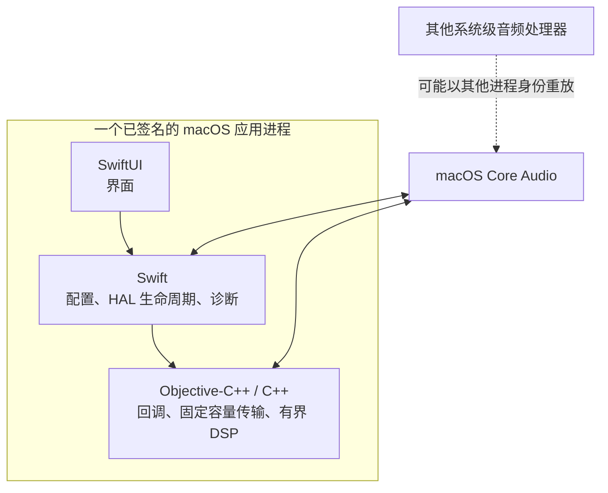
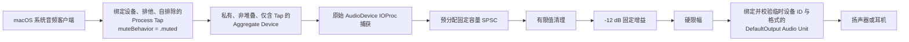
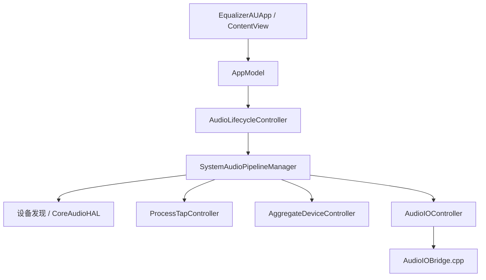
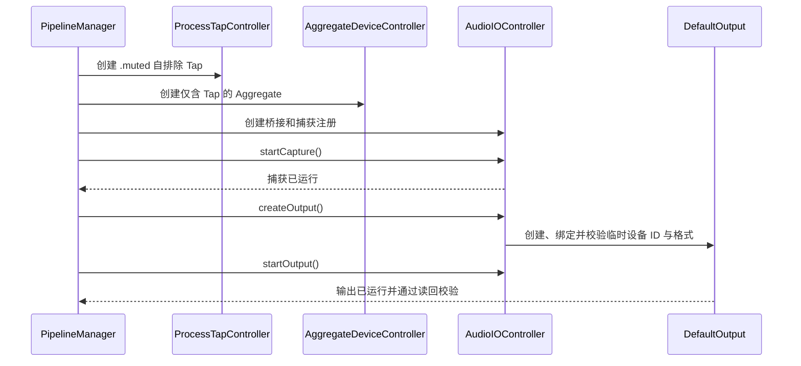
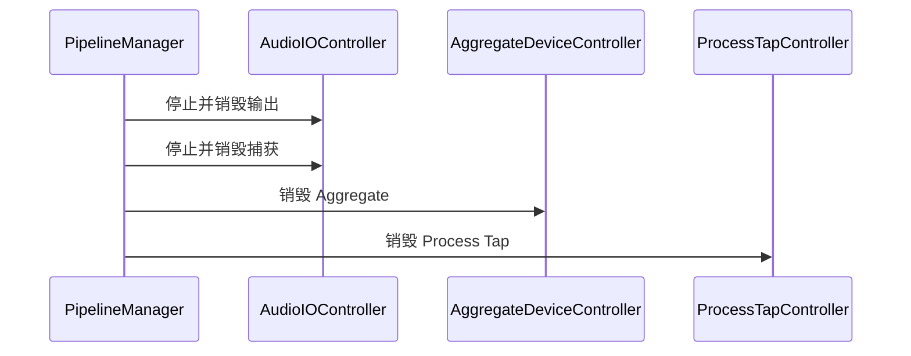
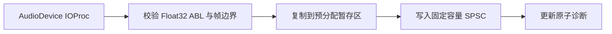
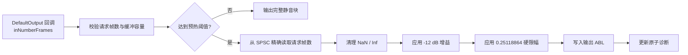
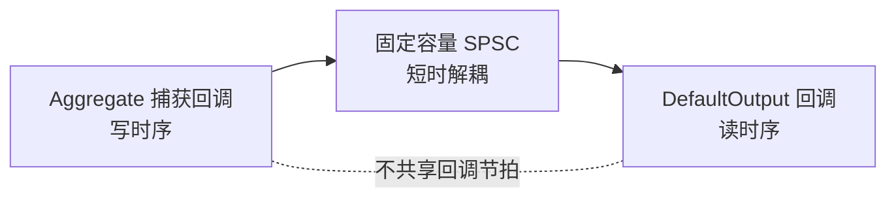
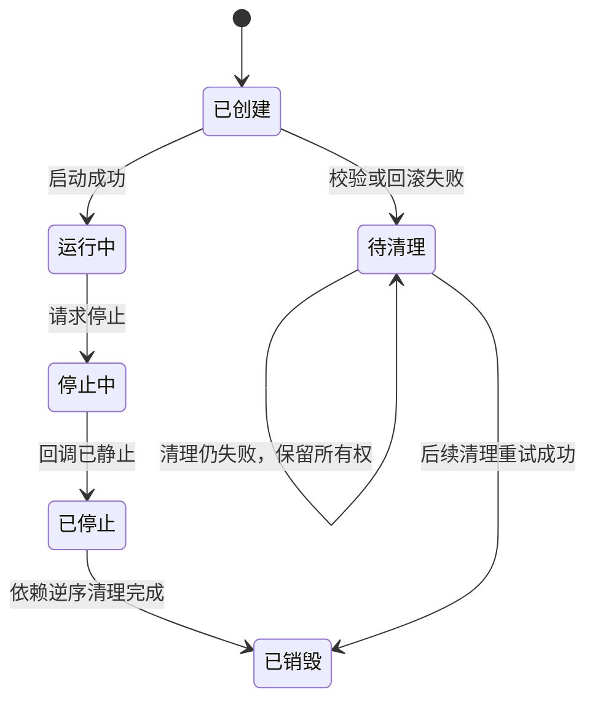
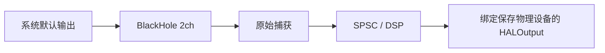

# EqualizerAU 当前架构

本文只描述当前真实实现。产品范围见 [`prd.md`](./prd.md)，决策理由见
[`adr/`](./adr/)，M0 证据见 [`milestones/M0-native-route.md`](./milestones/M0-native-route.md)。
当前实现整体属于 M0 产物；M1 按 <PII type="CASE_ID" id="678"/> 独立编码，不导入、调用或改造本文所列
M0 类型和桥接。M0 仍是当前产品入口；独立的 M1 target 已实现运行时、原生音频宿主和
配置基础，但尚未接管产品界面。

### M1 独立实现边界

`EqualizerAUM1Runtime` 提供正式 C ABI、有限值 Preamp DSP、10 ms 平滑、Prepared 发布和
退休回收；`EqualizerAUM1` 独立拥有原生 Tap、Aggregate、捕获、输出和代次生命周期。
配置层使用 typed Preamp 快照以及版本化规范 JSON：编码结果按键排序、可读格式、保留
slash 并以 LF 结尾，最终 UTF-8 数据上限为 `4 MiB`。设备无关校验不依赖输出布局。

`M1ConfigurationStore` actor 串行化完整快照提交。它通过同目录临时文件、文件同步、原子
替换和目录同步维护 `config.json` 与上一版完整 `config.previous.json`；首次创建和 Repair
先建立 previous，再建立主文件。首次创建配置目录时同步其父目录，bootstrap 尝试清理本 store
命名空间内的遗留临时文件，并区分主文件损坏、缺失和 I/O 失败；从 previous 成功恢复会
保留显式恢复来源。主文件替换后的最终目录同步失败会保留唯一候选和代次，bootstrap 使用
代次 `0`，不确定结果继续携带首次建立或 previous 恢复来源，且只允许对同代次执行目录同步
Retry。配置启动恢复、Save 界面、生命周期和 Runtime 发布之间的产品编排尚未接入，属于
M1.2；该编排必须在单应用进程内只拥有一个 production store，不提供多实例写盘仲裁。

## 1. 系统边界

选定路线不包含 helper、daemon、XPC、捆绑驱动或必需的虚拟音频设备。
本进程自排除只排除由本进程直接拥有的输出；其他系统级音频处理器若捕获后以
另一个进程身份重放，仍可能被本应用的 Tap 捕获。

## 2. 原生音频拓扑

捕获必须先创建并启动，之后才创建输出 Audio Unit。这是自排除拓扑的功能条件，
不是性能优化。

## 3. 模块职责

| 模块 | 当前职责 |
|---|---|
| `EqualizerAUApp`、`ContentView` | 展示紧凑操作界面、状态和 DEBUG 诊断入口，不直接拥有 Core Audio 对象 |
| `AppModel` | 把用户命令转换为生命周期操作，发布状态和错误，阻止互相冲突的操作 |
| `CoreAudioHAL` 与发现类型 | 集中读写 HAL 属性，区分持久 UID 与临时 `AudioObjectID`，解析有界格式 |
| `ProcessTapController` | 翻译本进程身份，创建并校验设备绑定的自排除 Tap，管理所有权令牌和回滚 |
| `AggregateDeviceController` | 创建仅含 Tap 的私有 Aggregate，设置漂移补偿，校验实际格式和帧容量 |
| `AudioIOController` | 管理桥接、捕获和输出的分阶段生命周期，硬校验输出临时设备 ID 与格式 |
| `SystemAudioPipelineManager` | 把设备、Tap、Aggregate、捕获和输出组成同一代次事务 |
| `AudioLifecycleController` | 串行化启动与停止，合并重复停止，向应用层发布生命周期状态 |
| `AudioIOBridge.cpp` | 拥有实时回调、预分配存储、SPSC、固定 DSP 和原子诊断 |

## 4. 生命周期

### 4.1 启动

### 4.2 停止与清理

若上游资源清理失败，其依赖资源必须保留，供下一次停止操作重试。

## 5. 实时数据面

### 5.1 捕获回调

### 5.2 输出回调

`-12 dB` 增益与相同幅值的限幅只用于 M0 路线证明，不代表最终 EQ 或限幅设计。

### 5.3 回调时序边界

捕获和输出属于两个独立回调时序。SPSC 吸收短时调度差异，但当前积压丢帧和欠载
静音策略不构成长稳漂移控制，也不证明两端长期保持相同速率。

## 6. 传输行为

| 条件 | 行为 |
|---|---|
| 启动前 | 一次性确定 SPSC 容量并预分配所有实时存储 |
| 尚未达到预热阈值 | 输出完整静音块 |
| SPSC 欠载 | 整块静音，不输出残留或半块旧数据 |
| SPSC 积压 | 执行有界、可观测的积压修正 |
| 输出回调 | 以 `inNumberFrames` 为准，不以缓冲容量推导工作量 |
| 捕获与输出格式不匹配 | 当前 M0 路线拒绝启动，不做实时采样率转换 |

输出创建前，持久 UID 已用于同一发现代次内的 Tap、Aggregate 和输出快照一致性校验；
DefaultOutput 创建后和启动后只读回校验临时 `AudioObjectID`、ASBD、帧容量和运行状态，
当前没有从 Audio Unit 绑定设备再次读回持久 UID。

## 7. 资源所有权与并发

- Tap、Aggregate 和 IO 资源都携带控制器签发的所有权令牌。
- 所有权令牌只保护同一控制器记录中的对象代次；当同一临时对象 ID 已由控制器登记为
  新代次时，旧令牌不能销毁新代次。
- 当前销毁前不会从 HAL 重新读取对象持久 UID；若对象在控制器之外失效后被 HAL 复用
  同一 ID，现有令牌记录不能独立证明它仍是原对象。
- 创建成功但校验失败时，控制器保留按令牌标识的待清理资源。
- 每个 IO 资源使用操作状态阻止重入的创建、启动、停止和销毁。
- 异步诊断返回前重新校验运行代次和所有权；停止期间的旧快照返回空值。

## 8. 实时约束

| 回调内允许 | 回调内禁止 |
|---|---|
| 预分配存储 | 堆分配和容器扩容 |
| 原子操作 | 锁、信号量、actor 跳转和等待 |
| 有界循环 | 日志、字符串和错误对象构造 |
| 有界 `memcpy` / `memset` | 文件、网络和配置 I/O |
| 有限标量 DSP | 动态图、FFT 初始化和滤波器构造 |

控制层可以异步复制诊断快照，但实时回调绝不等待控制层。

## 9. 诊断

桥接层通过原子计数器发布回调进度、帧数、非零样本、SPSC 填充、欠载、溢出、
丢帧、预热、积压修正、静音块、在途回调、故障标志和淡出完成状态。

DEBUG 版本可在控制层写入 JSONL 和有界 WAV/JSON 证据。cold nonce probe 是
独立的来源归因工具，不参与正常处理；M0 成功后仅在出现隔离异常时使用。

## 10. 未启用的 BlackHole 后备路线

该实现具备设备识别、默认路由事务、恢复日志、捕获先行启动、淡出和可重试清理，
但不是当前路线，也不要求安装。若未来启用，虚拟设备与物理设备的独立时钟要求
成熟的可变速率 SRC 和漂移控制。

## 11. 当前限制

- 只有短时真实音频验证，没有长期稳定性结论。
- 其他系统级处理器可能以不同进程身份重放本应用输出；当前没有运行期共存检测或隔离保证。
- 尚未覆盖所有设备切换、采样率变化、睡眠或 `coreaudiod` 变化。
- 不提供实时 SRC；格式不兼容时拒绝启动。
- 输出绑定后的身份读回只校验临时 `AudioObjectID`，尚未再次校验持久设备 UID。
- Tap 或 Aggregate 若在控制器之外失效并发生临时 ID 复用，销毁前尚无持久 UID 复核；
  该边界随设备变化和 `coreaudiod` 恢复在 M4 处理。
- DSP 仍是固定验证增益和限幅；用户可调处理链边界见已接受但尚未实现的
  [`ADR-0003`](./adr/0003-prepared-dsp-chain-publication.md)。
- 当前 `ContentView` 仍是 M0 实验界面，非 DEBUG 主流程仍暴露 BlackHole 虚拟路线证明和
  安装检查；这不改变已选择的原生路线。产品入口迁移计划见
  [`M1 处理链基础`](./milestones/M1-processing-chain-foundation.md)。
- 当前应用入口没有显式窗口关闭、Quit 和 `shutdown()` 终止协调钩子；终止协调计划见
  [`M1 处理链基础`](./milestones/M1-processing-chain-foundation.md)。
- 应用退出后处理停止。
- BlackHole 未被选择和安装，因此没有真实设备证据。

## 12. 源码位置

| 路径 | 内容 |
|---|---|
| `EqualizerAU/App/` | SwiftUI 应用和应用状态 |
| `EqualizerAU/Audio/` | HAL 控制、生命周期、诊断和 Swift 包装 |
| `EqualizerAU/Audio/AudioIOBridge.*` | Objective-C++ 实时桥接和 DSP 边界 |
| `EqualizerAUTests/` | 单元测试和确定性失败/竞态测试 |
| `EqualizerAUIntegrationTests/` | 不启动音频的真实 HAL 测试 |
| `EqualizerAUM1Runtime/` | M1 独立实时库与正式 C ABI |
| `EqualizerAUM1/Audio/` | M1 独立原生音频宿主、路线与生命周期 |
| `EqualizerAUM1/Configuration/` | M1 typed 配置、Builder、规范 JSON 与可恢复持久化 |
| `EqualizerAUM1RuntimeTests/` | 不加载应用宿主的 M1 Runtime、配置和故障注入测试 |
| `docs/` | 需求、架构、ADR 和里程碑 |
