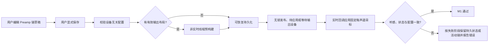
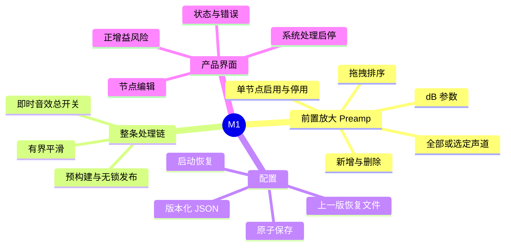
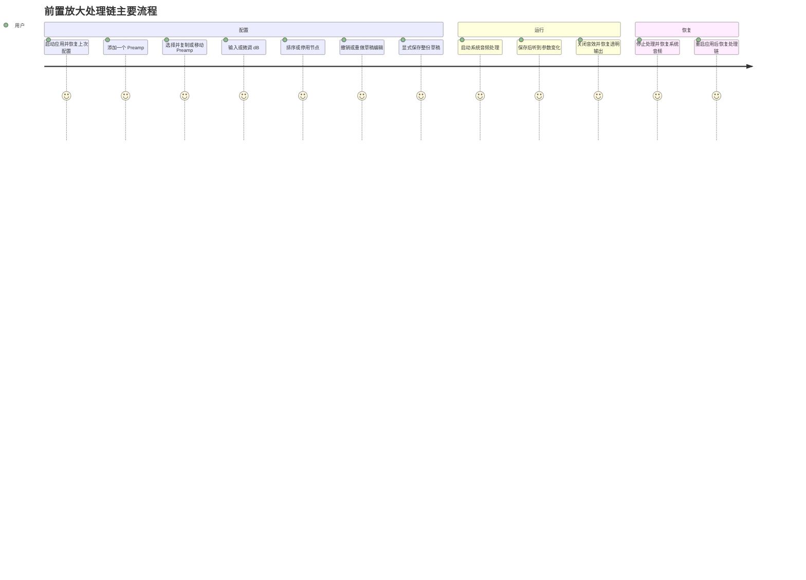
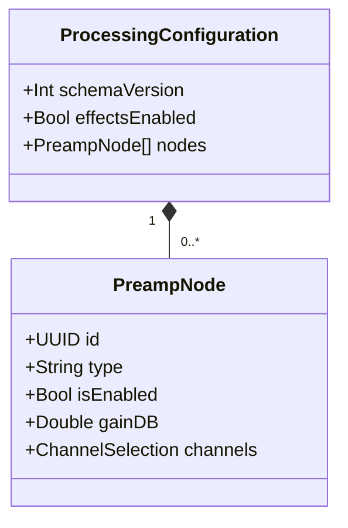
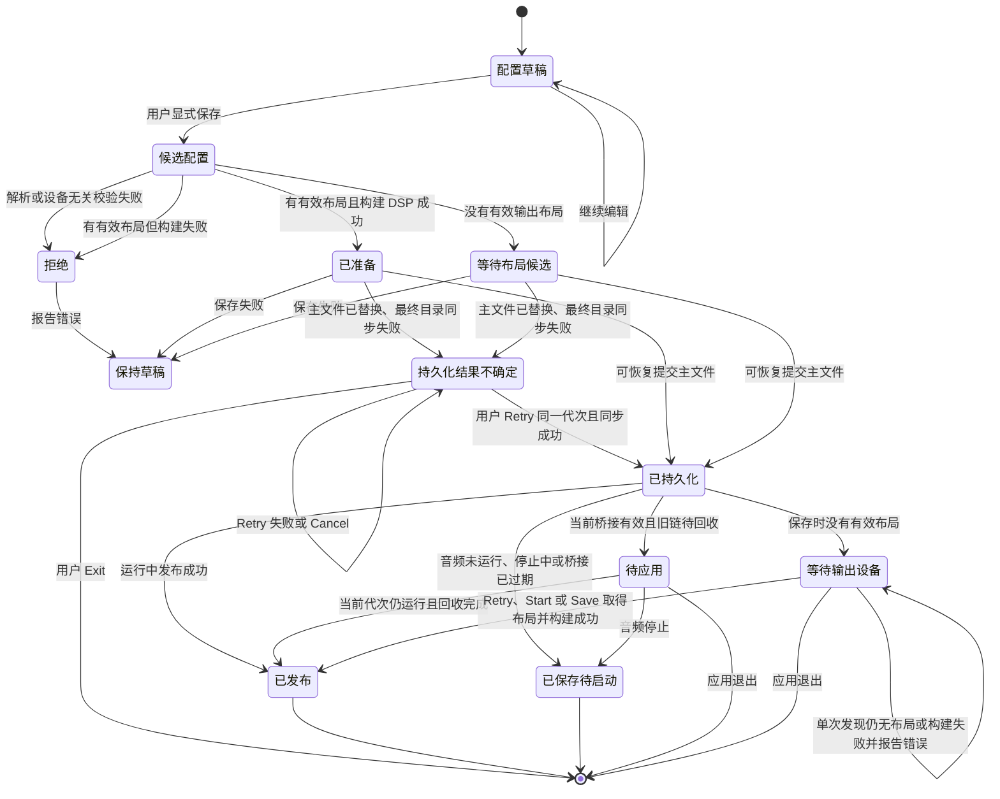
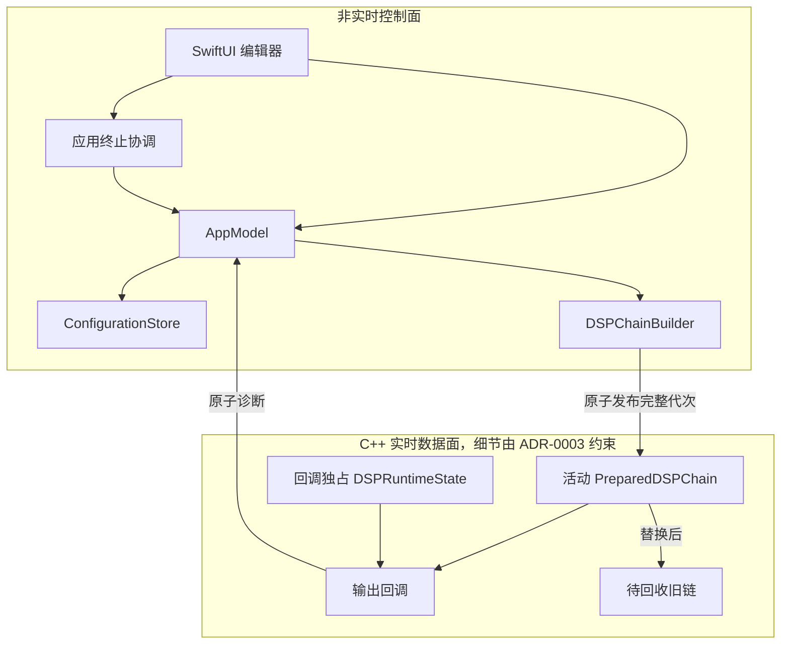
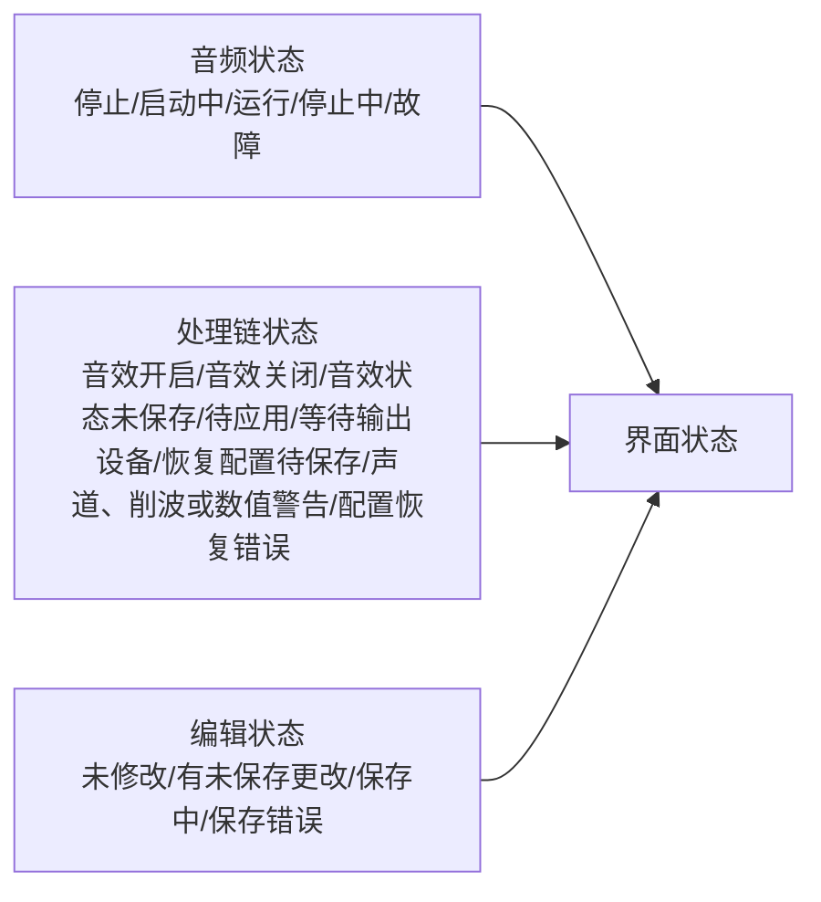
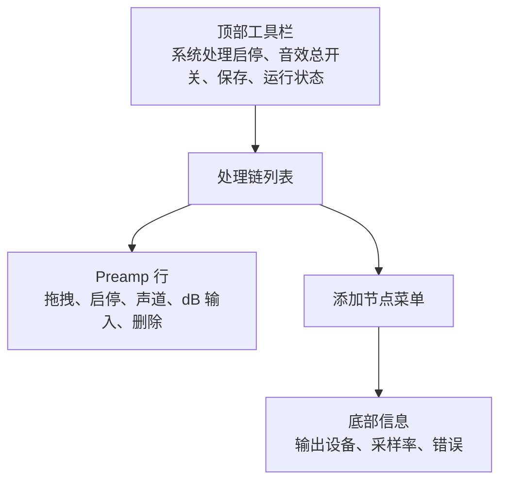
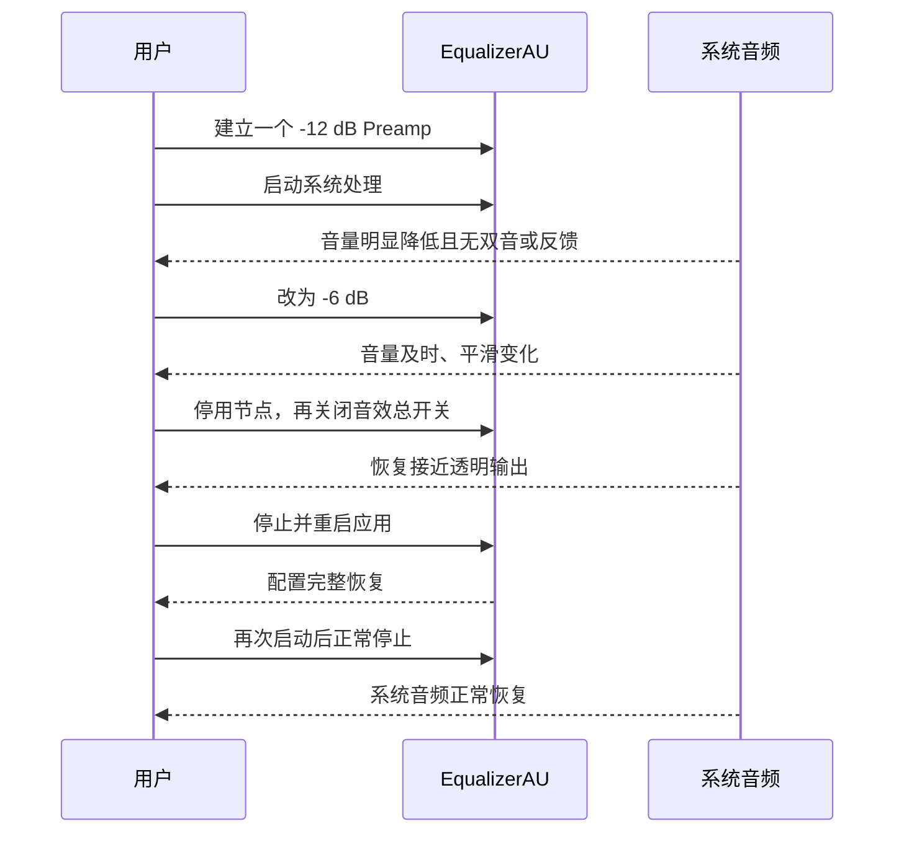
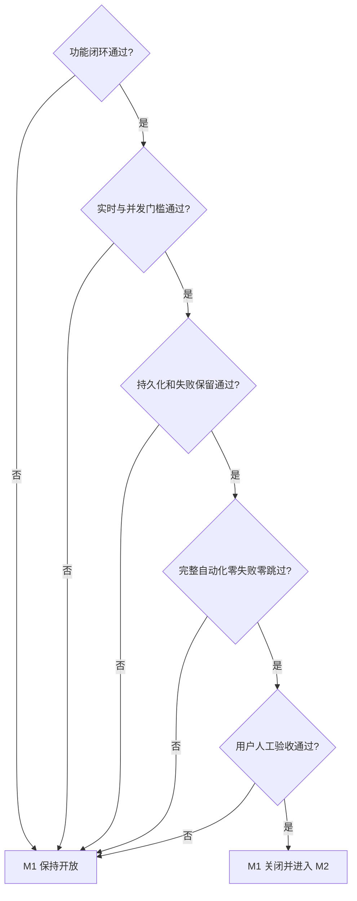

# M1 里程碑：前置放大处理链基础

> **当前状态**：实施中（M1.0 至 M1.3 已完成；下一阶段为 M1.4）
>
> 本文是 M1 范围、工作包、验证计划、证据和退出条件的唯一事实来源。
> 产品需求见 [`../prd.md`](../prd.md)，当前实现见
> [`../architecture.md`](../architecture.md)，已接受但尚未实现的 M1 决策见
> [`ADR-0003`](../adr/0003-prepared-dsp-chain-publication.md)、
> [`<PII type="CASE_ID" id="673"/>`](../adr/0004-versioned-native-configuration-and-explicit-save.md) 和
> [`<PII type="CASE_ID" id="675"/>`](../adr/0005-recoverable-configuration-commit.md)；M0/M1 代码边界见
> [`<PII type="CASE_ID" id="678"/>`](../adr/0006-independent-m1-implementation.md)。

## 1. 里程碑问题

M1 只回答一个产品闭环问题：

> 用户能否创建、编辑、排序、独立启停和持久化前置放大，并在原生系统音频运行时
> 无需重启音频即可安全应用变更？



## 2. 参考证据，不是代码基线

| 参考项 | M0 结论 |
|---|---|
| 系统链路 | 单进程同设备原生路线短时通过 |
| 生命周期 | 捕获先行，输出先停，依赖逆序清理 |
| 实时传输 | 预分配 Float32 SPSC，欠载静音，积压有界修正 |
| 当前 DSP | 固定 `-12 dB` 增益与 `0.25118864` 限幅 |
| 阶段证据 | 统一引用 [`M0-native-route.md`](M0-native-route.md)，不在本文复制 |

以上内容只作为 M1 选择约束和测试场景的参考。M1 不复用 M0 的源码、类型、桥接 ABI、
测试夹具、测试用例或构建产物，也不在 M0 实现上直接替换 DSP。M1 必须独立编码自己的
控制面、音频数据面、DSP、配置和界面，并用 M1 自有证据重新证明所采用的路线与约束。

## 3. 范围

### 3.1 本阶段包含



### 3.2 本阶段不包含

| 延期项 | 目标阶段或触发条件 |
|---|---|
| Graphic EQ | M2 |
| Convolution / WAV IR | M3 |
| 设备变化、睡眠、采样率变化和自动恢复 | M4 |
| 长时间稳定性和设备矩阵 | M4 稳定化计划 |
| 实时 SRC | 出现已测量的跨时钟或格式需求时单独设计 |
| helper、daemon、XPC、插件 ABI | 出现明确产品需求时重新评估 |
| BlackHole 真实路线 | 原生路线被新证据否决时重新评估 |
| 与其他系统级重放器共存保证 | 出现明确兼容需求和可验证方案时处理 |

### 3.3 分阶段交付

M1 的最终产品闭环不缩减，但不能作为一个不可分割的开发批次。按以下子里程碑独立实现、
审查和验收；前一阶段通过不代表整个 M1 关闭，也不得把尚未完成的界面能力写成已实现。

| 子里程碑 | 边界 | 独立通过结果 |
|---|---|---|
| [M1.0 运行时内核](M1.0-runtime-kernel.md) | M1 自有音频与实时边界、typed 节点最小模型、真实声道布局快照、Builder、有限数值、平滑、Prepared 发布与回收、音效总开关实时通道 | 不导入或调用 M0 产物；不启动真实音频的 M1 DSP、并发和实时审计通过，M1 产品入口只承接原生路线 |
| M1.1 可靠配置 | 规范 JSON、资源预算、显式 Save、主文件与 previous、Recovery、Repair、结果不确定、提交与桥接代次 | 故障注入证明每个已接纳提交都有唯一终态且没有半写或静默丢失 |
| M1.2 基础产品闭环 | 单选 Preamp 增删、排序、启停、dB、声道、Save、Start/Stop、音效总开关、基础状态与诊断、最小 Quit → `shutdown()` 清理 | 用户无需高级编辑命令即可完成 PRD 的 Preamp 保存与运行时应用闭环，明确退出后不留下持续静音 |
| M1.3 桌面编辑能力 | 多选、Cut/Copy/Paste、Option 拖拽、Undo/Redo 预算、键盘交互、未保存/在途/不确定结果的完整退出确认和分代诊断展示 | AppModel 与界面测试覆盖完整桌面编辑合同 |
| M1.4 加固与关闭 | 压力、故障交错、回归、静态实时审计、文档收口和用户明确执行的真实音频验收 | 满足第 11 节全部退出条件后才关闭 M1 |

`M1-00 ... M1-07` 是跨子里程碑的能力工作包，不再充当单一串行大批次。尤其
`M1-01` 和 `M1-05` 必须分别按可靠配置与基础/高级编辑边界交付，`M1-06` 的测试随每个
子里程碑同步完成，不能集中到最后补测。

### 3.4 M1.1 实施结果

M1.1 已实现独立的 typed 配置快照、规范 JSON codec 和可注入文件系统的串行持久化 store。
配置编码严格执行第 5 节格式及 `4 MiB` 最终字节预算；解码拒绝超限输入、未知 schema、
未知节点类型及无效 Preamp，并复用 Builder 的设备无关校验，因此没有输出布局也可形成
合法 Save 候选。

持久化 store 已覆盖首次默认建立、主文件与 previous 轮换、previous 恢复且不覆盖唯一
恢复副本、双损坏透明恢复、Repair、主文件替换前确定失败，以及替换后最终目录同步失败的
不确定状态。结果不确定时不接纳新候选，只允许同代次 Retry 且 Retry 不重写文件。M1.2
负责把这些基础类型接入草稿、Save 命令、音效总开关、生命周期和 Runtime 发布。

本阶段验证在未加载应用宿主、未启动音频的 `EqualizerAUM1RuntimeTests` 中执行：新增 7 个
codec 测试和 17 个 store 测试全部通过，其中包括精确 `4 MiB` 边界、逐故障点操作顺序、
启动临时文件清理、bootstrap 代次 `0`、同代次 Retry 和系统临时目录中的真实 POSIX
`rename`/`fsync` 路径。五个 M1 target 的
`build-for-testing CODE_SIGNING_ALLOWED=NO` 通过；未执行 GUI、hosted test、真实 HAL
对象创建、系统路由或人工音频验收。

## 4. 用户结果

M1 完成后，用户可以完成以下闭环：

应用启动时恢复配置草稿基线和磁盘中的音效总开关状态。M1 独立实现与产品一致的显式
生命周期：
系统处理初始保持停止，不自动创建 Tap、Aggregate、捕获或输出，直到用户执行 Start。



失败不得静默发生。编辑只修改配置草稿，不改变已保存配置或活动链。用户显式保存时才
校验并提交整份草稿；无效草稿、已有有效布局时的构建失败或保存失败会保留草稿供修正
或重试，旧链继续运行。没有有效输出布局时不构成构建失败：结构合法的配置可以保存，
界面显示“等待输出设备”，取得真实布局后再构建。主配置已保存且当前桥接有效、但旧链
仍待回收时，界面显示“待应用”；控制层只保留最新候选，并在回收完成后自动发布。桥接
已经过期或音频正在停止时丢弃 Prepared 对象并进入“已保存待启动”，下次启动从主配置
重建。没有任何有效已保存配置时，应用使用透明安全链并
进入“恢复配置待保存”，不得把内存恢复配置伪装成正常已保存状态。

## 5. 配置契约

### 5.1 逻辑模型



首版使用可读、可版本控制的原生 JSON。主文件位于
`~/Library/Application Support/EqualizerAU/config.json`，上一次完整主文件保留为同目录
下的 `config.previous.json`，只用于主文件缺失或损坏时恢复。EqualizerAPO 文本不作为
并列配置源；相关导入或导出在后续里程碑通过显式转换完成。配置使用 `JSONEncoder` 的
`.prettyPrinted`、`.sortedKeys` 和 `.withoutEscapingSlashes` 选项，末尾追加一个 LF，并以
最终 UTF-8 `Data.count` 判定 `4 MiB` 硬上限；节点数量不另设固定上限。读取超限主文件
按无效配置处理并尝试 `previous`，
任何会让草稿超限的编辑或粘贴都整体拒绝，不改变草稿、历史、磁盘或活动链。

```json
{
  "schemaVersion": 1,
  "effectsEnabled": true,
  "nodes": [
    {
      "id": "9E1696E7-23E9-4D1C-BCF2-7C89C63526EE",
      "type": "preamp",
      "isEnabled": true,
      "gainDB": 0.0,
      "channels": "all"
    }
  ]
}
```

### 5.2 校验与提交



| 校验项 | 契约 |
|---|---|
| Schema | 只接受明确支持的 `schemaVersion` |
| 节点身份 | UUID 非空且在链内唯一 |
| 节点类型 | M1 只接受 `preamp` |
| Preamp 增益 | 必须是有限数，并处于 `-100 dB ... +100 dB` |
| 无输出布局 | 仍执行全部设备无关校验并允许保存；不解析声道、不合成目标、不生成布局相关诊断，状态进入“等待输出设备” |
| 有效输出布局 | 快照包含声道数、缓冲布局，以及按实时缓冲索引排列的标识数组；仅使用 Core Audio 明确提供的语义位置，其余索引逐项使用 `1...N` 数字名称，不按声道数量猜测 |
| 每声道总目标 | 按可见顺序收集后以固定数值顺序完整求和；最终线性结果正向超界时夹到 Float32 最大有限值，低于最小正规值时归零，保留原始节点值并持续标出受影响声道 |
| 削波风险 | 根据已保存链编译后的每声道总 dB 判断；高于 `0 dB` 时标出该声道，不高于 `0 dB` 时不警告 |
| 声道选择 | 接受 `all` 或非空、无重复的声道标识列表；标识到实时掩码的解析必须在发布前完成 |
| 当前布局解析 | 未解析标识不构成配置失败；保留原选择、忽略缺失项并生成非阻塞警告，全部未解析时编译为空掩码 |
| 停用节点 | 保留并校验持久字段，但不编译到实时目标，也不生成当前声道或削波风险诊断；重新启用后重新解析 |
| 空处理链 | 合法；保存后透明处理，不自动插入默认节点 |
| 未知字段 | 只允许忽略同版本的非语义扩展；语义变化必须提升版本 |
| 未知节点或版本 | 拒绝候选配置，不部分应用 |
| 配置资源预算 | 规范 UTF-8 JSON 不超过 `4 MiB`；超限读取视为无效配置，超限草稿操作整体拒绝 |
| 写盘 | 同目录临时文件完整写入并同步后，以原子重命名和目录同步更新 `previous` 与主文件 |
| 全新安装 | 两份配置从未存在时，创建并持久化一个 `0 dB`、`channels: all`、已启用的 Preamp，音效总开关默认开启 |
| 主配置读取失败 | 非首次启动时尝试恢复 `config.previous.json` 并展示可恢复错误 |
| previous 有效但主文件重建在替换前失败 | 以内存恢复配置保留其完整内容并继续按该链处理；不改写唯一有效 previous、不建立正常已保存基线，显示错误并允许 Repair |
| 首次默认写入在主文件替换前失败 | 使用一个 `0 dB`、`channels: all`、已启用的 Preamp 作为内存恢复配置；实时使用透明安全链，显示错误并允许 Repair，不伪装成已保存 |
| 两份既有配置均失败 | 使用空链且音效总开关开启的内存恢复配置；实时使用透明安全链，显示错误并允许 Repair，不伪装成首次默认配置或已保存配置 |
| 恢复配置 Repair | Save 始终可用且音效总开关禁用；用户可先编辑恢复配置，但编辑不改变当前恢复链或透明安全链。成功提交整份恢复配置后才建立已保存比较基线并按通常规则构建或发布 |

主配置是用户持久状态的唯一来源；`previous` 只是上一版完整主文件，成功恢复后必须
重建主配置。运行时对象、临时 `AudioObjectID`、DSP 指针、平滑进度和诊断计数不得
写入配置。

声道、削波风险和数值边界警告归属于具体配置代次针对构建所用输出快照的编译结果，
不改变持久配置。控制层分别保存 `appliedGeneration` 的活动诊断和
`savedExpectedGeneration` 的期望诊断：两代相同时只显示一组；候选待应用时同时显示并
明确标注“当前处理中”和“已保存，待应用”。后续成功保存合并候选时，只用最新候选代次
及诊断替换旧期望组，活动组保持到原子发布；发布后期望组提升为活动组并清除旧活动组。
音效关闭时两组诊断仍按代次保留，应用重启时从主配置重建。未保存草稿可以显示独立的
字段校验，但不得覆盖这两组持续警告。保存时没有有效输出布局，则新配置没有布局相关
期望诊断；界面显示“等待输出设备”，不得把旧活动诊断冒充新配置结果，若旧活动链仍在
则只能以“当前处理中”标签继续展示。

M1 不监听或轮询运行期输出布局变化；设备和布局变化检测属于 M4。“等待输出设备”界面
必须提供显式 Retry；系统处理 Start 和有草稿时的 Save 也各执行一次设备与布局重新发现，
失败后仍保持等待，不自行安排下一次尝试。M0 的 `AudioDeviceSnapshot` 只提供了声道数
和缓冲布局这一参考事实；M1 不扩展或调用该类型，而是在 M1.0 独立定义布局快照。该快照
必须把按实时索引排列的可选 Core Audio
语义标签纳入布局快照；缺失标签的位置使用数字回退。M1 的 Builder 必须能针对调用方
提供的任意有效布局快照确定性重新解析全部声道选择，供启动、有布局时的 Save 和未来 M4
复用：原先未解析的标识可以恢复生效，原先可解析的标识也可以转为警告，任何情况下都
不得自动改写为 `all` 或其他声道。

`effectsEnabled` 属于已保存配置，但不属于节点草稿。音效总开关变化通过独立控制命令
立即发布，再使用相同的完整写入、原子替换和目录同步步骤尝试保存。保存失败不回滚
当前会话的实时状态，也不由后台自动重试；界面保持“音效状态未保存”，直到用户再次
切换总开关或显式保存节点草稿。保存节点草稿时必须读取并合并当前实时
`effectsEnabled`，不得用草稿创建时的旧值覆盖它；该次 Save 同时成为最新总开关状态的
下一次持久化尝试。

控制层分别维护 `draftRevision`、`commitGeneration` 和 `bridgeGeneration`。每次 Save 在
命令开始时递增 `commitGeneration` 并捕获不可变候选，内容由当时草稿和当时实时
`effectsEnabled` 合并而成；后续校验、构建和写盘只处理该已接纳提交。Save 进行期间允许
继续编辑节点，编辑只推进 `draftRevision`，不得取消或使已接纳提交过期；提交成功后只把
其快照设为已保存比较基线，若当前草稿与该基线不等则继续显示未保存。

`bridgeGeneration` 只判断 Prepared 对象能否发布，不决定提交是否有效。Stop 或桥接换代
不得取消、静默丢弃或回滚已经接纳的 Save；它们只使旧 Prepared 对象失效。写盘成功时，
若对应桥接仍有效则发布或待回收，若桥接已过期或音频已停止则丢弃 Prepared 对象并进入
“已保存待启动”，下次 Start 从主配置重建。每个已接纳提交都必须到达成功、可见失败或
“持久化结果不确定”之一，不得停留在无终态的后台任务中。

提交进行中始终允许 Stop，且 Stop 不等待提交；Stop 使当前桥接失效后，在 Save、Repair
及音效总开关后继写入队列到达终态前禁用 Start。提交成功后 Start 从新主配置重新构建，
主文件替换前确定失败后 Start 使用原已保存配置，结果不确定时继续按受限状态禁止 Start。

Save 期间的音效总开关切换仍通过实时通道立即生效；控制层按发生顺序串行化持久化，并
把多个等待中的总开关值合并为 `latestEffectsIntent`。当前 Save 得到确定终态后，使用最近
一次成功保存的节点链和该最新意图发起一次后继持久化。该后继请求是用户切换操作的延续，
不是失败后的后台重试；写入失败仍遵循“不回滚、不自动重试”。旧 Save 快照在任何情况下
都不得覆盖更新的实时总开关状态。当前 Save 及其已排队的后继写入到达终态前，Save 命令
保持禁用；节点编辑继续推进 `draftRevision` 并保留为未保存草稿。队列清空后，用户才能
再次 Save 最新草稿，因此磁盘提交顺序唯一为当前候选、其必要的最新总开关后继候选、再到
下一次用户 Save。

音效总开关保存失败后退出，下一次启动按磁盘实际留下的完整主文件恢复。若失败发生在
主文件替换前，磁盘仍是旧值；若主文件已替换但最终目录同步失败，则按本节崩溃语义，
完整主文件可能是新值或旧值。界面不得把不确定的磁盘结果宣称为已保存。普通的总开关
未保存且没有节点草稿时退出，必须提供 Retry、Exit 和 Cancel：Retry 是用户明确触发的
一次完整持久化尝试，失败后仍停留在确认流程；Exit 接受按磁盘状态恢复；Cancel 返回应用。
节点草稿与音效总开关同时未保存时不得叠加两个确认框：Save and Exit 必须合并草稿与
当前 `effectsEnabled` 做一次完整提交，Discard and Exit 丢弃草稿并接受下次按磁盘状态
恢复，Cancel 返回应用；合并保存失败时保持窗口和两个未保存状态。

写盘顺序必须形成以下唯一崩溃语义：

1. 候选编码到同目录 `next` 临时文件，完整写入、同步并关闭；临时文件永不作为配置读取；
2. 若当前主文件有效，先把它复制到同目录 `previous` 临时文件；若不存在任何有效已保存
   配置，则把候选从 `next` 复制到 `previous` 临时文件，作为首次或 Repair 的恢复基线。
   临时文件完整同步后原子替换 `config.previous.json`，再同步目录；正常更新时主文件始终
   保留，首次或 Repair 中途失败时则至少保留一份完整候选；
3. 原子地以 `next` 替换 `config.json` 并同步目录；只有最后一次目录同步成功才进入
   “已持久化”；
4. 正常更新在最终主文件替换前崩溃时，主文件仍是旧代次；首次或 Repair 在该点崩溃时，
   `previous` 已是完整候选并可恢复。最终目录同步完成后，正常更新的主文件是新代次且
   `previous` 是旧代次，首次或 Repair 的两者都包含候选。替换成功但最终目录同步前崩溃
   时，主文件允许是完整的新旧任一代次，启动逻辑接受实际留下的完整主文件；任一临时
   文件都忽略并清理；
5. 从 `previous` 恢复时，先通过新的主临时文件重建并同步 `config.json`，成功前不得
   改写唯一有效的 `previous`。

首次保存或 Repair 没有有效旧主文件时不得跳过第 2 步，而要先建立候选 `previous`。
原子替换必须在同一文件系统目录内完成。主文件
替换前的写入、文件同步、重命名或目录同步失败保持“未持久化”；主文件已替换但最终
目录同步失败时进入独立的“持久化结果不确定”状态，只保留该唯一候选及其代次。节点
Save 继续使用旧活动链；若该写入来自已经即时生效的音效总开关，则保持切换后的当前
听感。两种情况都冻结配置编辑、Save 和音效总开关，不接收新编辑或新切换，也不后台
重试；但进入该状态前已经发生并合并的 `latestEffectsIntent` 必须作为独立内存意图保留，
不得写入、覆盖或并入当前不确定候选。

界面提供 Retry、Exit 和 Cancel：Retry 只重试同一候选的最终目录同步，成功后先把该候选
标记为已保存并按通常规则处理 Prepared 对象；若保留的 `latestEffectsIntent` 与候选不同，
再使用该候选节点链发起一次用户操作延续的后继写入，在后继成功前持续显示“音效状态未
保存”。Retry 失败继续停留；Exit 丢弃内存中的 `latestEffectsIntent`，退出并由下次启动按
磁盘实际完整主文件重建；Cancel 关闭提示但应用仍保持受限状态。该状态不得套用普通
Save / Discard 或总开关未保存分支，也不能把磁盘状态伪报成旧代次或新代次已经持久化。
受限状态禁止系统处理 Start，但已经运行或正在启动的系统处理必须始终允许 Stop；Stop
遵循既有依赖感知清理，丢弃对应 Prepared 对象但不改变不确定候选、磁盘判断或
`latestEffectsIntent`。

该阶段判定覆盖普通 Save、首次默认创建、从 `previous` 重建主文件和 Repair，不按调用
来源另行分类：主文件替换前的确定失败进入相应 Recovery/Repair 状态；主文件已经替换但
最终目录同步失败一律进入“持久化结果不确定”，冻结规则、Start/Stop 规则和 Retry / Exit /
Cancel 行为完全相同。

配置草稿只归当前会话的 `AppModel` 所有，不写草稿恢复文件；退出或崩溃后未保存编辑
不恢复。Undo 与 Redo 两个栈合计最多 `30` 条记录、规范载荷合计最多 `64 MiB`。每条记录
使用与配置相同的规范 JSON 选项编码对应 typed 草稿快照，以最终 UTF-8 `Data.count` 记账，
并携带单调递增 sequence；跨两个栈超出任一预算时按 sequence 淘汰全局最旧记录。当前
草稿和单独保存的比较基线各自仍受 `4 MiB` 配置上限约束，但不计入 `64 MiB` 历史预算，
且淘汰历史不得丢失两者。

参数、声道、节点启停、增删、Cut、Paste 和排序等草稿修改进入历史，连续旋钮或拖拽手势
合并为一步，批量结构操作各计为一步，新编辑清空 Redo。纯 Copy 只更新系统剪贴板，
不修改草稿、不改变未保存状态且不进入历史；音效总开关也不进入草稿历史。Save 成功后
保留历史并标记已保存快照：Undo 到其他快照形成新的未保存草稿，Redo 回到已保存快照时
恢复为未修改状态；Undo 和 Redo 都不直接改变活动链。已保存快照对应的历史记录被淘汰后，
后续状态只按当前草稿与独立保存基线的语义等值比较判断是否修改。

关闭最后一个窗口只隐藏编辑界面，应用进程、草稿、在途提交和系统处理继续保留；重新
打开窗口恢复原状态，不执行 `shutdown()`，也不触发未保存确认。有未保存草稿时明确
Quit 应用必须提供 Save、Discard 和 Cancel：Save 成功后继续退出，Save 失败恢复窗口并
保留草稿，Discard 明确丢弃草稿，Cancel 返回编辑。
如果 Save、Repair 或由总开关操作延续的后继写入仍在进行，明确 Quit 必须等待
该提交到达终态；不得通过退出静默取消已经接纳的提交。成功后重新比较当前草稿、已保存
基线与 `latestEffectsIntent`，再直接退出或进入相应未保存确认；失败时保留窗口和未保存
状态；进入“持久化结果不确定”时转入其专用 Retry / Exit / Cancel 流程。
只有显式 Save 才进入配置提交。配置提交与音频生命周期由同一控制层串行化。
磁盘提交与实时发布是两个显式阶段，
不声称跨文件系统和音频回调原子提交：主配置是期望状态，活动链是已应用状态。旧链
待回收时进入“待应用”，后续成功保存覆盖尚未发布的旧候选；未保存编辑只保留在草稿中。
停止、退出或桥接换代会丢弃对应 Prepared 对象但不回滚主配置，并进入“已保存待启动”；
下次启动从主配置重新构建，不得继续发布旧布局或旧桥接对象。音频仍运行且桥接有效时，
已准备对象的原子替换不是可恢复错误，不伪造发布失败。

## 6. 实现边界



`ConfigurationStore` 和 `DSPChainBuilder` 是计划职责名，不要求提前拆成同名类型。所有
M1 职责必须由 M1 自有实现承接，不能导入、调用或复制 M0 类型；同时必须保持配置、构建、
发布和实时执行职责可测试。JSON
解析与编码、设备无关校验和 DSP Builder 不得占用音频生命周期 actor 执行长计算；它们在
非实时任务中处理不可变候选。结果回到 actor 后必须比较 `commitGeneration` 和
`bridgeGeneration`：草稿修订不使已接纳提交过期；提交队列串行执行且非空时禁用第二次
Save，任何提交代次不匹配都必须以明确失败结束；桥接代次不匹配只丢弃 Prepared 对象，不得取消写盘或丢失
提交结果。Stop 可越过大配置编译，不等待且不取消已接纳提交；提交持久化成功后进入
“已保存待启动”。只有写盘开始前的明确校验失败或用户在尚未接纳提交时终止操作可以取消，
所有取消和失败都必须回到可见状态。磁盘提交仍按本文状态机串行化。

应用入口或 `AppModel` 必须拥有唯一的终止协调职责。关闭最后一个窗口不是终止请求：只
隐藏界面并保留进程、草稿、提交和系统处理。明确 Quit 才由协调器按第 5 节和第 7 节处理
草稿、总开关意图及在途提交；只有允许应用进程退出的分支才能调用音频 `shutdown()` 并
等待依赖感知清理。失败或 Cancel 必须取消本次终止请求并恢复窗口，不能绕过清理或静默
丢弃状态。

处理顺序、节点启用状态、连续更新、发布和旧链回收的唯一设计来源是 ADR-0003。M1 实现还须
保持捕获先行、输出先停、SPSC 传输和生命周期淡出；不得把 M0 固定增益或固定限幅
保留在用户处理链之外。

## 7. 应用状态与界面

### 7.1 状态组合

系统音频生命周期与处理链状态分别建模，不能用一个布尔值同时表达两者。



### 7.2 主窗口最小结构



| 控件 | 行为 |
|---|---|
| 系统处理 | 应用启动后初始停止，由用户显式 Start；清楚区分启动、停止和处理中状态。提交进行中仍允许 Stop；Stop 使桥接失效后到提交队列终态前禁用 Start。持久化结果不确定时继续禁用 Start，但运行中或启动中的处理始终允许 Stop |
| 音效总开关 | 使用开关；通过独立实时通道立即生效后尝试保存，不提交节点草稿，也不停止音频链路；保存失败保持当前状态并显示未保存，不自动重试 |
| 保存 | 使用保存图标和工具提示；有未保存更改或处于恢复配置时可用，提交整份草稿并显示保存中、已保存待启动或错误 |
| 保存期间编辑 | 节点编辑和音效总开关保持可用；当前 Save 只提交命令开始时的不可变快照，后续节点编辑保持未保存，后续总开关切换即时生效并合并为一个后继持久化请求；当前提交及其后继写入结束前禁用第二次 Save |
| 持久化结果不确定 | 显示独立阻塞状态并将编辑器切为只读，禁用 Save、音效总开关和系统处理 Start；系统处理 Stop 始终可用；提供 Retry / Exit / Cancel，Cancel 后仍保持受限状态 |
| 等待输出设备 | 配置已经保存但没有有效布局可供编译；不显示旧配置的布局相关警告，提供显式 Retry，Start 和后续 Save 也执行一次发现；成功构建后转为已应用，失败不后台重试 |
| 恢复配置待保存 | 显示无法建立正常主配置及原因；有完整 previous 时继续按其恢复链处理，否则使用透明安全链；编辑器可用、音效总开关禁用，Save 始终作为 Repair 可用，成功前不得显示为未修改或已保存 |
| 关闭窗口与退出 | 关闭最后窗口只隐藏界面并继续处理；明确 Quit 时，Save、Repair 或总开关后继写入完成前延迟退出，成功后重新判断未保存状态，失败恢复窗口，不确定结果转专用流程 |
| 撤销与重做 | 使用标准箭头图标、工具提示和 macOS 标准快捷键；Undo 与 Redo 合计最多 `30` 条且规范历史载荷不超过 `64 MiB`，按钮可用性与草稿历史一致 |
| 未保存退出 | 仅明确 Quit 使用原生 Save / Discard / Cancel 确认；普通关窗不提示也不丢草稿，保存失败不得退出应用 |
| 总开关未保存退出 | 没有节点草稿时使用 Retry / Exit / Cancel 确认；Retry 失败后不自动退出 |
| 组合未保存退出 | 使用一个 Save and Exit / Discard and Exit / Cancel 确认；保存失败保持全部未保存状态 |
| 添加节点 | M1 菜单只提供 Preamp；行内 Add 在该行之前插入，底部 Add 追加；新增节点为 `0 dB`、`all`、已启用且不改变当前选择 |
| 节点选择 | 支持单选、Command 切换、Shift 连续范围、Command+A、方向键移动焦点及 Shift 扩展范围；加载后首行作为键盘焦点锚点但不预选；节点属性仍按行编辑，不批量修改 |
| Cut / Copy / Paste | 使用系统剪贴板 UTI `com.ruimingchen.equalizerau.preamp-nodes`；载荷是包含 `schemaVersion` 和 `nodes` 的 JSON envelope，使用配置相同的 `.prettyPrinted`、`.sortedKeys`、`.withoutEscapingSlashes` 选项并追加一个末尾 LF，以最终 `Data.count` 判定 `4 MiB` 上限，不承诺 EqualizerAPO 文本互操作；Cut / Copy 保留选中节点相对顺序，Copy 不修改草稿或历史，Cut 仅在剪贴板写入成功后删除并计为一个 Undo 步骤；超限 Copy / Cut 报错且不改草稿或剪贴板；Paste 在首个选中节点之前插入、无选择时追加，生成新 UUID，选中全部新项并聚焦第一项；剪贴板没有兼容 UTI 或版本时 Paste 为不修改历史的无操作，载荷超限或结果草稿超限时整体拒绝 |
| 节点排序 | 使用 macOS 列表拖拽行为；选中项作为有序组移动并保留 UUID，Option 拖拽复制整组并生成新 UUID；放置后选中新位置的整组 |
| 节点启停 | 使用电源图标按钮并提供“启用节点”或“停用节点”工具提示；只修改配置草稿，Save 成功后才应用 |
| 声道选择 | 使用多选菜单；默认 `all`，展示当前输出的语义名称或数字回退名称；允许新增非空自定义标识并规范化为大写；保留当前布局缺失的已选项并标出警告 |
| dB 参数 | 数值输入支持 `-100...+100 dB` 和 `0.1 dB` 步进；主旋钮覆盖 `-20...+20 dB`，始终显示单位；超出旋钮范围的直接输入值不得被夹回；数值控件仅在获得焦点时响应滚轮 |
| 删除 | Delete 命令删除全部选中项；行内垃圾桶只删除所在行。两者均不弹确认，包括形成空链，并各自作为一步进入 Undo 历史 |
| 削波风险 | 显示净增益高于 `0 dB` 的声道；正负 Preamp 抵消后不误报，不把警告归因到单个正值节点；待应用时分别标注活动代与已保存期望代 |
| 数值边界 | 总目标发生 Float32 夹值或下溢时持续显示非阻塞警告，并标出受影响声道；节点原始值保持可编辑，待应用时诊断按活动代与期望代分组 |
| DEBUG 工具 | 与产品主流程分离，不占据发布版主界面 |

## 8. 工作包


| 工作包 | 交付物 | 完成门槛 |
|---|---|---|
| M1-00 锁定契约 | 确认 ADR-0003、Preamp 目标编译和平滑预算 | 不再存在阻塞实现的产品参数 |
| M1-01 配置领域 | `Codable` 模型、配置与历史资源预算、带真实索引标签的输出布局快照、声道选择、设备无关校验、无布局保存、可恢复原子存储、上一版配置；其中最小模型与布局快照子项归 M1.0，持久化子项归 M1.1 | 失败测试证明无半写文件、无布局误编译、无超预算部分修改且可恢复 |
| M1-02 Preamp DSP | dB 转线性、按顺序编译每声道有限目标、数值饱和、节点启停、平滑、透明路径 | 纯内存确定性 DSP 测试通过 |
| M1-03 发布与回收 | 预构建链、打包回调状态、退休票据、有界非实时维护任务、候选合并与安全回收 | 并发压力测试和实时审计通过 |
| M1-04 生命周期集成 | M1 独立实现启动前装载、运行时更新、捕获先行和逆序停止 | M1 自有测试重新证明捕获先行、停止顺序和资源清理，不运行或复用 M0 测试作为证据 |
| M1-05 编辑器 UI | 配置草稿、两栈合计 30 条与 `64 MiB` 预算内的 Undo / Redo、显式 Save、Preamp 多选与增删剪切复制粘贴改排、节点启停、声道选择、状态和错误；M1.2 先交付单选基础编辑与最小 Quit 清理，M1.3 再交付高级编辑和完整退出确认 | AppModel 测试覆盖主要用户命令 |
| M1-06 自动化与审计 | 回归、配置、DSP、发布、故障注入和静态检查 | 完整测试零失败、零跳过 |
| M1-07 人工验收与关闭 | 用户执行真实音频脚本并记录证据 | 可听结果、持久化和启停均符合退出条件 |

每个工作包独立合入可验证结果。M1-05 不得先用直接修改实时内存的临时通道绕过
M1-03；否则 UI 成功会掩盖数据竞争和部分更新。

工作包按第 3.3 节分配到可关闭子里程碑；M1-06 的自动化与审计随 M1.0 至 M1.3
逐阶段交付，M1-07 只负责最终人工验收与事实收口。

### 8.1 M1.2 实施证据

M1.2 已完成基础产品闭环：独立 M1 应用装配可靠配置 store、产品控制 actor、原生路线与
Runtime；提供单选 Preamp 的增删、排序、启停、完整 dB 输入、声道选择、显式 Save、
Start/Stop、音效总开关、等待输出与不确定结果 Retry、活动/期望诊断以及明确 Quit 的有序
清理。配置在持久化前针对同一次真实布局构建；Stop 或桥接换代只使发布失效，不取消写盘。

新增 `M1ProductControllerTests` 共 28 项 hostless 用例，覆盖不可变 Save、Save 期间继续编辑、
总开关后继写入与失败隔离、Recovery/Repair、无输出保存与重试、不确定同代次 Retry、
pending 发布提升、Stop 与 Start/发布交错、维护故障后的产品状态收敛、bootstrap 幂等和 Quit
关闭新操作准入并等待已接纳操作。M1 Runtime 完整 hostless 套件串行执行共 122 项通过；
五 target 无签名 `build-for-testing`、M1 隔离脚本、
工程元数据和静态差异检查通过。以上验证未启动 GUI、真实音频、HAL 路线或 hosted 测试。

### 8.2 M1.3 实施证据

M1.3 已完成桌面编辑能力：有序多选、Command/Shift 与键盘范围选择、typed 剪贴板、Cut /
Copy / Paste、组移动与 Option-copy、行移动、可合并连续增益手势的 Undo/Redo，以及自定义
声道标识。Undo 与 Redo 共同执行 30 条和 `64 MiB` 预算；剪贴板与草稿继续执行规范 JSON
和 `4 MiB` 整体边界。活动代与期望代的声道、削波和数值边界诊断分别展示。

明确 Quit 会先关闭编辑命令准入并等待已接纳编辑和持久化操作，再按节点未保存、音效未保存、
组合未保存或持久化结果不确定进入独立 Save / Discard / Retry / Exit / Cancel 分支。取消、
保存失败或 shutdown 失败不批准退出并恢复编辑窗口；关闭最后窗口本身不触发退出。

新增 `M1EditingSessionTests` 15 项，`M1ProductControllerTests` 增至 41 项。M1 Runtime 完整
hostless 套件串行执行共 151 项通过；五 target 无签名 `build-for-testing`、M1 隔离脚本、
工程元数据、脚本语法和静态差异检查通过。以上验证未启动 GUI、真实音频、HAL 路线或
hosted 测试。

M1 总里程碑仍保持开放；M1.4 继续负责压力与故障交错加固、静态实时审计、文档收口，以及
仅在用户明确许可后执行的真实音频验收和正式产品入口切换。

## 9. 自动化验证矩阵

| 层级 | 必测行为 |
|---|---|
| 配置模型 | 编解码、`4 MiB` 边界、透明首次默认链、稳定顺序、UUID 唯一、Preamp 范围、声道选择、自定义标识大写规范化、版本和未知节点拒绝 |
| 配置存储 | 首次启动、首次默认写入在主文件替换前失败、主文件与 previous 轮换、有效 previous 但主文件重建在替换前失败时按恢复链处理并 Repair、首次创建/previous 恢复/Repair 在主文件替换后最终目录同步失败时统一进入结果不确定、双损坏透明恢复配置、Repair 先建立候选 previous 再建立主文件、超限主文件恢复、崩溃点、损坏文件、写入失败、Save 与最新总开关后继写入的唯一串行顺序、最终目录同步失败时只重试同一候选且保留进入前的 `latestEffectsIntent`、Retry 成功后的后继写入与 Exit 丢弃意图，以及没有输出布局时结构合法配置仍可保存 |
| 声道解析 | Core Audio 明确标签按实时索引映射、逐位置数字回退、同声道数但不同语义布局、完全没有语义标签的多声道设备、部分与全部未解析、空掩码、停用节点不诊断、重新启用，以及同一 Builder 对不同布局快照重新解析且不改写配置；无布局时不解析、不猜测、不沿用旧诊断，Retry / Start / Save 各触发一次发现并可从已保存配置构建；失败后不轮询，M1 不启动布局监听 |
| Preamp DSP | `0 dB`、负增益、正增益、多个节点、全选与部分声道、空掩码空操作、节点停用、音效关闭；每声道净增益正值警告及正负抵消后消警 |
| 数值边界 | NaN/Inf 输入清理、规范顺序完整求和、中途越界后反向抵消、节点重排目标一致、每声道目标正向夹值与次正规归零、原始配置保留、受影响声道诊断生命周期、有限乘法溢出按符号饱和、原子样本饱和计数、空块、单帧、多声道和最大帧数 |
| 平滑 | 首次通过预热的完整非静音块所有帧直接使用已加载状态的有效目标，覆盖音效开启、音效关闭和空链；运行中链替换和音效总开关切换按 ADR 的 Float64 `R` 帧公式及显式 Float32 次正规归零规则逐帧匹配，连续更新从最近实际规范化值重新起步 |
| 顺序与编译 | 配置和 Builder 保留节点 ID 顺序及诊断归属；Preamp 数值按 ADR 的规范顺序求和，使单纯重排不改变目标，实时工作量不随 Preamp 数量增加 |
| 发布 | 重叠者静音并报错、单写状态、原子完成收尾、退休票据、候选合并、无后续命令仍由 `1 ms` 维护任务推进、回调完成后立即回收并发布最新候选、过期桥接丢弃 Prepared 并进入已保存待启动、旧链不提前释放 |
| 生命周期 | 应用启动后音频初始停止且显式 Start、启动前配置、运行中更新、维护任务每次恢复时的桥接代次复核、`100 ms` 超时进入故障停止且不提前回收、Stop 取消维护任务并接管静止但不取消提交、Stop 后提交队列终态前禁用 Start、持久化不确定时 Start 禁用但 Stop 可用、重试和过期资源拒绝 |
| AppModel | 草稿中的参数、顺序和节点启用状态不影响活动链且不跨重启、添加位置与选择保持、Command/Shift/全选和键盘焦点、多选 Cut / Copy / Paste / Delete / 移动与 Option 拖拽复制、pasteboard UTI/envelope/version、系统剪贴板写入失败时 Cut 不删除、纯 Copy 不产生历史或未保存状态、无兼容格式时 Paste 无操作、`4 MiB` 剪贴板与草稿边界整体拒绝、行内删除只作用本行、批量操作保序、粘贴位置、新 UUID 和新选择、删除不确认且可撤销、Undo 与 Redo 合计 30 条和 `64 MiB` 的规范 `Data.count` 记账及跨栈 sequence 淘汰、手势合并、新编辑清空 Redo、Save 捕获不可变快照、Save 期间继续编辑后只把所捕获快照设为基线、后续草稿保持未保存、期间总开关切换即时生效并合并为最新后继写入、提交及后继写入期间第二次 Save 禁用且队列清空后可保存最新草稿、Save/Repair/后继写入期间退出等待终态并重新比较、回到已保存快照恢复未修改、显式 Save、草稿/总开关/组合未保存退出分支及失败阻止退出、总开关即时生效且不进入草稿历史、总开关保存失败不回滚且不自动重试、后续 Save 合并当前总开关、保存错误保留草稿、持久化结果不确定时冻结命令并处理同代次 Retry / Exit / Cancel 及既有 effects intent、首次写入失败或双损坏时使用透明安全链、有效 previous 重建失败时使用恢复链、两种 Recovery 均禁用总开关且 Repair 始终可用、Repair 成功前不产生已保存基线、无布局保存后的等待输出设备及 Retry / Start / Save 单次恢复、活动代与期望代诊断分组、候选覆盖和发布提升、待应用和状态组合 |
| 控制面并发 | `draftRevision`、`commitGeneration`、`bridgeGeneration` 相互独立；解析、编码、校验和 Builder 在生命周期 actor 外执行，后续草稿不取消已接纳提交；Stop 不等待也不取消提交，桥接过期只丢 Prepared 并进入已保存待启动；确定性覆盖 `Save(G1) -> Stop -> Start` 被阻止到提交终态，成功后从新主配置启动、失败后从旧配置启动；所有失败和取消路径都有可见终态 |
| 路线重证 | M1 自有测试独立证明捕获先行、SPSC、欠载、积压、停止淡出和资源清理；M0 测试结果不计入 M1 |
| 实时审计 | 回调无分配、锁、等待、日志、配置 I/O 或对象构造；活动链、回调状态和音效总开关原子均为 lock-free |

测试不得依赖真实音频设备即可证明 DSP 数值和发布一致性。真实 HAL 集成测试仍不得
启动音频，除非用户明确批准单独的人工步骤。

### 9.1 量化门槛

| 行为 | 通过门槛 |
|---|---|
| 空链、稳态 `0 dB`、节点停用、音效关闭 | 有限 Float32 样本逐位一致 |
| dB 换算 | 目标位于 Float32 正规范围时，相对误差不超过 `1e-6`；归零边界必须精确为 `0` |
| 目标数值边界 | 发布数组不含次正规值、NaN 或 Inf；正向超界精确等于 Float32 最大有限值，低于最小正规值时精确等于 `0`，诊断声道集合准确且持久节点值不变 |
| 样本数值边界 | 有限乘法溢出按数学符号等于 Float32 最大有限值，原子样本饱和计数按样本数准确增加；不夹到 `[-1, +1]` |
| 首次装载 | 首次通过预热的完整非静音输出块中，所有帧直接使用已加载状态的有效目标：音效开启时为链目标，音效关闭时为透明增益；不执行参数过渡 |
| 平滑启动 | 仅对运行中的后续链替换和音效总开关切换：状态改变后的下一个完整输出块，第 1 帧使用 ADR 公式的 `k = 1` |
| 平滑轨迹 | 仅对上述运行中状态改变：先按 ADR 用 Float64 计算 expected，再把低于 Float32 最小正规值的非零实际增益显式归零；非归零帧误差满足 `abs(actual - expected) <= max(1e-6, abs(expected) * 1e-6)`，运行状态不得含 Float32 次正规增益 |
| 平滑收敛 | 仅对上述运行中状态改变：`R = max(1, ceil(sampleRate * 0.010))`，第 `R` 帧逐位等于目标 |
| 发布压力 | 至少 10,000 次候选更新与重叠合成回调，无多写、混合代次、泄漏或提前释放 |
| 退休推进 | 奇数票据每 `1 ms` 检查且最迟 `100 ms` 截止；使用虚拟时钟证明没有后续用户命令、没有后续回调但票据已经完成时仍回收并发布最新候选，永久在途回调只触发故障停止而不提前释放 |
| 资源预算 | 配置规范 JSON 和带 UTI/version envelope 的 typed 剪贴板最终 `Data.count` 分别不超过 `4 MiB`；Undo 与 Redo 两栈合计最多 `30` 条、规范载荷合计不超过 `64 MiB`，按单调 sequence 跨栈淘汰最旧记录；边界外操作整体拒绝或确定性淘汰，不产生部分状态 |
| 实时编辑诊断 | 30 秒人工编辑窗口内故障、欠载、溢出和丢帧计数增量均为 0 |

若 M1-00 修改目标编译或平滑技术契约，必须先同步 ADR-0003 和本表，再开始 DSP 实现。
发布测试必须确定性覆盖旧所有者完成、新所有者取得所有权、活动指针替换和退休状态
读取的各个交错，包括 `callbackState` 从 `UINT64_MAX` 回绕为 `0`；证明偶数状态立即
回收、奇数票据等待值变化都不会提前释放或永久等待。

## 10. 人工验收

人工步骤只能由用户明确启动并报告结果；自动化 Agent 不控制 GUI、系统路由或真实
音频。推荐使用熟悉且音量安全的内容，先降低物理设备音量。



| 场景 | 通过标准 |
|---|---|
| 固定负增益 | `-12 dB` 与 `-6 dB` 听感方向和相对幅度正确 |
| 保存后调参 | Save 成功后生效，无明显爆音、长中断或必须重启音频 |
| 节点停用 | 只取消目标节点效果，不改变节点配置或其他节点 |
| 音效总开关 | 关闭后不停止链路并恢复接近透明，重新开启恢复已保存处理链；保存失败保持当前听感、显示未保存且不自动重试 |
| 持久化 | 应用重启后节点 ID、顺序、启用状态和参数一致 |
| 重复启停 | 至少三次启动与停止，未留下持续静音 |
| 诊断 | 30 秒编辑窗口内故障、欠载、溢出和丢帧计数增量均为 0 |

M1 不要求用正增益进行听觉测试。正增益的数学行为由自动化证明，界面风险提示由
AppModel 或界面测试证明。

## 11. 退出条件



M1 关闭必须同时满足：

1. 用户可以新增、多选、剪切复制粘贴、批量删除或移动、独立启停和选择一个或多个 Preamp 的目标声道；批量操作保留相对顺序，复制项使用新 UUID，自定义及缺失声道标识保留配置并显示非阻塞警告；
2. 未保存草稿及其 Undo / Redo 不改变声音；Undo 与 Redo 合计 `30` 条、`64 MiB` 规范载荷预算和手势合并符合契约；配置及 typed 剪贴板的 `4 MiB` 上限不会产生部分编辑或提交；已接纳 Save 不因后续编辑、Stop 或桥接换代静默丢失，提交期间退出等待可见终态；有有效输出布局时，Save 成功后参数与节点启用状态变化运行时生效且不重启捕获或输出；没有布局时配置仍成功保存并明确等待输出设备；
3. 空链、`0 dB` 和音效关闭不再经过 M0 固定增益或限幅；
4. 配置原子保存，并在应用重启后按磁盘实际保留的完整主文件恢复；首次默认写入失败或两份配置均损坏时，透明安全链、恢复配置错误和 Repair 流程不伪装成正常已保存状态；
5. 无效配置、有有效布局时的构建失败或保存失败不提交；没有布局不作为失败且不得构造占位目标；数值边界夹值允许提交但持续标出受影响声道，且活动目标和输出样本始终有限；延迟发布明确显示“待应用”，等待输出时明确显示对应状态，并在所需运行条件满足后应用最新已保存配置；
6. 实时回调仍满足无分配、无锁、无等待和有界工作量；
7. M1 自有实现和测试独立证明选定原生路线、资源所有权和启停语义，不引用 M0 通过结果作为证据；
8. 用户完成真实音频验证并明确报告结果；
9. ADR-0003、<PII type="CASE_ID" id="673"/>、<PII type="CASE_ID" id="675"/> 和 <PII type="CASE_ID" id="678"/> 的实现与测试符合已接受决策；
10. `architecture.md` 更新为实际落地结构，本文记录最终证据而非预期。

## 12. 已确认决策

| 决策 | 采用值 | 当前状态 | 关联工作包 |
|---|---|---|---|
| Preamp 数值输入 | `-100 dB ... +100 dB`，步进 `0.1 dB` | 已确认，对齐 EqualizerAPO 编辑器 | M1-01、M1-05 |
| Preamp 主旋钮 | `-20 dB ... +20 dB` | 已确认，对齐 EqualizerAPO 编辑器旋钮；直接输入仍支持完整范围 | M1-05 |
| 配置格式 | 版本化原生 JSON | 已确认；EqualizerAPO 文本作为后续导入或导出格式 | M1-00、M1-01 |
| 首次默认链 | 一个 `0 dB`、`channels: all` 的 Preamp | 已确认；透明且可直接编辑 | M1-01、M1-05 |
| 编辑提交 | 显式 Save 提交整份配置草稿 | 已确认；不提供 Instant mode | M1-01、M1-05 |
| 未保存退出 | Save / Discard / Cancel | 已确认；Save 失败保持窗口与草稿 | M1-01、M1-05 |
| 总开关未保存退出 | Retry / Exit / Cancel | 已确认；Retry 是显式操作，失败后不自动退出 | M1-01、M1-05 |
| 组合未保存退出 | 单一 Save and Exit / Discard and Exit / Cancel | 已确认；保存两者或明确丢弃并退出，不叠加确认框 | M1-01、M1-05 |
| 单节点启停 | 每个节点独立保存 `isEnabled` | 已确认；对齐 EqualizerAPO 的 `Power on` 能力，但随草稿显式 Save 后应用 | M1-01、M1-02、M1-05 |
| Preamp 链形态 | 不设置固定节点数量上限且可排序 | 对齐 EqualizerAPO；控制层编译为每声道目标，实时工作量与节点数无关 | M1-01、M1-02、M1-05 |
| 控制面资源预算 | 配置和 typed 剪贴板各 `4 MiB`；Undo 与 Redo 合计 `30` 条且 `64 MiB` | 已确认；按规范编码的 `Data.count` 判定，超限操作整体拒绝，历史按 sequence 跨栈淘汰最旧记录，计算任务不阻塞 Stop | M1-01、M1-02、M1-05、M1-06 |
| 配置恢复 | “恢复配置待保存”，Save 作为 Repair | 已确认；有效 previous 无法重建主文件时继续按恢复链处理，完全无有效配置时使用透明安全链；Repair 前禁用总开关，Repair 先建立有效 previous 再建立主文件 | M1-01、M1-04、M1-05、M1-06 |
| 聚合数值边界 | 最终目标夹到 Float32 正常范围并持续警告；样本溢出按符号饱和到最大有限值 | 已确认；完整求和允许正负抵消，保留原始配置，不发布次正规或非有限目标，不加入 `[-1, +1]` 隐藏限幅 | M1-02、M1-05、M1-06 |
| 削波风险判定 | 已保存链的每声道净增益高于 `0 dB` 时警告 | 已确认；标出受影响声道，正负 Preamp 抵消到不高于 `0 dB` 时不误报 | M1-02、M1-05、M1-06 |
| 无输出布局时保存 | 允许保存并显示“等待输出设备” | 已确认；只做设备无关校验，不猜声道、不生成或沿用布局相关诊断，取得真实布局后再编译 | M1-01、M1-04、M1-05 |
| 等待设备恢复 | 显式 Retry，Start / Save 也单次重试 | 已确认；M1 不轮询或监听，失败保持等待，自动设备恢复仍属于 M4 | M1-04、M1-05、M1-06 |
| 待应用诊断 | 活动代与已保存期望代同时分组展示 | 已确认；候选覆盖只替换期望组，原子发布后提升并清除旧活动组 | M1-01、M1-04、M1-05、M1-06 |
| Save 期间操作 | 允许继续编辑和切换总开关，按不可变快照线性化 | 已确认；后续节点编辑保持未保存，后续总开关即时生效并合并为一个用户触发的后继写入 | M1-01、M1-04、M1-05、M1-06 |
| 提交期间再次 Save | 禁用到当前提交及其音效后继写入到达终态 | 已确认；编辑仍可继续，队列清空后再保存最新草稿，使主文件和 previous 的代次顺序唯一 | M1-01、M1-05、M1-06 |
| 提交期间 Stop 后 Start | Stop 立即执行，Start 等待提交队列终态 | 已确认；成功后从新主配置启动，确定失败后从旧配置启动，结果不确定时保持 Start 禁用 | M1-01、M1-04、M1-05、M1-06 |
| 最终目录同步失败 | 进入独立受限状态，只允许 Retry / Exit / Cancel | 已确认；冻结编辑、Save 和音效总开关，不接收新候选，不后台重试，Retry 只处理同一代次 | M1-01、M1-05、M1-06 |
| 节点多选与剪贴板 | 学习 EqualizerAPO 的多选、Cut / Copy / Paste、批量删除和拖拽 | 已确认；适配 macOS 修饰键，复制项生成新 UUID，应用内格式不提前承诺 APO 文本互操作 | M1-01、M1-05 |
| 添加位置 | 行内 Add 前插，底部 Add 追加 | 对齐 EqualizerAPO；新增不改变当前选择 | M1-05 |
| 自定义声道标识 | 允许创建并规范化为大写 | 对齐 EqualizerAPO；无法解析时按既有警告与空操作契约处理 | M1-01、M1-05 |
| 草稿历史 | `30` 步 Undo / Redo，Save 后保留 | 已确认；连续手势合并，音效总开关不进入历史 | M1-01、M1-05 |
| 节点恢复默认 | M1 不提供专用命令 | 已确认；分别编辑字段，误操作通过 Undo 恢复 | M1-05 |
| 自定义节点名称 | M1 不提供 | 对齐 EqualizerAPO；使用节点类型、参数、声道和顺序识别 | M1-01、M1-05 |
| 删除确认 | 不弹确认，包括最后节点 | 已确认；只修改草稿且可 Undo | M1-05 |
| 空处理链 | 允许保存 | 已确认；透明处理且不自动补节点 | M1-01、M1-02、M1-05 |
| 参数平滑时长和曲线 | `10 ms` 线性幅值过渡 | M1 技术契约 | M1-02 |
| 平滑次正规值 | Float64 插值，实际 Float32 增益低于最小正规值时显式归零 | 已确认；不依赖硬件 FTZ，连续更新从最近实际规范化值起步 | M1-02、M1-06 |
| 退休维护预算 | `1 ms` 检查、`100 ms` 截止 | M1 技术预算；由 M1 自有协调器和桥接静止协议独立实现并通过 M1 测试证明，不新增线程或实时通知 | M1-03、M1-04、M1-06 |

这些参数必须在实现前明确记录。它们不改变 M1 的系统路线，但直接决定配置校验、
实时工作量和用户行为，不能由 UI 与 DSP 分别采用不同默认值。
