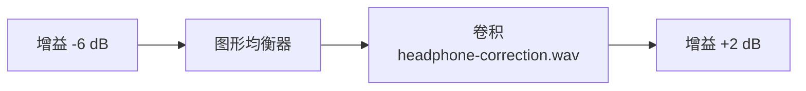

# EqualizerAU 产品需求文档

本文只定义产品意图、范围、用户需求和验收结果，不规定 Core Audio 拓扑、
编程语言、DSP 算法或模块接口。当前技术事实见
[`architecture.md`](./architecture.md)，技术选择原因见 [`adr/`](./adr/)，
阶段证据见 [`milestones/`](./milestones/)。

## 1. 产品定义

- 产品名称：EqualizerAU
- 产品形态：macOS 原生桌面应用
- 目标平台：macOS 14.2 及以上
- 目标许可证：GPL-3.0-or-later

EqualizerAU 是一款开源的 macOS 系统级音频均衡与效果处理工具。产品借鉴
EqualizerAPO 的使用理念：用户可以自由编排处理模块的类型、参数和顺序，
而不是被固定效果面板或预设流程限制。

首个 MVP 聚焦三类处理能力：

1. 增益
2. 图形均衡器
3. 卷积 / 冲激响应

## 2. 背景与机会

现有 macOS 音频工具通常存在以下一个或多个限制：

- 处理链结构固定，不能自由调整模块顺序；
- 功能复杂但基础 DSP 工作流不够直接；
- 需要用户手工配置难以恢复的音频路由；
- 配置不透明，不利于理解、备份或版本管理。

EqualizerAU 希望提供一个原生、透明、可控的系统音频处理体验，并让配置与
实际执行顺序保持一致。

## 3. 产品目标

### 3.1 核心目标

- 实时处理系统输出，而不是只处理本应用产生的音频；
- 提供可新增、删除、启用、停用和排序的自由处理链；
- 稳定支持 Gain、Graphic EQ 和 Convolution；
- 配置可持久化、可读、可编辑，并在用户显式保存后及时应用；
- 使用符合 macOS 习惯的原生桌面交互；
- 停止处理、正常退出或可恢复故障后，不让系统持续静音；
- 向用户清楚展示运行、旁路、权限和故障状态。

### 3.2 长期目标

- 逐步迁移适合 macOS 的 EqualizerAPO 能力；
- 支持更多滤波器、声道控制和条件化配置；
- 评估 EqualizerAPO 配置的部分导入；
- 建立可扩展且可诊断的实时处理链。

## 4. 非目标

以下内容不属于 MVP：

- 非 macOS 平台；
- 完整复刻 EqualizerAPO 的所有指令和边界行为；
- DAW 插件或独立 Audio Unit 插件产品；
- AutoEQ、动态 EQ、响度补偿、混响等高级效果；
- 按应用分别配置增益或处理链；
- 多前端、远程控制或复杂 IPC；
- 内置播放器、录音或音频编辑；
- 为方便实验而增加 helper、daemon 或后台服务；
- macOS 14.2 以前的系统。

## 5. 目标用户

- 希望在 macOS 获得 EqualizerAPO 类似体验的用户；
- 需要对耳机、音箱或房间进行系统级校正的用户；
- 使用 Graphic EQ 或卷积 IR 改善系统输出的音频爱好者；
- 希望处理链透明、配置可控且不依赖封闭商业工具的用户。

## 6. 核心场景

### 6.1 调整前置放大

用户添加前置放大（Preamp）、设置 dB 值并启用处理。通过当前系统输出播放的音频均
应用该电平变化。数值输入范围为 `-100 dB ... +100 dB`，步进为 `0.1 dB`。应用按已保存
处理链在每个声道上的净增益判断削波风险：净增益高于 `0 dB` 的声道必须明确标出；正负
Preamp 抵消后净增益不高于 `0 dB` 时不警告。用户可让 Preamp 作用于全部声道或选定声道；已知布局使用语义
声道标识，未知布局使用从 `1` 开始的数字标识，不得按声道数量猜测扬声器位置。
用户通过独立的 Channels 控制节点选择后续效果的目标声道；该作用域持续到下一个 Channels
节点。Preamp 等效果节点只显示其继承的有效声道，不各自保存一份声道选择。用户可以创建
非空的自定义声道标识，保存时规范化为大写。
当前输出不存在某个已选声道时，配置仍须保留：其余可解析声道继续处理，缺失项被忽略
并在对应 Channels 节点显示非阻塞警告；若全部已选声道都缺失，作用域内效果为空操作，
不得自动改为 `all`。
多个 Preamp 在同一声道上的 dB 值相加。若总值超过实时处理可表示的数值范围，应用仍
保存原始节点值，但实际处理限制在安全边界内，并持续标出受影响声道；输出不得因该配置
进入非有限状态。

### 6.2 使用图形均衡器

用户通过任意频率控制点定义图形均衡曲线，可以新增、删除并编辑各点的频率和增益。
参数变化应及时生效，不要求重启应用或重新开始播放。

### 6.3 加载冲激响应

用户选择本地 IR 文件。应用校验文件并将其应用到系统音频；无效或不支持的
文件不得静默失败。

### 6.4 自由编排处理链

用户可组合并排序多个节点，例如：

应用必须严格按照可见顺序执行。用户可停用单个节点，或通过音效总开关让整条处理链
立即透明。

## 7. 功能需求

### 7.1 系统音频处理

- 主窗口提供一个 Processing 控件：首次开启时启动系统处理并应用已保存效果；运行中关闭时
  立即旁路为透明输出但不销毁系统音频链路，再次开启恢复已保存效果；真正的引擎 Start/Stop
  保留为高级生命周期和恢复命令；
- 默认处理系统当前默认输出的音频；
- 应用启动时恢复配置和 Processing 旁路状态，但系统处理保持停止，直到用户显式开启
  Processing 或使用高级 Start；
- 首次需要系统权限时给出清楚说明；
- 权限拒绝、设备失效或启动失败时显示可理解的错误和恢复动作；
- 运行状态必须区分启动中、运行中、音效关闭、停止和故障；
- 关闭最后一个窗口只隐藏编辑界面，应用进程、配置草稿、在途提交和系统处理继续保留；
  重新打开窗口恢复原状态，只有明确 Quit 才进入退出确认与系统处理清理；
- 应用只允许一个进程实例和一个主编辑窗口；重复启动应激活既有实例和主窗口；
- 停止处理或退出后，系统音频应恢复正常；
- 输出设备变化时应自动恢复，或进入明确可恢复状态。

### 7.2 处理链编辑器

- 新增和删除节点；
- 支持单选、Command 多选、Shift 连续范围和 Select All；
- Copy、Cut、Delete 和拖拽移动作用于全部选中节点并保留相对顺序；Copy 只更新系统
  剪贴板，不修改草稿或产生 Undo 步骤；Cut 仅在复制成功后作为一次草稿操作完成删除；
  删除不弹确认且可通过
  Undo 恢复，包括删除最后一个节点；
- Paste 在首个选中节点之前插入，无选择时追加到末尾；粘贴节点使用新 UUID，插入后成为
  新选择；Option 拖拽复制采用相同的新身份语义；
- 允许删除最后一个节点并保存空处理链；空链保持透明，不自动补默认节点；
- 顶部 Processing 控件右侧的 Add 菜单追加节点；Paste 可在首个选中节点前插入；新增节点
  不改变当前选择；
- Add 可创建 Channels 控制节点或效果节点；Channels 只改变后续效果的声道作用域，不执行 DSP；
- 拖拽调整顺序，移动后保持节点身份和新位置选择；
- 单节点启用和停用；
- 节点启用状态与参数、顺序一样属于配置草稿，显式保存后才改变声音；
- 停用节点保留配置但不参与当前声道或削波风险诊断，重新启用后再按当前输出重新判断；
- 运行中的 Processing 开关立即生效且不提交节点草稿；关闭只旁路效果，不停止系统音频链路；
- 音效总开关保存失败时不得回滚当前会话的听感状态，也不得后台自动重试；界面必须持续
  显示该状态尚未保存，后续用户触发的持久化操作才可再次尝试保存；
- 只有音效总开关状态尚未保存时退出，提供 Retry、Exit 和 Cancel；Retry 由用户明确触发，
  Exit 接受下次按磁盘完整配置恢复，Cancel 返回应用；
- 可见顺序与实际处理顺序一致；
- 调整一个节点不得改变无关节点；
- 编辑先形成不影响当前声音的配置草稿；
- 配置草稿的 Undo 与 Redo 两个历史栈合计最多保留 `30` 步；连续旋钮或拖拽手势合并为一步，Cut、Paste、
  批量删除和拖拽等修改草稿的批量结构操作各计为一步，新编辑清空 Redo；纯 Copy 和
  音效总开关不属于草稿历史；
- Undo 与 Redo 的历史载荷合计最多 `64 MiB`；超过预算时确定性淘汰最旧记录，但不得
  丢失当前草稿或已保存比较基线；
- 原生配置草稿和应用 typed 剪贴板载荷分别不得超过 `4 MiB`；超限的编辑、Copy、Cut
  或 Paste 必须整体拒绝并显示原因，不得产生部分修改；
- 用户通过明确的 Save 命令提交整份草稿，保存成功后应用；
- Save 开始时捕获不可变的草稿和音效总开关快照；写盘期间仍可继续编辑和切换总开关，
  但 Save 成功只把所捕获快照标记为已保存，后续节点编辑继续显示未保存，后续总开关
  状态仍即时生效并在当前 Save 完成后持久化，不得被旧快照覆盖；
- 当前 Save 及其已经排队的音效总开关后继写入到达终态前禁用第二次 Save；节点编辑仍
  保留为未保存草稿，提交队列清空后用户可再次保存；
- 已经接纳的 Save 不得因后续编辑、停止系统处理或音频桥接换代而静默丢失；桥接失效只
  延迟运行时应用，持久化仍必须得到成功、明确失败或结果不确定的可见终态；
- Save、Repair 或音效总开关后继写入进行中时仍必须允许立即 Stop；Stop 使当前桥接失效后，
  在提交队列到达终态前暂时禁用 Start。提交成功后从新主配置启动，确定失败后从原已保存
  配置启动，结果不确定时沿用专用受限流程；
- 当前没有可用输出设备或布局快照时，结构合法的设备无关配置仍可保存；应用显示“等待
  输出设备”，不猜测声道或生成布局相关诊断；用户可显式 Retry，系统处理 Start 和后续
  Save 也各触发一次设备与布局重新发现，取得真实布局后再编译应用；M1 不后台轮询或监听
  设备变化；
- Save 成功后保留草稿历史并标记已保存快照；Undo 到其他快照形成新的未保存草稿，
  Redo 回到已保存快照时恢复为未修改状态，Undo 或 Redo 本身不立即改变声音；
- 未保存状态、保存中和保存错误必须可见，应用不得提供 Instant mode；
- 最新已保存配置尚未应用时，诊断必须按“当前处理中”和“已保存，待应用”分代展示；
  不得用新配置的诊断冒充当前声音，也不得因新配置更安全而提前隐藏活动链警告；
- 有未保存草稿时明确 Quit 应用，提供 Save、Discard 和 Cancel；Save 失败不得退出，
  Discard 明确丢弃草稿，Cancel 返回编辑；关闭窗口不触发该确认，也不丢弃草稿；
- 节点草稿与音效总开关同时未保存时只显示一个确认：Save and Exit 合并保存两者，
  Discard and Exit 丢弃草稿并接受下次按磁盘总开关状态恢复，Cancel 返回应用；
- Save、Repair 或由音效总开关操作延续的写入进行中时，明确 Quit 必须等待本次提交得到
  终态；成功后重新判断是否仍有未保存更改，失败不得关闭窗口，结果不确定时进入其专用
  Retry、Exit 和 Cancel 流程；

### 7.3 增益

- 单位为 dB，默认值为 `0 dB`；
- 支持直接输入和控件微调；
- `0 dB` 时不应有可测的非预期改变；
- 已保存处理链在任一声道上的净增益高于 `0 dB` 时，削波风险和受影响声道必须向用户可见；
- 总增益触及实时处理数值边界时必须持续显示受影响声道，且不得静默改变持久配置；
- 参数变化不得产生明显爆音或长期中断。

### 7.4 图形均衡器

- 支持通过表格新增、删除和选择任意正有限频率控制点；
- 每个控制点的频率和增益均可直接编辑，配置、剪贴板、历史与导出不得因点位于处理域外而
  删除、投影或拒绝；
- 频响曲线只读，目标曲线与编译响应必须可见；只有 `20...20000 Hz` 内的控制点参与插值和
  DSP 设计，域外点只保留、不参与目标计算；域外目标为 `0 dB`，不对输出硬切；
- 默认配置保持 `0 dB` 透明目标；
- 采样率变化后仍保持正确频响；
- 参数变化不得产生明显爆音或长期中断；
- 控制点范围、插值、端点和容量语义在 M6 实施前形成独立契约。

### 7.5 卷积

- 至少支持 WAV IR；
- 展示文件名、完整源路径、最后成功加载的采样率、声道数和时长；
- 配置只保存外部绝对源路径，不复制、移动、删除或自动监听用户 WAV；
- Start、运行中 Save、路线重建和格式恢复时重新读取、校验并按当前输出格式加载；
- 文件不可用、损坏、超限、不支持或声道不匹配时，仅旁路所属节点并显示原因，不改写其启用状态；
- 单声道 IR 可用于常见双声道输出，多声道严格按当前有效 Channels 作用域顺序映射；
- schema 或全局 stage/tap/Prepared 容量错误仍整批拒绝，不得静默丢弃合法节点；
- 展示该节点引入的处理延迟。

### 7.6 配置管理

- 已保存配置是处理链持久状态的唯一来源，配置草稿不参与重启恢复或实时处理；
- 未保存草稿只存在于当前应用会话，退出或崩溃后不恢复；
- 格式可读并适合版本管理；
- 单份原生配置不超过 `4 MiB`；超限配置视为无效并按恢复流程处理，不设置与该字节预算
  重复的固定节点数量上限；
- 全新安装首次启动创建一个作用于全部声道的 `0 dB` Preamp，默认信号保持透明；
- 启动时恢复上次有效配置；
- 全新安装默认配置写入失败、上一份完整配置可读取但无法恢复为主配置，或所有配置都
  无法恢复时，必须进入明确的“恢复配置待保存”状态，而不是伪装成正常已保存：仍有完整
  配置时继续按该配置处理，否则使用透明安全链；界面持续显示错误并允许用户编辑恢复配置，
  Save 作为 Repair；Repair 成功前这些编辑不改变声音，音效总开关保持禁用；这里的写入
  失败仅指主文件替换前的确定失败，若主文件已经替换但最终目录同步失败，则无论发生在
  首次创建、previous 恢复还是普通 Save，都统一进入“持久化结果不确定”；
- 音效总开关尚未保存时退出，下一次启动以磁盘实际保留的完整配置为准；
- 写入不能留下半成品配置；
- 主配置已经替换但最终目录同步失败时，应用进入独立的“持久化结果不确定”状态：保持
  进入该状态时的声音，冻结配置编辑、Save 和音效总开关，不接受新一代配置；用户只能
  显式 Retry 同一代次、Exit 并在下次启动按磁盘实际完整配置恢复，或 Cancel 留在该受限
  状态，不得由后台自动重试；进入该状态前已经发生的最新总开关意图必须保留但不得写入
  不确定候选，Retry 成功后再作为用户原操作的延续写入，Exit 才丢弃该内存意图；该状态
  禁止 Start，但系统处理已经运行时必须始终允许 Stop，停止不改变不确定候选；
- 解析失败时保留上一份有效配置并报告问题；
- MVP 使用可读、版本化的原生 JSON；EqualizerAPO 文本只作为后续导入或导出兼容目标，
  不与原生配置并列为可写事实来源。

## 8. 界面需求

### 8.1 设计原则

- 采用符合 macOS 习惯的原生桌面交互；
- 重点是处理链和参数编辑，不使用固定效果仪表盘；
- 控件密度适合重复操作的桌面工具；
- 参数值、单位、状态和执行顺序清晰可见；
- 不使用营销式布局或无功能装饰。

### 8.2 主窗口

至少包含：

- 单一主 Processing 控件和运行状态；真正的引擎 Start/Stop 只放在高级命令中；
- 权限及错误状态；
- 可滚动处理链；
- Processing 右侧的添加节点入口；
- 以本地 EqualizerAPO 为行为参考的紧凑处理器编排区，以及节点启用或停用、选择、删除、
  拖拽排序和参数编辑；
- 当前输出、采样率和处理延迟等基础信息。

### 8.3 Graphic EQ

Graphic EQ 使用按频率排序的任意控制点。用户通过有明确边框的数值表格新增、删除、选择并调整
控制点；频响图只读，同时呈现目标和当前采样率下的编译响应。配置原样保存所有正有限频率点，
`20...20000 Hz` 只约束主动 DSP 目标，不得静默移动、丢弃或改写域外用户控制点。具体插值、
采样率、边界过渡、数值容差和容量契约以 ADR 0013 为准。

### 8.4 状态反馈

- 未授权：提供授权说明和可执行入口；
- 启动中：非阻塞显示进度；
- 运行中：明确显示处理已生效；
- 节点已停用：明确显示该节点当前不参与 DSP；
- 音效已关闭：明确显示整条处理链当前透明；
- 错误：说明原因和下一步恢复动作。

## 9. 非功能需求

### 9.1 音频质量与性能

- 不得出现持续爆音、卡顿、反馈或明显丢帧；
- 空处理链和音效关闭应尽量接近透明；
- 常见图形均衡器配置的 CPU 占用应适合持续运行；
- 卷积能力上限应通过测量确定，不能静默超载；
- 参数修改不得阻塞音频处理。

### 9.2 稳定性与恢复

- 正常停止或退出后不得留下持续静音；
- 设备变化后应恢复或给出明确提示；
- 无效配置和无效 IR 不得使音频处理崩溃；
- 局部失败不得丢失恢复系统音频所需的资源所有权；
- 自动恢复必须有界，不能形成无限重试。

配置文件完整性、`previous` 恢复和 Repair 属于 M1 的持久化闭环；本节所称运行期自动
恢复主要指设备、权限、睡眠、采样率和系统音频服务变化，集中在 M4 完成。

### 9.3 可维护性

- 产品状态、配置、DSP 和系统音频生命周期职责清楚；
- 新处理节点遵循一致的用户行为和配置契约；
- DSP 行为具备不依赖真实设备的自动化验证；
- 系统音频生命周期具备失败注入和清理验证；
- 实时路径的约束可被静态检查和测试。

## 10. MVP 验收标准

MVP 完成需满足：

1. 在支持的 macOS 版本上完成必要授权并启动系统音频处理；
2. 常见应用的系统音频可通过 EqualizerAU 播放到默认输出；
3. 用户可新增、删除、启用、停用和排序增益、图形均衡器、卷积节点；
4. 增益听感与数值一致，`0 dB` 近似透明；
5. 图形均衡器实时生效，全部 `0 dB` 时近似透明；
6. 卷积节点可加载有效 WAV IR 并产生相应处理结果；
7. 参数和节点启用状态变化不造成明显爆音或长期中断；
8. 配置在重启后完整恢复；
9. 无效配置或 IR 有明确错误，上一份有效处理继续工作；
10. 停止或退出后系统音频恢复；
11. 项目按目标许可证发布并包含必要上游归属。

## 11. 结果导向里程碑

| 里程碑 | 期望结果 |
|---|---|
| M0 系统链路可行性 | 系统音频经过一条原生处理链产生可听处理结果，并可重复启动和停止 |
| M1 处理链基础 | 用户可持久化并实时调整前置放大和节点启用状态，并通过独立音效总开关切换整链处理或透明 |
| M2 图形均衡器 | 多频段调整与参考频响一致，实时调参稳定 |
| M3 卷积 | 有效 WAV IR 可加载、处理和安全切换 |
| M4 MVP 稳定化 | 设备变化、权限异常、睡眠、系统服务及运行期自动恢复、签名和发布验收完成 |
| M5 EqualizerAPO 编辑器对齐 | 处理器编排和处理器交互经本地源码对齐后形成一致、紧凑且可流畅操作的编辑器 |
| M6 任意频率 Graphic EQ | 用户可编辑任意频率控制点，可见曲线、保存配置和实际频响遵循同一契约 |
| M7 开源技术预览发布 | GPL 来源完整、源码与 arm64 ad-hoc Release ZIP 可验证重放，用户可按逐应用 Gatekeeper 流程安装 |
| M8 Convolution 外部源路径 | schema v8 不复制 WAV，每次生效重新加载，资源局部故障可见旁路并自动恢复 |
| M9 菜单栏与中英 i18n | 关闭窗口后 Dock 与菜单栏均驻留并恢复同一主窗口；精简菜单并支持中英切换 |

M0 已完成，详见 [`milestones/M0-native-route.md`](./milestones/M0-native-route.md)。M8、M9 已完成并关闭，
验收证据分别见 [`milestones/M8-convolution-source-path.md`](./milestones/M8-convolution-source-path.md) 和
[`milestones/M9-menu-bar-i18n.md`](./milestones/M9-menu-bar-i18n.md)。

## 12. 待确认产品事项

- MVP 是否允许选择非默认输出设备；
- EqualizerAPO 配置导入范围；
- 是否需要登录启动。
